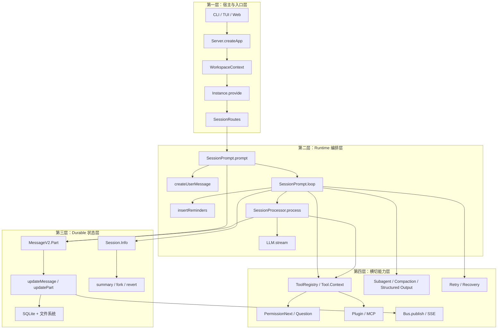
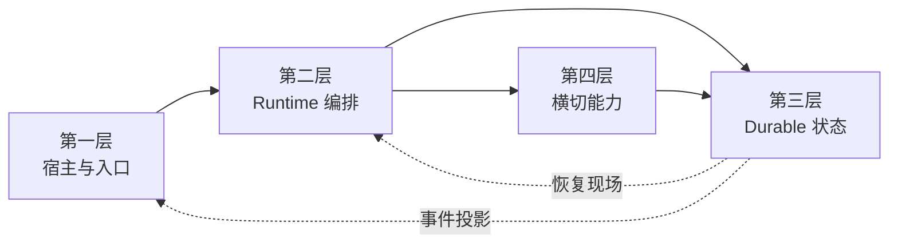

# OpenCode Agent Runtime 总纲

> 本文是整套 kickoff 文档的总地图。新版目录先回答一件事：**OpenCode 这套 runtime 到底分哪四层，四层之间怎样接力，读每一层时再该往哪里展开。**

---

## 一、一句话定位

**OpenCode 是一个以 durable log 为真相源的 session 调度器。**  
它把外部入口挂到实例上下文，把输入编译成持久化 message/part，把 session 级任务交给 loop 调度，把单轮模型流交给 processor 落盘，再把状态变化通过事件流投影给 CLI、TUI 和 Web。

---

## 二、先把四层讲全

OpenCode 可以先概括成一条四层调用骨架：



### 第一层：宿主与入口层

这一层的职责只有一个：**把外部请求挂到正确的实例上下文和 session 上。**

- `Server.createApp()`（`server/server.ts`）是统一宿主入口，建立 Hono 路由应用。
- `WorkspaceContext.provide()`（`control-plane/workspace-context.ts`）与 `Instance.provide()`（`server/server.ts`）把 workspace、directory、插件和项目上下文灌进去。
- `SessionRoutes`（`server/routes/session.ts`）把 HTTP / CLI / TUI 的外部操作统一翻译成 session runtime 操作。
- `RunCommand.handler()`（`cli/cmd/run.ts`）是 CLI 入口：创建/选择 session、订阅事件。

CLI、TUI、Web 在这里提供不同入口，但最终都汇入同一条 `SessionRoutes → SessionPrompt` 的主线。读完这一层，你应该能说明入口怎样绑定实例上下文，以及不同入口为什么会带来不同初始条件。

### 第二层：Runtime 编排层

这一层负责"真正推进执行"，是 OpenCode 的主时钟。

- `SessionPrompt.prompt()`（`session/prompt.ts`）把一次外部输入转成 runtime 里的正式动作：清理回滚、落盘用户输入。
- `SessionPrompt.createUserMessage()`（`session/prompt.ts`）在写入前完成输入预处理：文件、目录、MCP、agent mention 展开。
- `SessionPrompt.insertReminders()`（`session/prompt.ts`）注入 plan/build 语义提示。
- `SessionPrompt.loop()`（`session/prompt.ts`）做 session 级调度：优先消费 pending subtask / compaction，再进入普通轮次。
- `SessionProcessor.process()`（`session/processor.ts`）做单轮执行：消费 LLM 流、写 durable parts。
- `LLM.stream()`（`session/llm.ts`）提供访问 provider 的统一接口：合并 model / system / messages。

读完这一层，你应该能画出 `prompt → loop → process → continue/compact/stop` 的主时钟。

### 第三层：Durable 状态层

这一层负责"什么才算被执行过"，是 OpenCode 的真相源。

- `Session.Info`（`session/index.ts`）定义执行边界：directory / workspace / permission / revert / summary / share。
- `MessageV2.Part`（`session/message-v2.ts`）定义最小状态单元：text / tool / reasoning / step / patch / subtask / compaction。
- `Session.updateMessage()`（`session/index.ts`）是 message 级写路径。
- `Session.updatePart()`（`session/index.ts`）是 part 级写路径。
- `Session.fork()`（`session/index.ts`）复制会话边界与历史，重建执行轨迹。
- SQLite + 文件系统保存长期状态，summary / fork / share / revert 都建立在这一层之上。

读完这一层，你应该能回答：OpenCode 为什么可以 resume、fork、share，为什么工具输出和普通文本能共存在同一条历史里。

### 第四层：横切能力层

这一层负责"哪些能力在主链的固定插槽里介入"。不单独驱动主循环，但会在固定节点接入。

- `Tool.define()` / `Tool.Context`（`tool/tool.ts`）提供统一工具协议。
- `ToolRegistry.tools()`（`tool/registry.ts`）负责工具装配与过滤。
- `PermissionNext.ask()`（`permission/index.ts`）与 `Question.ask()`（`question/index.ts`）提供用户介入原语。
- `Plugin.trigger()`（`plugin/index.ts`）与 `MCP.tools()`（`mcp/index.ts`）折叠扩展能力。
- `SessionCompaction.process()`（`session/compaction.ts`）、subagent、structured output 把高级能力接回主链。
- `Bus.publish()`（`bus/index.ts`）与 SSE 把 durable 写操作投影成实时事件。
- retry / revert / overflow compaction 提供恢复路径。

读完这一层，你应该能回答：为什么 OpenCode 能做这么多事，但仍然没有长出第二套状态系统。

---

## 三、先记最短主线，再区分主线文档和侧面展开

`03` 以后最容易乱，是因为“主线代码流”和“侧面概念文档”混在一起了。  
总纲里应该先把 **最短主线** 讲完，再告诉你哪些文档是在继续追代码，哪些是在回头解释 durable state、对象模型、上下文工程或横切能力。

### 3.1 最短主线

如果只记一条调用骨架，先记这个：

```text
入口
  -> Server / SessionRoutes
  -> SessionPrompt.prompt()
  -> createUserMessage()
  -> SessionPrompt.loop()
  -> SessionProcessor.process()
  -> updateMessage / updatePart
  -> Bus.publish / SSE
```

这条链里：

- `01` 和 `02` 负责把请求送到 `SessionRoutes`
- `03` 开始正式进入 `prompt()` / `loop()` 代码
- `10`、`11`、`12` 继续把 `loop` 和 `processor` 拆开
- `04`、`05`、`06` 更适合当 **侧面展开**，而不是冒充主线续篇

### 3.2 主线文档：按 runtime 代码流往里追

| 文档 | 回答什么 |
|------|----------|
| **[01-user-entry](./01-user-entry.md)** | CLI / TUI / Web / Serve / ACP / Desktop 六种入口怎样到达 Server |
| **[02-server-and-routing](./02-server-and-routing.md)** | Server 启动、Hono 中间件链、路由分发、实例上下文绑定 |
| **[03-request-lifecycle](./03-request-lifecycle.md)** | 从 `SessionRoutes` 正式进入 `SessionPrompt.prompt()` 与 `SessionPrompt.loop()` |
| **[10-loop-and-processor](./10-loop-and-processor.md)** | loop 与 processor 为什么必须拆两层 |
| [11-loop-source-walkthrough](./11-loop-source-walkthrough.md) | loop 源码逐段解剖 |
| [12-processor-source-walkthrough](./12-processor-source-walkthrough.md) | processor 源码逐段解剖 |

### 3.3 侧面展开：durable state 与对象模型

| 文档 | 回答什么 |
|------|----------|
| **[04-session-centric-runtime](./04-session-centric-runtime.md)** | 从主线回头看 session 为什么是执行边界 |
| **[05-object-model](./05-object-model.md)** | Agent / Session / MessageV2 / Tool 怎样支撑主线运行 |
| **[20-storage-and-persistence](./20-storage-and-persistence.md)** | SQLite / Drizzle / 写路径 / 表结构 |

### 3.4 侧面展开：上下文工程

| 文档 | 回答什么 |
|------|----------|
| **[06-context-engineering](./06-context-engineering.md)** | 上下文怎样在 loop 的多个阶段被装配出来 |
| [07-context-system-and-instructions](./07-context-system-and-instructions.md) | system / environment / instruction 如何叠加 |
| [08-context-input-and-history-rewrite](./08-context-input-and-history-rewrite.md) | 输入预处理、附件展开、history rewrite |
| [09-context-injection-order](./09-context-injection-order.md) | 注入顺序为什么会改变约束力 |

### 3.5 侧面展开：横切能力

| 文档 | 回答什么 |
|------|----------|
| **[13-advanced-primitives](./13-advanced-primitives.md)** | subagent / compaction / structured output 怎样接回主链 |
| **[14-hardcoded-vs-configurable](./14-hardcoded-vs-configurable.md)** | 哪些骨架固定，哪些策略可插拔 |
| **[16-observability](./16-observability.md)** | 为什么写路径天然能变成事件源 |
| **[21-error-recovery](./21-error-recovery.md)** | retry / revert / overflow compaction 如何恢复执行 |

### 3.6 收束文档

| 文档 | 用途 |
|------|------|
| [17-why-this-design-matters](./17-why-this-design-matters.md) | 回看这套设计到底值不值得学 |
| [18-reading-path](./18-reading-path.md) | 明确主线阅读和侧面展开的顺序 |
| [19-final-mental-model](./19-final-mental-model.md) | 用一张最终图把四层收束成一个闭环 |

---

## 四、层级 × 源码索引

### 4.1 第一层：宿主与入口层

| 函数 / 对象 | 位置 | 职责 |
|-------------|------|------|
| `Server.createApp()` | `server/server.ts` | 建立实例上下文，绑定路由和事件出口 |
| `WorkspaceContext.provide()` | `control-plane/workspace-context.ts` | 注入 workspace 作用域 |
| `Instance.provide()` | `cli/bootstrap.ts` / `server/server.ts` 等 | 注入目录、项目、插件等实例作用域 |
| `SessionRoutes` | `server/routes/session.ts` | 把外部操作统一汇入 session runtime |
| `RunCommand.handler()` | `cli/cmd/run.ts` | CLI 入口：创建/选择 session、订阅事件 |

### 4.2 第二层：Runtime 编排层

| 函数 / 对象 | 位置 | 职责 |
|-------------|------|------|
| `SessionPrompt.prompt()` | `session/prompt.ts` | 入口：清理回滚、落盘用户输入、启动 loop |
| `SessionPrompt.createUserMessage()` | `session/prompt.ts` | 输入预处理：文件、目录、MCP、agent mention 展开 |
| `SessionPrompt.insertReminders()` | `session/prompt.ts` | plan/build 语义注入 |
| `SessionPrompt.loop()` | `session/prompt.ts` | session 级调度：subtask / compaction / normal |
| `SessionProcessor.process()` | `session/processor.ts` | 单轮执行：消费 LLM 流、写 durable parts |
| `LLM.stream()` | `session/llm.ts` | provider 调用：合并 model / system / messages |

### 4.3 第三层：Durable 状态层

| 函数 / 对象 | 位置 | 职责 |
|-------------|------|------|
| `Session.Info` | `session/index.ts` | 执行边界：directory / workspace / permission / revert |
| `MessageV2.Part` | `session/message-v2.ts` | 最小状态单元：text / tool / reasoning / subtask / compaction |
| `Session.updateMessage()` | `session/index.ts` | message 级写路径 |
| `Session.updatePart()` | `session/index.ts` | part 级写路径 |
| `Session.fork()` | `session/index.ts` | 复制会话边界与历史，重建执行轨迹 |
| `Session.create()` / `createNext()` | `session/index.ts` | 创建根 session / child session |

### 4.4 第四层：横切能力层

| 函数 / 对象 | 位置 | 职责 |
|-------------|------|------|
| `Tool.define()` / `Tool.Context` | `tool/tool.ts` | 统一工具协议 |
| `ToolRegistry.tools()` | `tool/registry.ts` | 工具装配与过滤 |
| `PermissionNext.ask()` | `permission/index.ts` | 权限挂起 |
| `Question.ask()` | `question/index.ts` | 问题挂起 |
| `Plugin.trigger()` | `plugin/index.ts` | 固定节点钩子 |
| `MCP.tools()` | `mcp/index.ts` | 外部能力折叠进统一工具面 |
| `SessionCompaction.process()` | `session/compaction.ts` | 显式压缩阶段 |
| `Bus.publish()` | `bus/index.ts` | 事件总线 |

> 所有路径相对于 `packages/opencode/src/`。

---

## 五、四个核心判断

1. **第一层只负责挂载，不负责思考。** CLI、TUI、Web 的差异主要来自实例上下文和 session 初始条件，不来自 agent 主循环本体。
2. **第二层才是 runtime 主时钟。** `prompt -> loop -> process` 是 OpenCode 真正推进执行的核心链路。
3. **第三层才是真相源。** `Session.Info` 下的 `MessageV2.Part` 轨迹构成 OpenCode 的真实执行状态。
4. **第四层全部是插槽式介入。** 工具、权限、问题、插件、MCP、compaction、事件、恢复机制都要接回同一条 durable history。

---

## 六、推荐阅读顺序

### 第一轮：只追主线代码流

1. 读 [01-user-entry](./01-user-entry.md)，搞清楚六种入口怎样到达 Server。
2. 读 [02-server-and-routing](./02-server-and-routing.md)，看 Server 内部怎样把请求送到 `SessionRoutes`。
3. 读 [03-request-lifecycle](./03-request-lifecycle.md)，从 `SessionRoutes` 正式进入 `prompt()` 和 `loop()`。
4. 读 [10-loop-and-processor](./10-loop-and-processor.md)，看 `loop` 和 `processor` 为什么要拆两层。
5. 读 [11-loop-source-walkthrough](./11-loop-source-walkthrough.md) 和 [12-processor-source-walkthrough](./12-processor-source-walkthrough.md)，把第二层主时钟按源码吃透。

### 第二轮：回头补侧面展开

1. durable state 与对象模型：[04](./04-session-centric-runtime.md) → [05](./05-object-model.md) → [20](./20-storage-and-persistence.md)
2. 上下文工程：[06](./06-context-engineering.md) → [07](./07-context-system-and-instructions.md) → [08](./08-context-input-and-history-rewrite.md) → [09](./09-context-injection-order.md)
3. 横切能力：[13](./13-advanced-primitives.md) → [14](./14-hardcoded-vs-configurable.md) → [16](./16-observability.md) → [21](./21-error-recovery.md)
4. 最后收束：[17](./17-why-this-design-matters.md) → [18](./18-reading-path.md) → [19](./19-final-mental-model.md)

---

## 七、最终心智模型



把这四层记住，再去读任何单篇文档，你都会更容易知道它是在解释“谁挂载上下文、谁推进执行、谁保存真相、谁在固定插槽里介入”。
