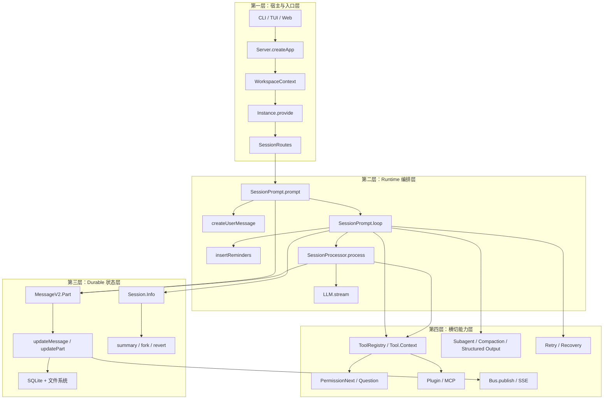
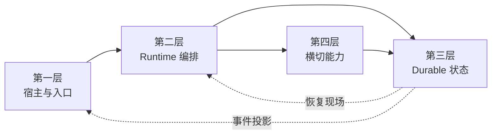

# OpenCode Agent Runtime 总纲

> 本文是整套 kickoff 文档的总地图。新版目录先回答一件事：**OpenCode 这套 runtime 到底分哪四层，四层之间怎样接力，读每一层时再该往哪里展开。**

---

## 一、一句话定位

**OpenCode 是一个以 durable log 为真相源的 session 调度器。**  
它把外部入口挂到实例上下文，把输入编译成持久化 message/part，把 session 级任务交给 loop 调度，把单轮模型流交给 processor 落盘，再把状态变化通过事件流投影给 CLI、TUI 和 Web。

---

## 二、先把四层讲全

OpenCode 可以先概括成一条四层调用骨架：

### 第一层：宿主与入口层

这一层只回答三件事：请求从哪里来、挂到哪个 workspace/directory、落到哪条 session 上。  
这一层说明 `Server.createApp()`、`WorkspaceContext.provide()`、`Instance.provide()` 和 `SessionRoutes` 怎样把一次外部请求绑定到同一个实例上下文里。CLI、TUI、Web 在这里提供不同入口，agent 主循环随后才开始。

从运行位置来看，这一层和第二层共同组成了 OpenCode 的宿主面。第一层负责挂载入口与实例上下文，第二层负责推进 session；二者一起把外部请求转换成可持续推进的 runtime 执行。

### 第二层：Runtime 编排层

这一层负责“推进执行”。`SessionPrompt.prompt()` 先把输入落盘，`createUserMessage()` 做输入预处理，`SessionPrompt.loop()` 决定当前 session 先跑 subtask、compaction 还是普通轮次，`SessionProcessor.process()` 再把一次模型流写回 durable parts。  
如果只想抓 OpenCode 的主时钟，核心就是这一层。

### 第三层：Durable 状态层

这一层负责“什么才算真相”。`Session.Info` 定义执行边界，`MessageV2.Part` 定义最小状态单元，`updateMessage()` / `updatePart()` 是统一写路径，SQLite 和文件系统保存长期状态。  
resume、fork、share、revert、summary 这些能力都建立在这一层之上。

### 第四层：横切能力层

这一层不单独驱动主循环，但会在固定插槽里介入主链。工具、权限确认、问题澄清、插件、MCP、subagent、compaction、structured output、事件总线和错误恢复都在这里。  
它们看起来很多样，但最后都要么改写 durable history，要么消费 durable history 发事件。

---

## 三、再看层内展开

四层讲全以后，再把每层内部拆开读，整个目录就不会散。

### 3.1 第一层：宿主与入口层

| 文档 | 这一层回答什么 |
|------|----------------|
| **[01-user-entry](./01-user-entry.md)** | 从 CLI / TUI / Web 入口看请求怎样进入统一 runtime |
| **[02-architecture-diagram](./02-architecture-diagram.md)** | 四层骨架里每层各放哪些模块 |

### 3.2 第二层：Runtime 编排层

| 文档 | 这一层回答什么 |
|------|----------------|
| **[03-request-lifecycle](./03-request-lifecycle.md)** | 一次请求怎样穿过四层，尤其怎样进入 runtime 主链 |
| **[06-context-engineering](./06-context-engineering.md)** | 上下文怎样在 runtime 编排过程中逐层装配 |
| [07-context-system-and-instructions](./07-context-system-and-instructions.md) | system / environment / instruction 如何叠加 |
| [08-context-input-and-history-rewrite](./08-context-input-and-history-rewrite.md) | 输入预处理、附件展开、history rewrite |
| [09-context-injection-order](./09-context-injection-order.md) | 注入顺序为什么会改变约束力 |
| **[10-loop-and-processor](./10-loop-and-processor.md)** | loop 与 processor 为什么必须拆两层 |
| [11-loop-source-walkthrough](./11-loop-source-walkthrough.md) | loop 源码逐段解剖 |
| [12-processor-source-walkthrough](./12-processor-source-walkthrough.md) | processor 源码逐段解剖 |

### 3.3 第三层：Durable 状态层

| 文档 | 这一层回答什么 |
|------|----------------|
| **[04-session-centric-runtime](./04-session-centric-runtime.md)** | session 作为执行边界承载哪些运行时语义 |
| **[05-object-model](./05-object-model.md)** | Session / MessageV2 / Agent / Tool 怎样围绕状态协作 |
| **[20-storage-and-persistence](./20-storage-and-persistence.md)** | durable state 最终落在哪里 |

### 3.4 第四层：横切能力层

| 文档 | 这一层回答什么 |
|------|----------------|
| **[13-advanced-primitives](./13-advanced-primitives.md)** | subagent / compaction / structured output 怎样接回主链 |
| **[14-hardcoded-vs-configurable](./14-hardcoded-vs-configurable.md)** | 哪些骨架固定，哪些策略可插拔 |
| **[16-observability](./16-observability.md)** | 为什么写路径天然能变成事件源 |
| **[21-error-recovery](./21-error-recovery.md)** | retry / revert / overflow compaction 如何恢复执行 |

### 3.5 读完全套后的收束文档

| 文档 | 用途 |
|------|------|
| [17-why-this-design-matters](./17-why-this-design-matters.md) | 回看这套设计到底值不值得学 |
| [18-reading-path](./18-reading-path.md) | 按层安排阅读顺序 |
| [19-final-mental-model](./19-final-mental-model.md) | 用一张最终图把四层收束成一个闭环 |

---

## 四、层级 × 源码索引

### 4.1 第一层：宿主与入口层

| 函数 / 对象 | 位置 | 职责 |
|-------------|------|------|
| `Server.createApp()` | `server/server.ts` | 建立实例上下文，绑定路由和事件出口 |
| `WorkspaceContext.provide()` | `control-plane/workspace-context.ts` | 注入 workspace 作用域 |
| `Instance.provide()` | `cli/bootstrap.ts` / `server/server.ts` 等 | 注入目录、项目、插件等实例作用域 |
| `SessionRoutes` | `server/routes/session.ts` | 把外部操作统一汇入 session runtime |
| `RunCommand.handler()` | `cli/cmd/run.ts` | CLI 入口：创建/选择 session、订阅事件 |

### 4.2 第二层：Runtime 编排层

| 函数 / 对象 | 位置 | 职责 |
|-------------|------|------|
| `SessionPrompt.prompt()` | `session/prompt.ts` | 入口：清理回滚、落盘用户输入、启动 loop |
| `SessionPrompt.createUserMessage()` | `session/prompt.ts` | 输入预处理：文件、目录、MCP、agent mention 展开 |
| `SessionPrompt.insertReminders()` | `session/prompt.ts` | plan/build 语义注入 |
| `SessionPrompt.loop()` | `session/prompt.ts` | session 级调度：subtask / compaction / normal |
| `SessionProcessor.process()` | `session/processor.ts` | 单轮执行：消费 LLM 流、写 durable parts |
| `LLM.stream()` | `session/llm.ts` | provider 调用：合并 model / system / messages |

### 4.3 第三层：Durable 状态层

| 函数 / 对象 | 位置 | 职责 |
|-------------|------|------|
| `Session.Info` | `session/index.ts` | 执行边界：directory / workspace / permission / revert |
| `MessageV2.Part` | `session/message-v2.ts` | 最小状态单元：text / tool / reasoning / subtask / compaction |
| `Session.updateMessage()` | `session/index.ts` | message 级写路径 |
| `Session.updatePart()` | `session/index.ts` | part 级写路径 |
| `Session.fork()` | `session/index.ts` | 复制会话边界与历史，重建执行轨迹 |
| `Session.create()` / `createNext()` | `session/index.ts` | 创建根 session / child session |

### 4.4 第四层：横切能力层

| 函数 / 对象 | 位置 | 职责 |
|-------------|------|------|
| `Tool.define()` / `Tool.Context` | `tool/tool.ts` | 统一工具协议 |
| `ToolRegistry.tools()` | `tool/registry.ts` | 工具装配与过滤 |
| `PermissionNext.ask()` | `permission/index.ts` | 权限挂起 |
| `Question.ask()` | `question/index.ts` | 问题挂起 |
| `Plugin.trigger()` | `plugin/index.ts` | 固定节点钩子 |
| `MCP.tools()` | `mcp/index.ts` | 外部能力折叠进统一工具面 |
| `SessionCompaction.process()` | `session/compaction.ts` | 显式压缩阶段 |
| `Bus.publish()` | `bus/index.ts` | 事件总线 |

> 所有路径相对于 `packages/opencode/src/`。

---

## 五、四个核心判断

1. **第一层只负责挂载，不负责思考。** CLI、TUI、Web 的差异主要来自实例上下文和 session 初始条件，不来自 agent 主循环本体。
2. **第二层才是 runtime 主时钟。** `prompt -> loop -> process` 是 OpenCode 真正推进执行的核心链路。
3. **第三层才是真相源。** `Session.Info` 下的 `MessageV2.Part` 轨迹构成 OpenCode 的真实执行状态。
4. **第四层全部是插槽式介入。** 工具、权限、问题、插件、MCP、compaction、事件、恢复机制都要接回同一条 durable history。

---

## 六、推荐阅读顺序

### 第一轮：先按层打通骨架

1. 读 [01-user-entry](./01-user-entry.md) 和 [02-architecture-diagram](./02-architecture-diagram.md)，把入口层和四层骨架先立住。
2. 读 [03-request-lifecycle](./03-request-lifecycle.md)，看一条请求怎样顺着四层走完。
3. 读 [04-session-centric-runtime](./04-session-centric-runtime.md) 和 [05-object-model](./05-object-model.md)，确认 durable state 到底长什么样。
4. 读 [10-loop-and-processor](./10-loop-and-processor.md)，把 runtime 主时钟彻底看懂。

### 第二轮：按层内专题展开

1. 第二层优先展开：[06](./06-context-engineering.md) → [07](./07-context-system-and-instructions.md) → [08](./08-context-input-and-history-rewrite.md) → [09](./09-context-injection-order.md) → [11](./11-loop-source-walkthrough.md) → [12](./12-processor-source-walkthrough.md)
2. 第三层优先展开：[20-storage-and-persistence](./20-storage-and-persistence.md)
3. 第四层优先展开：[13](./13-advanced-primitives.md) → [14](./14-hardcoded-vs-configurable.md) → [16](./16-observability.md) → [21](./21-error-recovery.md)
4. 最后收束：[17](./17-why-this-design-matters.md) → [18](./18-reading-path.md) → [19](./19-final-mental-model.md)

---

## 七、最终心智模型

把这四层记住，再去读任何单篇文档，你都会更容易知道它是在解释“谁挂载上下文、谁推进执行、谁保存真相、谁在固定插槽里介入”。
