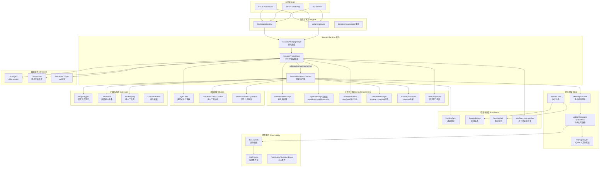
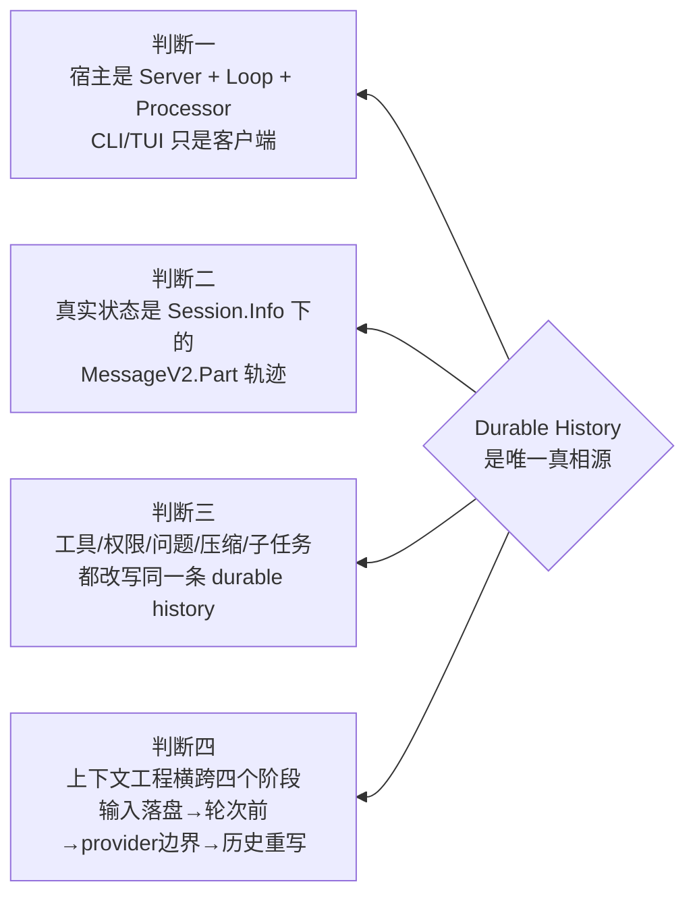
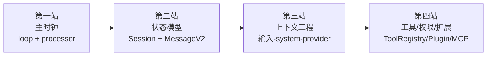
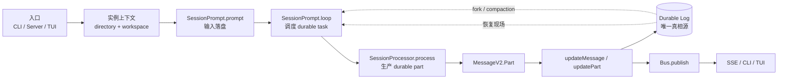

# OpenCode Agent Runtime 总纲

> 本文是整套 kickoff 文档的**总地图**。读完本文，你应该能回答三个问题：OpenCode 由哪些能力域构成？每个能力域对应哪些源码和深拆文档？从哪里开始读最高效？

---

## 一、一句话定位

**OpenCode 是一个以 durable log 为真相源的 session 调度器。** 它不是聊天框架，也不是 prompt 模板引擎；它的核心工作是：把用户输入编译成持久化消息，调度 session 级任务，消费模型流并将结果写回 durable history，再通过事件总线把状态变更投影给任意客户端。

---

## 二、能力全图

下图覆盖 OpenCode 的**全部能力域**。每个节点都能在后续文档中找到对应的深拆。

---

## 三、能力域 × 文档地图

下表把每个能力域映射到对应的深拆文档。**粗体**标记的是该域的主入口文档。

| # | 能力域 | 核心问题 | 深拆文档 |
|---|--------|----------|----------|
| **I. 入口与宿主** | 请求从哪里进入 runtime？ | 宿主不是 CLI | **[01-runtime-host](./01-runtime-host.md)** |
| | 架构骨架怎么读？ | 四层调用骨架 | [02-architecture-diagram](./02-architecture-diagram.md) |
| | 不同入口为什么行为不同？ | 共享主循环，不共享初始化 | [15-client-differences](./15-client-differences.md) |
| **II. 请求生命周期** | 一条输入怎样变成 durable log？ | 端到端追踪 | **[03-request-lifecycle](./03-request-lifecycle.md)** |
| **III. Session 中心化** | 为什么 session 是执行边界？ | session 不是聊天容器 | **[04-session-centric-runtime](./04-session-centric-runtime.md)** |
| **IV. 对象模型** | 四大核心对象如何协作？ | Agent/Session/MessageV2/Tool | **[05-object-model](./05-object-model.md)** |
| **V. 上下文工程** | 模型看到的世界是怎样被构造的？ | 四层流水线 | **[06-context-engineering](./06-context-engineering.md)** |
| | system prompt 怎样层层叠上去？ | provider→env→skill→instruction | [07-context-system-and-instructions](./07-context-system-and-instructions.md) |
| | 输入预处理和 history rewrite | 文件展开/命令编译/翻译 | [08-context-input-and-history-rewrite](./08-context-input-and-history-rewrite.md) |
| | 注入顺序为什么重要？ | 位置决定约束力 | [09-context-injection-order](./09-context-injection-order.md) |
| **VI. 状态机双层架构** | loop 与 processor 为什么要分开？ | session级 vs 单轮级 | **[10-loop-and-processor](./10-loop-and-processor.md)** |
| | loop 源码逐段解剖 | 主循环内部结构 | [11-loop-source-walkthrough](./11-loop-source-walkthrough.md) |
| | processor 源码逐段解剖 | 单轮执行内部结构 | [12-processor-source-walkthrough](./12-processor-source-walkthrough.md) |
| **VII. 高级能力** | subagent/compaction/structured output | 都接回主链 | **[13-advanced-primitives](./13-advanced-primitives.md)** |
| **VIII. 硬编码与可配置** | 骨架固定，策略晚绑定 | 边界在哪里？ | **[14-hardcoded-vs-configurable](./14-hardcoded-vs-configurable.md)** |
| **IX. 可观测性** | 为什么观测性这么强？ | 写路径即事件源 | **[16-observability](./16-observability.md)** |
| **X. 持久化与存储** | durable state 存在哪里？ | SQLite + Bus + 事件 | **[20-storage-and-persistence](./20-storage-and-persistence.md)** |
| **XI. 错误恢复与重试** | 失败后怎么办？ | retry/revert/compaction | **[21-error-recovery](./21-error-recovery.md)** |
| **XII. 设计价值与代价** | 为什么值得研究？ | 复杂度摊开成可定位边界 | **[17-why-this-design-matters](./17-why-this-design-matters.md)** |

---

## 四、核心源码索引

下表列出 OpenCode 最关键的源码入口。**你不需要全部读完；按"阅读路径"（第六节）选择起点即可。**

### 4.1 Runtime 主链

| 函数 / 对象 | 位置 | 职责 |
|-------------|------|------|
| `Server.createApp()` | `server/server.ts` | 建立实例上下文，绑定路由 |
| `SessionRoutes` | `server/routes/session.ts` | 统一 HTTP 入口 |
| `SessionPrompt.prompt()` | `session/prompt.ts` | 入口：落盘 user message，启动 loop |
| `SessionPrompt.loop()` | `session/prompt.ts` | session级调度：subtask→compaction→normal |
| `SessionProcessor.process()` | `session/processor.ts` | 单轮执行：消费 LLM 流，写 durable parts |
| `LLM.stream()` | `session/llm.ts` | provider 调用：合并 model/system/messages |

> 所有路径相对于 `packages/opencode/src/`。

### 4.2 状态模型

| 函数 / 对象 | 位置 | 职责 |
|-------------|------|------|
| `Session.Info` | `session/index.ts` | 执行边界：directory/permission/parent/revert |
| `MessageV2.Part` | `session/message-v2.ts` | 最小状态单元：text/tool/reasoning/subtask/compaction/patch |
| `Session.updateMessage()` | `session/index.ts` | message 级写路径 + 事件发布 |
| `Session.updatePart()` | `session/index.ts` | part 级写路径 + 事件发布 |
| `Session.fork()` | `session/index.ts` | 状态分叉：复制 message，重建 part ID |
| `Session.create()` / `createNext()` | `session/index.ts` | session 创建与父子关系 |

### 4.3 上下文工程

| 函数 / 对象 | 位置 | 职责 |
|-------------|------|------|
| `SessionPrompt.createUserMessage()` | `session/prompt.ts` | 输入预处理：文件/目录/MCP/agent 展开 |
| `SessionPrompt.insertReminders()` | `session/prompt.ts` | plan/build 语义注入 |
| `SystemPrompt.provider()` | `session/system.ts` | 模型族分流模板 |
| `SystemPrompt.environment()` | `session/system.ts` | 运行环境注入 |
| `InstructionPrompt.system()` | `session/instruction.ts` | AGENTS.md/CLAUDE.md 动态发现 |
| `MessageV2.toModelMessages()` | `session/message-v2.ts` | durable→provider 翻译 |
| `ProviderTransform.message()` | `provider/transform.ts` | provider 约束适配 |

### 4.4 工具、权限与扩展

| 函数 / 对象 | 位置 | 职责 |
|-------------|------|------|
| `Tool.define()` / `Tool.Context` | `tool/tool.ts` | 统一工具协议 |
| `ToolRegistry.tools()` | `tool/registry.ts` | 工具装配与过滤 |
| `TaskTool.execute()` | `tool/task.ts` | subagent：创建 child session |
| `ReadTool.execute()` | `tool/read.ts` | 文件读取 + 局部 instruction 注入 |
| `PermissionNext.ask()` | `permission/index.ts` | 权限挂起为 pending request |
| `Question.ask()` | `question/index.ts` | 问题挂起为 pending question |
| `Plugin.trigger()` | `plugin/index.ts` | 固定节点钩子 |
| `MCP.tools()` | `mcp/index.ts` | 外部能力折叠进统一工具面 |
| `SessionCompaction.process()` | `session/compaction.ts` | 显式压缩阶段 |
| `Bus.publish()` | `bus/index.ts` | 事件总线 |

### 4.5 入口差异

| 入口 | 位置 | 关键差异 |
|------|------|----------|
| `RunCommand.handler()` | `cli/cmd/run.ts` | 默认 deny question/plan，非交互模式 |
| `Server.createApp()` | `server/server.ts` | 解析 workspace/directory，建实例上下文 |
| `TUI Session()` | `cli/cmd/tui/...` | 监听 plan 事件，动态切换 agent |

---

## 五、四个核心判断

读 OpenCode 源码之前，先建立这四个判断：

1. **宿主不是 CLI。** `Server.createApp()` 建立实例上下文，`SessionPrompt.loop()` 和 `SessionProcessor.process()` 推进 session。CLI/TUI/Web 只是操作面。详见 [01](./01-runtime-host.md)
2. **真实状态是 durable log。** `Session.Info` 定义执行边界，`MessageV2.Part` 定义最小状态单元，`updateMessage/updatePart` 是所有副作用的唯一写路径。详见 [04](./04-session-centric-runtime.md)、[05](./05-object-model.md)
3. **一切都改写同一条历史。** 工具执行、权限挂起、问题澄清、上下文压缩、子任务——没有旁路状态系统。详见 [13](./13-advanced-primitives.md)
4. **上下文工程横跨整条链路。** 不只是 system prompt，而是从输入预处理到 provider 适配的四层流水线。详见 [06](./06-context-engineering.md)

---

## 六、阅读路径

### 第一站：打通主时钟

先读 [10-loop-and-processor](./10-loop-and-processor.md) 理解为什么要分两层，再读 [11](./11-loop-source-walkthrough.md) 和 [12](./12-processor-source-walkthrough.md) 看源码细节。此时你应该能画出 `subtask -> compaction -> normal step -> continue/compact/stop` 的完整状态转移图。

### 第二站：理解状态模型

读 [04-session-centric-runtime](./04-session-centric-runtime.md) 理解 session 为什么是执行边界，读 [05-object-model](./05-object-model.md) 看四大核心对象如何协作，读 [20-storage-and-persistence](./20-storage-and-persistence.md) 了解状态存在哪里。

### 第三站：拆解上下文工程

这是最复杂的区域。先读 [06-context-engineering](./06-context-engineering.md) 建立四层模型，再按需深入 [07](./07-context-system-and-instructions.md)（system 装配链）、[08](./08-context-input-and-history-rewrite.md)（输入预处理与历史重写）、[09](./09-context-injection-order.md)（注入顺序）。

### 第四站：工具、权限与扩展点

读 [05-object-model](./05-object-model.md) 的 Tool 和 Permission 部分，读 [13-advanced-primitives](./13-advanced-primitives.md) 看 subagent/compaction/structured output 如何接回主链，读 [14-hardcoded-vs-configurable](./14-hardcoded-vs-configurable.md) 理解哪些可以改、哪些不能改。

### 调试专用路径

如果你在排查具体问题，建议这样走：

| 症状 | 起点 |
|------|------|
| "模型为什么这样回答" | [09-context-injection-order](./09-context-injection-order.md) |
| "不同入口行为不同" | [15-client-differences](./15-client-differences.md) |
| "session 恢复/fork 异常" | [04-session-centric-runtime](./04-session-centric-runtime.md) |
| "工具执行失败" | [12-processor-source-walkthrough](./12-processor-source-walkthrough.md) |
| "上下文太长 / compaction" | [13-advanced-primitives](./13-advanced-primitives.md) |
| "重试/错误处理" | [21-error-recovery](./21-error-recovery.md) |

---

## 七、文档全景目录

按能力域分区排列，括号内为文档编号。

### I. 入口与架构
- [(01) 从入口到宿主：agent 实际运行在哪里](./01-runtime-host.md)
- [(02) 架构总图：把目录树翻译成调用骨架](./02-architecture-diagram.md)
- [(15) 不同入口的行为差异：共享主循环，不共享初始化](./15-client-differences.md)

### II. 请求生命周期
- [(03) 一次请求的完整生命周期](./03-request-lifecycle.md)

### III. Session 与状态模型
- [(04) Session 中心化：执行边界，不是聊天容器](./04-session-centric-runtime.md)
- [(05) 对象模型：Agent、Session、MessageV2、Tool 与交互原语](./05-object-model.md)
- [(20) 持久化与存储：durable state 存在哪里](./20-storage-and-persistence.md)

### IV. 上下文工程
- [(06) 上下文工程总览：四层流水线](./06-context-engineering.md)
- [(07) 深拆一：system/provider/environment/instruction 装配链](./07-context-system-and-instructions.md)
- [(08) 深拆二：输入预处理、命令展开与 history rewrite](./08-context-input-and-history-rewrite.md)
- [(09) 注入顺序图：装配顺序决定约束力](./09-context-injection-order.md)

### V. 状态机双层架构
- [(10) loop 与 processor：两层状态机的职责划分](./10-loop-and-processor.md)
- [(11) loop 源码逐段解剖](./11-loop-source-walkthrough.md)
- [(12) processor 源码逐段解剖](./12-processor-source-walkthrough.md)

### VI. 高级能力
- [(13) subagent、compaction 与 structured output](./13-advanced-primitives.md)
- [(14) 硬编码与可配置的边界](./14-hardcoded-vs-configurable.md)

### VII. 运维与可观测
- [(16) 观测性：写路径即事件源](./16-observability.md)
- [(21) 错误恢复与重试策略](./21-error-recovery.md)

### VIII. 设计哲学
- [(17) 这套设计为什么值得研究](./17-why-this-design-matters.md)
- [(18) 建议的源码阅读路径](./18-reading-path.md)
- [(19) 最终心智模型：durable log 驱动的 session 调度器](./19-final-mental-model.md)

---

## 八、最终心智模型

**Loop 调度 durable task，Processor 生产 durable part。** 所有高级能力——subagent、compaction、structured output、permission、question——都表现为 `MessageV2.Part` 或 `Tool`，然后被这两层消费。这就是 OpenCode 的全部。
