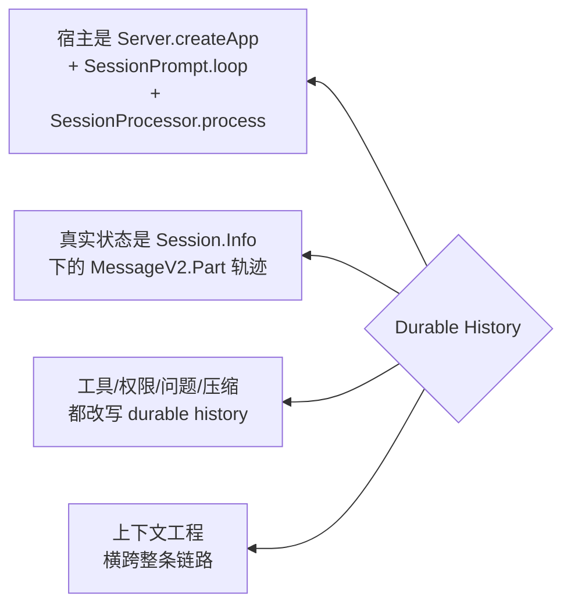
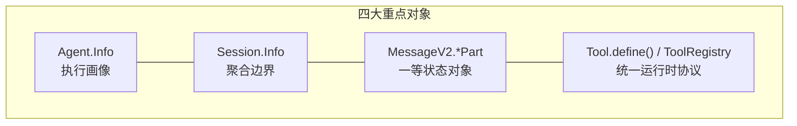
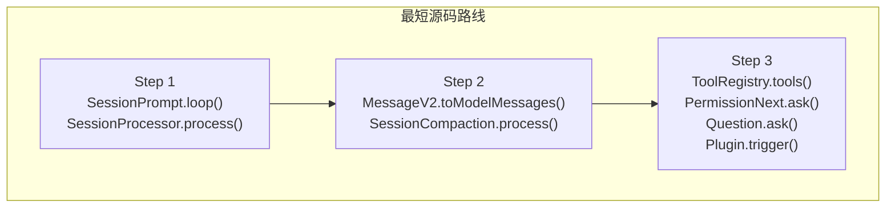

# OpenCode Agent 机制 Kickoff

- [从入口到宿主：OpenCode 的 agent 实际运行在哪里](./01-runtime-host.md)
- [架构总图怎么读：把目录树翻译成调用骨架，而不是模块清单](./02-architecture-diagram.md)
- [一次请求的完整生命周期：一条用户输入怎样被编译成 durable execution log](./03-request-lifecycle.md)
- [为什么 session 才是中心：源码里它定义的是执行边界，而不是聊天容器](./04-session-centric-runtime.md)
- [把对象模型放回执行链里看：Agent、Session、MessageV2、Tool 与交互原语如何协作](./05-object-model.md)
- [上下文工程并不只发生在 system prompt：OpenCode 在多个阶段共同塑造模型视角](./06-context-engineering.md)
- [上下文工程深拆一：system、provider、environment 与 instruction 是怎样层层叠上去的](./07-context-system-and-instructions.md)
- [上下文工程深拆二：输入预处理、命令展开与 history rewrite 怎样改写模型看到的世界](./08-context-input-and-history-rewrite.md)
- [上下文注入顺序图：OpenCode 真正控制的是装配顺序，不只是装配内容](./09-context-injection-order.md)
- [loop 与 processor：OpenCode 把状态机拆成两层之后，代码为什么会稳很多](./10-loop-and-processor.md)
- [loop 源码逐段解剖：主循环怎样把 session 推进成状态机](./11-loop-source-walkthrough.md)
- [processor 源码逐段解剖：单轮执行怎样被写成 durable parts](./12-processor-source-walkthrough.md)
- [subagent、compaction 与 structured output：这些高级能力为什么没有长歪](./13-advanced-primitives.md)
- [硬编码与可配置的边界：骨架固定，策略晚绑定](./14-hardcoded-vs-configurable.md)
- [为什么不同入口看到的 agent 行为会不一样：共享主循环，不共享初始化条件](./15-client-differences.md)
- [观测性为什么这么强：因为主状态本来就是事件化的](./16-observability.md)
- [这套设计为什么值得研究：因为复杂度直接对着长任务运行时开刀](./17-why-this-design-matters.md)
- [建议的源码阅读路径：先打通状态机，再扩展到上下文和扩展点](./18-reading-path.md)
- [最终心智模型：把 OpenCode 看成“以 durable log 为真相源的 session 调度器”](./19-final-mental-model.md)

## 先抓住四个源码判断

&nbsp;

&nbsp;

- 宿主不是 CLI，而是 `Server.createApp()`（`packages/opencode/src/server/server.ts:58-575`）建立出来的实例上下文，加上 `SessionPrompt.loop()`（`packages/opencode/src/session/prompt.ts:277-735`）和 `SessionProcessor.process()`（`packages/opencode/src/session/processor.ts:46-425`）这条 session runtime 主链。
- OpenCode 的真实状态不是某份当前 prompt，而是 `Session.Info`（`packages/opencode/src/session/index.ts:122-164`）作用域下的 `MessageV2.Part`（`packages/opencode/src/session/message-v2.ts:377-395`）轨迹；`Session.updateMessage()`（`packages/opencode/src/session/index.ts:686-706`）和 `Session.updatePart()`（`packages/opencode/src/session/index.ts:755-776`）是最核心的写路径。
- 工具、权限、问题、压缩、子任务都没有旁路状态。`Tool.Context`（`packages/opencode/src/tool/tool.ts:17-27`）、`PermissionNext.ask()`（`packages/opencode/src/permission/index.ts:148-182`）、`Question.ask()`（`packages/opencode/src/question/index.ts:109-133`）、`SessionCompaction.process()`（`packages/opencode/src/session/compaction.ts:102-297`）和 `TaskTool.execute()`（`packages/opencode/src/tool/task.ts:46-163`）都在改写同一条 durable history。
- 上下文工程横跨整条链路：`SessionPrompt.createUserMessage()`（`packages/opencode/src/session/prompt.ts:965-1355`）先预处理输入，`InstructionPrompt.system()`（`packages/opencode/src/session/instruction.ts:117-142`）与 `SystemPrompt.environment()`（`packages/opencode/src/session/system.ts:32-57`）负责 system 侧拼装，`MessageV2.toModelMessages()`（`packages/opencode/src/session/message-v2.ts:559-792`）与 `ProviderTransform.message()`（`packages/opencode/src/provider/transform.ts:252-289`）再把 durable history 重写成 provider 可消费的消息。

## 读这套代码时最该盯住的对象

&nbsp;

&nbsp;

- `Agent.Info`（`packages/opencode/src/agent/agent.ts:25-50`）不是类层次，而是执行画像；agent 差异大多落在 prompt、permission、model 和 options 上。
- `Session.Info`（`packages/opencode/src/session/index.ts:122-164`）不是聊天记录头，而是目录、权限、父子关系、share、revert、summary 的聚合边界。
- `MessageV2.ToolPart`（`packages/opencode/src/session/message-v2.ts:335-344`）、`MessageV2.ReasoningPart`（`packages/opencode/src/session/message-v2.ts:121-132`）和 `MessageV2.SubtaskPart`（`packages/opencode/src/session/message-v2.ts:210-225`）说明 OpenCode 把执行过程本身物化成了一组第一等状态对象。
- `Tool.define()`（`packages/opencode/src/tool/tool.ts:49-89`）和 `ToolRegistry.tools()`（`packages/opencode/src/tool/registry.ts:132-173`）说明工具面也不是零散函数，而是一套统一的运行时协议。

## 最短源码路线

&nbsp;

&nbsp;

如果只想用最短路径看懂 OpenCode，先读 `SessionPrompt.loop()`（`packages/opencode/src/session/prompt.ts:277-735`）和 `SessionProcessor.process()`（`packages/opencode/src/session/processor.ts:46-425`），再读 `MessageV2.toModelMessages()`（`packages/opencode/src/session/message-v2.ts:559-792`）和 `SessionCompaction.process()`（`packages/opencode/src/session/compaction.ts:102-297`），最后回头看 `ToolRegistry.tools()`（`packages/opencode/src/tool/registry.ts:132-173`）、`PermissionNext.ask()`（`packages/opencode/src/permission/index.ts:148-182`）、`Question.ask()`（`packages/opencode/src/question/index.ts:109-133`）和 `Plugin.trigger()`（`packages/opencode/src/plugin/index.ts:112-127`）。这样读，你看到的是一台状态机如何被扩展，而不是一堆功能点如何堆起来。
