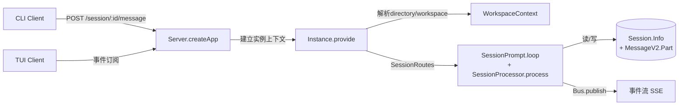

# 从入口到宿主：OpenCode 的 agent 实际运行在哪里

主向导对应章节：`从入口到宿主`

&nbsp;

  

OpenCode 的 agent 不住在 CLI 里。`RunCommand.handler()`（`packages/opencode/src/cli/cmd/run.ts:306-672`）真正做的事，是解析参数、补齐附件、创建或选择 session（`packages/opencode/src/cli/cmd/run.ts:381-394`），然后订阅 `/event` 流并把 `message.part.updated` 渲染成终端输出（`packages/opencode/src/cli/cmd/run.ts:441-553`）。它是 client，而不是宿主。

真正的宿主是 `Server.createApp()`（`packages/opencode/src/server/server.ts:58-575`）和其背后的实例上下文。服务端在请求进入时先解析 `directory` 与 `workspace`，再通过 `WorkspaceContext.provide()` 和 `Instance.provide()` 建立本次执行的目录、工作树、项目和插件作用域（`packages/opencode/src/server/server.ts:195-221`）。这个上下文一旦建立，后面的 session、tool、instruction、plugin、MCP 都在同一个实例里工作。

`SessionRoutes`（`packages/opencode/src/server/routes/session.ts:25-1023`）把外部操作统一汇入 session runtime：发消息走 `SessionPrompt.prompt()`（`packages/opencode/src/session/prompt.ts:161-188`），执行命令走 `SessionPrompt.command()`（`packages/opencode/src/session/prompt.ts:1781-1923`），执行本地 shell 走 `SessionPrompt.shell()`（`packages/opencode/src/session/prompt.ts:1509-1745`）。一旦进入这些入口，真正推动 agent 前进的是 `SessionPrompt.loop()`（`packages/opencode/src/session/prompt.ts:277-735`）和 `SessionProcessor.process()`（`packages/opencode/src/session/processor.ts:46-425`），而不是发起调用的客户端。

这也是为什么 OpenCode 天然支持 resume、fork、share 和多入口接管。状态不依赖某个前端进程，而依赖 `Session.Info`（`packages/opencode/src/session/index.ts:122-164`）及其 message/part 轨迹；事件分发也不依赖某个 UI，而依赖 `Bus.publish()`（`packages/opencode/src/bus/index.ts:41-64`）和 `/event` SSE（`packages/opencode/src/server/server.ts:502-556`）。从源码角度说，宿主是 server + instance + session runtime 这三层的组合，CLI/TUI/Web 只是不同的操作面。
