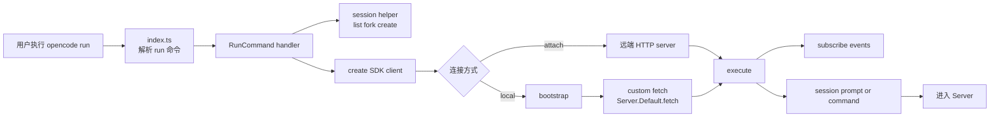
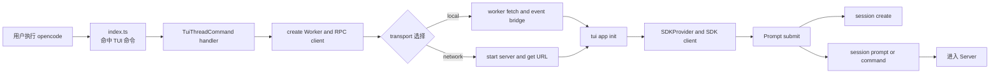
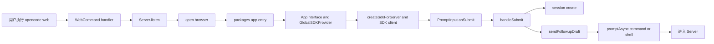

# 从用户入口开始：CLI、TUI、Web、Serve、ACP、Desktop — 每条路怎么走到 Server

> **总纲** [00-opencode_ko](./00-opencode_ko.md) · **能力域** I. 入口与架构 · **分层定位** 第一层：宿主与入口层
> **前置阅读** [14-hardcoded-vs-configurable](./14-hardcoded-vs-configurable.md)
> **后续阅读** [02-server-and-routing](./02-server-and-routing.md) · [16-observability](./16-observability.md)

## 为什么要从入口开始看

很多人看 OpenCode 源码，第一反应是去找 "agent 主循环在哪里"。但如果你从这里开始，你会发现一件事：**同一个主循环，被六七种完全不同的宿主形态调用过。** CLI 是命令行直接触发，TUI 多了一层 worker 线程，Web 是浏览器 HTTP 回连，serve 是无头守护进程，ACP 是 stdin/stdout 的 ND-JSON 协议桥，桌面应用是 sidecar 子进程。它们的共同终点都是 `Server`（OpenCode 的 HTTP 服务模块，基于 Hono 框架，定义在 `src/server/server.ts`）里那套 session runtime（以 session 为执行边界的 agent 调度引擎，核心是 `SessionPrompt` → `SessionProcessor` 的主循环），但到达 Server 之前的路径、transport 选择、上下文注入方式各不相同。

所以这篇文档做一件事：**把所有入口到 Server 的路径都走一遍，讲清楚每条路上"谁触发、经过谁、怎么到达 Server"。**

读完这篇，你会理解一个关键事实：**OpenCode 的第一层（宿主与入口层）不是一个入口，而是一组入口适配器。** 它们各自适配不同的宿主环境，但最终都把请求汇入同一条 `SessionRoutes` → `SessionPrompt` 的主线。

---

## 零、先看全景：有多少种方式启动 OpenCode

在进入每条路径的细节之前，先把所有入口摆在一起，建立一个全景印象。

### 安装与发现

用户拿到 OpenCode 的第一条路径是安装：

```bash
curl -fsSL https://opencode.ai/install | bash
```

这个安装脚本（`install:1-460`）做了一件很朴素的事：检测你的平台、架构、是否支持 AVX2、是否是 musl libc，然后从 GitHub Releases 下载对应平台的原生二进制文件，放到 `~/.opencode/bin`，再把这目录加到 PATH 里。

如果你走 npm 安装（`npm i -g opencode-ai`），那实际执行的入口变成了一个 Node.js shim：

- `packages/opencode/bin/opencode:1-179`

这个 shim 不做任何 agent 的事。它的全部工作是：检测平台 → 找到对应的原生二进制 → `spawnSync` 执行它。你可以把它理解成一个"二进制加载器"。

### 六种核心启动方式

| 命令 | 宿主形态 | transport 到 Server | 一句话描述 |
|------|---------|-------------------|-----------|
| `opencode` | 终端 TUI | 本地：RPC worker → `Server.Default().fetch()`；网络：HTTP | 交互式终端界面 |
| `opencode run "prompt"` | 终端 CLI | 本地：自定义 fetch → `Server.Default().fetch()`；`--attach`：HTTP | 非交互式一次性执行 |
| `opencode serve` | 无头进程 | 本身就是 Server | HTTP API 守护进程 |
| `opencode web` | 浏览器 | 先起 Server，浏览器 HTTP 回连 | 服务器 + 浏览器 UI |
| `opencode acp` | stdin/stdout | 内嵌 Server + SDK over HTTP | ACP 协议桥 |
| `opencode attach <url>` | 终端 TUI | 直接连远端 HTTP server | 附加到已有 server |

### 管理类命令

这些命令不直接参与 agent 主循环，但也是入口：

| 命令 | 说明 |
|------|------|
| `opencode models` | 列出可用模型 |
| `opencode mcp` | 管理 MCP 服务器（add / list / auth / logout / debug） |
| `opencode agent` | 创建/列出 agent |
| `opencode providers` / `opencode auth` | 管理 provider 认证 |
| `opencode session` | 管理会话（list / delete） |
| `opencode stats` | 查看 token 用量和费用统计 |
| `opencode db` | 数据库工具（交互式查询 / path / migrate） |
| `opencode debug` | 调试工具集（config / lsp / ripgrep / file / skill / snapshot / agent / paths） |
| `opencode pr <number>` | 拉取 GitHub PR 分支并启动 TUI |
| `opencode github install/run` | GitHub Actions 集成 |
| `opencode export/import` | 会话数据导入导出 |
| `opencode upgrade` | 版本升级 |
| `opencode uninstall` | 卸载 |
| `opencode completion` | 生成 shell 补全脚本 |

### 桌面应用

桌面应用不走命令行，而是通过 sidecar 模式（主应用把 opencode 作为子进程启动，子进程跑 `opencode serve` 起 HTTP 服务，主应用的 WebView/BrowserWindow 再连上去）嵌入 opencode：

- **Tauri 版**（`packages/desktop/`）：`opencode_lib::run()` 启动 sidecar 子进程运行 `opencode serve`
- **Electron 版**（`packages/desktop-electron/`）：`cli.ts:serve()` 生成命令 `opencode --print-logs --log-level WARN serve --hostname ... --port ...`，spawn 为子进程

两者的共同点是：**桌面应用本身不做 agent 逻辑，它只是把 `opencode serve` 当子进程跑起来，然后用浏览器窗口连上去。**

如果你是从源码开发桌面端，当前仓库里能直接启动的命令有两条：

```bash
# Tauri 版（根目录已暴露快捷脚本）
bun run dev:desktop
# 等价于
bun run --cwd packages/desktop tauri dev

# Electron 版（需要进对应子包执行）
bun run --cwd packages/desktop-electron dev
```

它们分别适合的场景也不一样：

- **Tauri 版**：更偏"正式桌面壳"开发。适合你要看原生窗口集成、Tauri plugin、Rust 侧生命周期管理、Linux Wayland/X11 适配时使用。
- **Electron 版**：更偏"Node/Electron 宿主"开发。适合你要看 BrowserWindow、IPC、electron-updater、Windows/WSL 兼容路径，或者排查 Electron 打包/分发问题时使用。

之所以会有两种实现，不是因为 OpenCode 有两套 agent 内核，而是因为**宿主壳层有两种技术路线**：Tauri 偏原生、壳更轻；Electron 偏成熟桌面运行时、Node 主进程能力更强。两者共享同一套 `packages/app` 前端和同一个 `opencode serve` sidecar，分叉点只在"谁来当桌面窗口宿主"这一层。

### 开发模式

如果你想从源码跑：

```bash
# 根目录
bun run dev

# 或在 packages/opencode 目录
bun run --conditions=browser ./src/index.ts
```

还有一个 `workspace-serve` 命令（`packages/opencode/src/cli/cmd/workspace-serve.ts`），只在 `Installation.isLocal()` 为 true 时注册（`packages/opencode/src/index.ts:149-151`），用于本地开发时启动远程 workspace 事件服务器。

### 前置约定：三种输入类型

在进入每条路径的细节之前，还有一个概念必须先交代清楚，否则后面 CLI、TUI、Web 三段都会出现让人困惑的术语：**用户输入到了 Server 之后，到底分哪几种？**

OpenCode 把用户输入分成三种类型，每种对应一个 SDK 调用：

| 输入类型 | 用户怎么触发 | SDK 调用 | 含义 |
|---------|------------|---------|------|
| **prompt**（普通消息） | 直接输入文本，按 Enter | `sdk.client.session.prompt(...)` / `promptAsync(...)` | 把文本发给 LLM，走完整的 agent 主循环 |
| **command**（斜杠命令） | 输入 `/` 开头的命令，如 `/help`、`/compact` | `sdk.client.session.command(...)` | 触发预定义的命令模板，可能走 MCP prompt 或 skill |
| **shell**（Shell 模式） | 输入 `!` 开头的命令，如 `!ls` | `sdk.client.session.shell(...)` | 直接在宿主机上执行 shell 命令，不经过 LLM |

后面讲到 CLI 的 `run` 时会说"命令模式走 `sdk.client.session.command(...)`"，讲到 TUI 的 `Prompt.submit()` 时会说"slash command"，讲到 Web 的 `handleSubmit` 时会说"shell 模式"——它们都是在说这三种输入类型。**先记住这张表，后面就不会迷路。**

---

## 一、从安装到执行：那条二进制链路

在讲每种启动方式之前，先看一个很多文档跳过的问题：**用户敲下 `opencode` 之后，到底执行的是什么？**

### 1.1 curl 安装路径

```bash
curl -fsSL https://opencode.ai/install | bash
```

安装脚本（`install`）会：

1. 检测平台和架构（`install:79-100`）。
2. 检测 AVX2 支持（`install:130-158`）—— x64 上很关键，决定用标准版还是 baseline 版。
3. 检测 musl libc（`install:117-128`）—— Alpine Linux 用户会用到。
4. 从 GitHub Releases 下载对应包（`install:267-325`）。
5. 解压到 `~/.opencode/bin`（`install:327-346`）。
6. 修改 shell 配置文件把 `~/.opencode/bin` 加入 PATH（`install:362-438`）。

最终产物是 `~/.opencode/bin/opencode`——这就是原生二进制。

### 1.2 npm 安装路径

```bash
npm i -g opencode-ai
```

这时安装的是 `packages/opencode/bin/opencode` 这个 Node.js shim（`bin/opencode:1-179`）。它的工作流程：

1. 检查 `OPENCODE_BIN_PATH` 环境变量——如果设置了，直接用那个路径（`bin/opencode:20-23`）。
2. 检查同目录下是否有 `.opencode` 缓存文件（`bin/opencode:29-32`）。
3. 检测平台、架构、AVX2、musl（`bin/opencode:34-104`）。
4. 构建候选包名列表，按优先级排序（`bin/opencode:106-149`）。比如 `linux-x64` + AVX2 的候选顺序是：`opencode-linux-x64` → `opencode-linux-x64-baseline` → `opencode-linux-x64-musl` → `opencode-linux-x64-baseline-musl`。
5. 从 shim 位置向上遍历 `node_modules` 目录树，找到第一个匹配的包（`bin/opencode:151-167`）。
6. `spawnSync` 执行找到的二进制（`bin/opencode:8-18`）。

**不管哪种安装方式，最终执行的都是同一个原生（Rust）二进制。** 这个二进制编译自 `packages/opencode/src/index.ts`，包含了 yargs CLI 定义和所有子命令。

### 1.3 CLI 路由层：`index.ts` 做了什么

所有命令的公共前置逻辑在 `packages/opencode/src/index.ts:67-123` 的 middleware 里：

1. 初始化日志（`index.ts:68-76`）——本地开发用 DEBUG，否则 INFO。
2. 设置 `AGENT=1`、`OPENCODE=1`、`OPENCODE_PID` 环境变量（`index.ts:78-80`）。
3. 检测首次运行的 SQLite 迁移（`index.ts:87-122`）——如果数据目录里没有 `opencode.db`，就执行 `JsonMigration.run()`，把旧的 JSON 存储迁移到 SQLite，期间显示进度条。

然后 yargs 解析命令，命中对应的 `Command.handler()`。

**这个 middleware 对所有入口都生效。** 不管用户跑 `opencode serve` 还是 `opencode run` 还是 `opencode mcp add`，日志初始化和数据库迁移都会先跑一遍。

---

## 二、CLI：`opencode run "..."` 之后，怎样走到 Server

### 1. CLI 是怎么触发的

CLI 入口来自命令行本身。用户执行例如：

```bash
opencode run "fix this bug"
```

真正接住这个命令的是 `packages/opencode/src/index.ts` 里的 yargs 注册：

- `packages/opencode/src/index.ts:126-150`

其中：

- `index.ts` 把 `RunCommand` 注册到命令表。
- `cli.parse()` 解析用户输入。
- 命中 `run` 子命令后，进入 `RunCommand.handler()`。

也就是说，CLI 的第一个触发点不是 UI 组件，而是：

**shell 命令 → yargs parse → `RunCommand.handler()`**

### 2. 到 Server 之前的调用链



### 3. 每一步在代码里对应什么

#### 第一步：命令解析进入 `RunCommand.handler()`

- `packages/opencode/src/index.ts:126-150`
- `packages/opencode/src/cli/cmd/run.ts:221-675`

`index.ts` 只负责把 `run` 绑定到 `RunCommand`。真正的入口逻辑在：

- `RunCommand.handler()`

#### 第二步：先确定 session，而不是立刻发 prompt

`RunCommand.handler()` 里有一个局部的 `session(sdk)` helper：

- `packages/opencode/src/cli/cmd/run.ts:381-394`

它会先处理：

- `--continue`
- `--session`
- `--fork`
- 不存在 session 时新建 session

而且 CLI 会在新建 session 时把默认权限写进去：

- `question -> deny`
- `plan_enter -> deny`
- `plan_exit -> deny`

代码在：

- `packages/opencode/src/cli/cmd/run.ts:357-373`
- `packages/opencode/src/cli/cmd/run.ts:392`

所以 CLI 的本地入口逻辑，第一件事是**构造 session 初始状态**。

#### 第三步：创建 SDK client，但 transport 有两条分支

CLI 到 Server 前，最大的分叉点在这里。

##### 分支 A：`--attach`，直接连远端 server

代码：

- `packages/opencode/src/cli/cmd/run.ts:655-664`

这里会：

1. 组装认证 header。
2. `createOpencodeClient({ baseUrl: args.attach, directory, headers })`
3. 后面所有 `sdk.client.session.*` 调用都会走远端 HTTP。

这条链路里，CLI 本地不会经过 `Server.Default().fetch()`。

##### 分支 B：默认本地模式，走内嵌 server

代码：

- `packages/opencode/src/cli/cmd/run.ts:667-673`

这里会：

1. `bootstrap(process.cwd(), ...)`
2. 自己构造一个 `fetchFn`
3. 这个 `fetchFn` 内部直接调用 `Server.Default().fetch(request)`
4. 再把这个 `fetchFn` 注入 `createOpencodeClient`

也就是说，本地 CLI 虽然表面上用的是 SDK，但它没有先起一个单独的 HTTP server 进程，而是：

**SDK → 自定义 fetch → 内嵌 `Server.Default().fetch()`**

#### 第四步：真正把用户输入变成请求

准备好 session 和 SDK 之后，`execute(sdk)` 才会开始发请求：

- [CLI] 普通文本走 `sdk.client.session.prompt(...)`
- [CLI] 命令模式走 `sdk.client.session.command(...)`

代码：

- `packages/opencode/src/cli/cmd/run.ts:634-651`

这一步之后，请求才开始越过本文边界，真正进入 Server。

### 4. CLI 这一段最该记住的一句话

**[CLI] 主线是：命令行触发 `RunCommand.handler()`，先准备 session，再创建 SDK；默认本地模式把 SDK 请求转给 `Server.Default().fetch()`，`--attach` 模式则直接发到远端 HTTP server。**

---

## 三、TUI：用户在终端里按 Enter 之后，怎样走到 Server

### 1. TUI 是怎么触发的

TUI 入口不是 `run` 子命令，而是默认命令：

- `opencode`
- 或 `opencode [project]`

注册位置：

- `packages/opencode/src/index.ts:127-130`

对应命令对象：

- `packages/opencode/src/cli/cmd/tui/thread.ts:65-225`

也就是说，TUI 的第一层触发是：

**shell 命令 → yargs → `TuiThreadCommand.handler()`**

但这还不是用户真正提交 prompt 的地方。用户真正的第二次触发发生在 TUI 界面里：

- 输入框按 Enter
- 或触发 `prompt.submit`

实际提交逻辑在：

- `packages/opencode/src/cli/cmd/tui/component/prompt/index.tsx:530-673`

所以 TUI 有两层触发：

1. 启动 TUI 程序
2. 在 TUI 输入框里提交一次 prompt

### 2. 到 Server 之前的调用链



### 3. 每一步在代码里对应什么

#### 第一步：启动 TUI 主线程

代码：

- `packages/opencode/src/cli/cmd/tui/thread.ts:101-225`

`TuiThreadCommand.handler()` 会做三件关键事：

1. 切工作目录。
2. 创建 `Worker`。
3. 决定 TUI 之后走哪种 transport。

#### 第二步：TUI 不是直接持有 Server，而是先经过 worker

代码：

- `packages/opencode/src/cli/cmd/tui/thread.ts:131-195`

这里创建了：

- `Worker(file, ...)`
- `Rpc.client<typeof rpc>(worker)`

接着构造两种桥接能力：

- `createWorkerFetch(client)`
- `createEventSource(client)`

这说明 TUI 的本地模式不是组件直接调用 `Server.Default().fetch()`，而是：

**TUI UI 线程 → RPC → worker → Server**

#### 第三步：worker 里才真正碰到内嵌 Server

对应代码：

- `packages/opencode/src/cli/cmd/tui/worker.ts:46-66`
- `packages/opencode/src/cli/cmd/tui/worker.ts:100-123`

这里有两个关键点：

1. `startEventStream()` 用 SDK 订阅事件流，再通过 `Rpc.emit("event", ...)` 推回 TUI 线程。
2. `rpc.fetch()` 内部直接调用 `Server.Default().fetch(request)`。

所以本地 TUI 打到 Server 前的最后一跳是：

**Prompt → SDK → 自定义 fetch → RPC → worker `rpc.fetch()` → `Server.Default().fetch()`**

#### 第四步：TUI 也可能改走外部 HTTP server

在 `thread.ts` 里，如果显式提供了网络相关参数，就不会走本地 worker fetch，而是：

- `client.call("server", network)` 先起一个 server
- 拿到返回的 URL
- 后续 TUI SDK 直接用这个 URL 发 HTTP/SSE

代码：

- `packages/opencode/src/cli/cmd/tui/thread.ts:176-195`

所以 TUI 和 CLI 一样，也有"本地内嵌"和"外部 HTTP"两种 transport，只是 TUI 多了一层 worker。

#### 第五步：UI 组件树里创建 SDK client

TUI 真正渲染界面的入口在：

- `packages/opencode/src/cli/cmd/tui/app.tsx:109-201`

这里会把 `url / fetch / events` 传给：

- `SDKProvider`

随后在：

- `packages/opencode/src/cli/cmd/tui/context/sdk.tsx:11-35`

里调用：

- `createOpencodeClient({ baseUrl, directory, fetch, events })`

所以，TUI 的 SDK 不是全局写死的，而是由 `thread.ts` 选好的 transport 注入进来。

#### 第六步：用户按 Enter，才真正提交 prompt

提交逻辑在：

- `packages/opencode/src/cli/cmd/tui/component/prompt/index.tsx:530-673`

这一段做了几件事：

1. 检查当前 prompt 内容和 model。
2. [TUI] 若当前没有 session，则先 `sdk.client.session.create(...)`
3. [TUI] 如果输入是 slash command，则走 `sdk.client.session.command(...)`
4. [TUI] 否则走 `sdk.client.session.prompt(...)`

关键代码：

- `packages/opencode/src/cli/cmd/tui/component/prompt/index.tsx:545-563`
- `packages/opencode/src/cli/cmd/tui/component/prompt/index.tsx:617-649`

这一步之后，请求才真正进入 Server。

### 4. TUI 这一段最该记住的一句话

**[TUI] 主线是：先由 `TuiThreadCommand` 起 UI 线程和 worker，选好 transport，再由输入框 `Prompt.submit()` 把一次 Enter 变成 `sdk.client.session.prompt()` 或 `command()`；本地模式下，这个请求会先经过 RPC worker，最后才到 `Server.Default().fetch()`。**

---

## 四、Web：用户在浏览器里点提交之后，怎样走到 Server

### 1. Web 是怎么触发的

Web 其实有两个入口动作。

第一个动作发生在终端里：

```bash
opencode web
```

对应代码：

- `packages/opencode/src/cli/cmd/web.ts:31-80`

这里会：

1. `Server.listen(opts)`
2. 输出访问地址
3. `open(displayUrl)` 打开浏览器

第二个动作发生在浏览器页面里：

- 用户在 Web 输入框里提交 prompt

真正处理浏览器提交的是前端 `packages/app`，不是文档站 `packages/web`。

### 2. 到 Server 之前的调用链



### 3. 每一步在代码里对应什么

#### 第一步：`opencode web` 先把 server 起起来

代码：

- `packages/opencode/src/cli/cmd/web.ts:31-80`

它和 `serve` 的区别是：

- `serve` 只起服务
- `web` 起服务后还会 `open(...)` 打开浏览器

也就是说，Web 入口的宿主触发先发生在 CLI 里。

#### 第二步：浏览器加载的是 `packages/app`

浏览器侧入口：

- `packages/app/src/entry.tsx:128-143`

这里会：

1. 取当前页面 URL
2. 把它包装成一个 `ServerConnection.Http`
3. `render(...)`
4. 挂载 `AppInterface`

所以 Web 前端从一开始就知道自己要连接哪个 server。

#### 第三步：全局 SDK 在应用根部创建

代码：

- `packages/app/src/app.tsx:287-304`
- `packages/app/src/context/global-sdk.tsx:15-42,211-229`
- `packages/app/src/utils/server.ts:4-22`

调用链是：

- `AppInterface`
- `GlobalSDKProvider`
- `createSdkForServer(...)`
- `createOpencodeClient(...)`

`createSdkForServer()` 做的事很简单但关键：

1. 取 server URL
2. 注入 Basic Auth header
3. 返回一个指向当前 server 的 SDK client

也就是说，Web 前端到 Server 前，并没有 worker 这层桥，也没有 `Server.Default().fetch()` 这类内嵌调用，它就是标准的浏览器 HTTP client。

#### 第四步：用户提交发生在 `PromptInput`

表单提交点在：

- `packages/app/src/components/prompt-input.tsx:1076-1098`
- `packages/app/src/components/prompt-input.tsx:1279-1280`

这里把：

- `DockShellForm onSubmit`

绑定到了：

- `createPromptSubmit(...).handleSubmit`

所以浏览器里真正把"点击发送"变成代码调用的第一站是：

**`PromptInput` → `handleSubmit`**

#### 第五步：`handleSubmit` 决定发哪一种请求

具体逻辑在：

- `packages/app/src/components/prompt-input/submit.ts:284-575`

它会先做：

1. 读取当前 prompt、model、agent
2. [Web] 如果当前是新会话，先 `sdk.client.session.create()`
3. [Web] 判断输入是 shell、slash command，还是普通 prompt

分支如下：

##### 普通 prompt

- `sendFollowupDraft(...)`
- [Web] 内部调用 `sdk.client.session.promptAsync(...)`

代码：

- `packages/app/src/components/prompt-input/submit.ts:358-377`
- `packages/app/src/components/prompt-input/submit.ts:552-560`
- `packages/app/src/components/prompt-input/submit.ts:152-159`

##### slash command

- [Web] 直接 `sdk.client.session.command(...)`

代码：

- `packages/app/src/components/prompt-input/submit.ts:450-479`

##### shell 模式

- [Web] 直接 `sdk.client.session.shell(...)`

代码：

- `packages/app/src/components/prompt-input/submit.ts:431-447`

所以 Web 到 Server 前的最后一步，其实非常清晰：

- 普通消息走 `promptAsync`
- slash command 走 `command`
- shell 输入走 `shell`

### 4. Web 这一段最该记住的一句话

**[Web] 主线是：`opencode web` 先起 server 并打开浏览器，浏览器里的 `packages/app` 再创建指向当前 URL 的 SDK client；用户提交时由 `PromptInput → handleSubmit` 决定走 `sdk.client.session.promptAsync`、`command` 还是 `shell`，然后通过标准 HTTP 请求进入 Server。**

---

## 五、Serve：`opencode serve` 之后，它自己就是 Server

### 1. Serve 是怎么触发的

`serve` 是所有入口里最特殊的一个——**它不是"到达" Server，它就是 Server 本身。**

```bash
opencode serve --port 4096 --hostname 0.0.0.0
```

对应代码：

- `packages/opencode/src/cli/cmd/serve.ts:9-24`

### 2. 它做了什么

`ServeCommand.handler()` 的逻辑极其精简：

1. 检查 `OPENCODE_SERVER_PASSWORD` 是否设置（`serve.ts:14`）。没有的话打印安全警告。
2. 解析网络选项——端口、hostname、mDNS、CORS（`serve.ts:17`），从 CLI 参数和全局配置合并。
3. 调用 `Server.listen(opts)`（`serve.ts:18`）——这是关键的一行。
4. 打印监听地址（`serve.ts:19`）。
5. `await new Promise(() => {})` 阻塞住进程（`serve.ts:21`），等 kill 信号。
6. 收到退出信号后调 `server.stop()`（`serve.ts:22`），清理 mDNS 和端口。

### 3. `Server.listen()` 内部发生了什么

`Server.listen()`（`packages/opencode/src/server/server.ts:535-578`）做三件事：

1. 调 `createApp()` 创建完整的 Hono（一个轻量级 Web 框架，类似 Express/Fastify，OpenCode 用它来定义所有 HTTP 路由）路由应用——包括 session、file、config、pty、mcp、provider、event、project、experimental、global 等所有路由。
2. 调 `Bun.serve()` 启动 HTTP 服务器，默认尝试 4096 端口，被占用则退回随机端口。
3. 如果启用了 mDNS（局域网服务发现协议，让同网段设备无需知道 IP 就能自动找到 opencode 服务），发布一个 `_opencode._tcp` 的 mDNS 记录，方便局域网发现。

**所以 `serve` 模式下，从用户操作到 Server 之间没有任何中间层。** 外部客户端（浏览器、另一个 `opencode attach`、或者 curl）直接发 HTTP 请求到这个 Hono 应用。

### 4. 谁在用 serve

- **桌面应用**：Tauri 和 Electron 都通过 sidecar 模式 spawn `opencode serve` 作为子进程。
- **远程工作流**：在一台服务器上 `opencode serve`，然后本地 `opencode attach http://server:4096`。
- **CI/CD**：`opencode github run` 内部也会启动 server。

### 5. Serve 这一段最该记住的一句话

**`serve` 是所有其他入口的"服务器端"——CLI 的 `--attach`、TUI 的 network 模式、Web 的浏览器、桌面应用的 sidecar，最终都连到一个 `Server.listen()` 起来的 Hono 应用。**

---

## 六、ACP：`opencode acp` 之后，stdin/stdout 变成了协议通道

前面几种入口里，OpenCode 都是自己控制 UI 或自己控制 HTTP server；但现实里还有一类宿主不是浏览器、不是终端 UI，而是**另一个进程**，比如 IDE 插件、桌面宿主、外部 agent 平台、编排器。这类宿主最自然的集成方式通常不是"我去连一个 HTTP 服务"，而是"我直接拉起一个子进程，然后通过 stdin/stdout 跟它说话"。ACP 就是为这种场景准备的：它让 OpenCode 以"可被别的程序托管"的形态存在。ACP 全称 Agent Client Protocol，是一种通过 ND-JSON（Newline-Delimited JSON）在 stdin/stdout 上传输 JSON-RPC 消息的协议。OpenCode 通过这个命令把自己暴露为一个 ACP agent。

### 1. ACP 是怎么触发的

```bash
opencode acp --cwd /path/to/project
```

对应代码：

- `packages/opencode/src/cli/cmd/acp.ts:12-70`

### 2. 它做了什么

`AcpCommand.handler()` 的执行流程：

1. 设置环境变量 `OPENCODE_CLIENT=acp`（`acp.ts:23`）。
2. 调 `bootstrap(process.cwd(), callback)`（`acp.ts:24`）——初始化完整的项目上下文（Plugin、Format、LSP、Vcs、Snapshot 等）。
3. 在 bootstrap 回调里，解析网络选项，调 `Server.listen(opts)`（`acp.ts:26`）**启动一个内嵌的 HTTP server**。
4. 创建一个 opencode SDK client 指向这个内嵌 server（`acp.ts:28-30`）。
5. 设置 ND-JSON 流（`acp.ts:32-55`）：
   - `WritableStream` 接 stdout，输出 JSON-RPC 响应。
   - `ReadableStream` 接 stdin，输入 JSON-RPC 请求。
   - 通过 `ndJsonStream` 把 stdin/stdout 包装成双向 ND-JSON 通道。
6. 初始化 ACP agent（`ACP.init({sdk})`）（`acp.ts:56`）。
7. 创建 `AgentSideConnection`（`acp.ts:58-60`）——这是 ACP 协议的连接处理器。
8. 等 stdin 关闭（`acp.ts:63-67`）。

### 3. ACP 的架构很值得品味

ACP 入口体现了一种典型的"协议桥"模式：

```
外部 ACP 客户端
    ↓ stdin/stdout ND-JSON
AgentSideConnection (JSON-RPC)
    ↓
ACP.* 方法 (src/acp/agent.ts:54)
    ↓ HTTP
OpencodeClient SDK
    ↓
Server (Hono 路由)
    ↓
Session runtime
```

注意这里有一个反直觉的设计：**ACP 命令也会启动一个内嵌 HTTP server。** 它不是直接在进程内调用 `Server.Default().fetch()`（像 CLI 本地模式那样），而是真的起了一个 Bun HTTP 服务，然后 SDK 通过 HTTP 跟它通信。

为什么要多此一举？因为 `bootstrap()` 需要一个完整的 Instance 上下文，而 ACP 协议的生命周期可能很长（连接保持期间一直有效），用独立的 HTTP server 可以更好地管理生命周期和资源。

换句话说，ACP 适用的是这种宿主环境：

- 宿主已经有自己的 UI 或编排逻辑，不想再嵌一个浏览器。
- 宿主更容易管理子进程和标准输入输出，而不是管理一个额外暴露的 HTTP 端口。
- 需要把 OpenCode 作为"能力后端"挂进去，而不是把 OpenCode 当成完整应用来启动。
- 需要协议层可组合、可代理、可转发，方便接入编辑器、IDE、自动化平台、代理网关。

所以 ACP 的价值不在于"比 HTTP 更强"，而在于**它把 OpenCode 从一个最终应用，变成了一个可以被别的 agent 宿主进程消费的协议端点。**

### 4. ACP 这一段最该记住的一句话

**ACP 是一种"协议翻译器"：外部客户端通过 stdin/stdout 的 ND-JSON 跟它对话，它把这些调用翻译成 opencode SDK 请求，转发给内嵌的 HTTP server，最终进入 session runtime。**

---

## 七、Attach：`opencode attach <url>` 之后，TUI 连到别人的 Server

### 1. Attach 是怎么触发的

```bash
opencode attach http://server:4096 --password mysecret
```

对应代码：

- `packages/opencode/src/cli/cmd/tui/attach.ts:9-88`

`attach` 的本质是：**把 TUI 前端"嫁接"到一个已经运行的 server 上。** 这个 server 可能是另一台机器上的 `opencode serve`，也可能是本地的桌面应用。

### 2. 它做了什么

`AttachCommand.handler()` 的流程：

1. 安装 Win32 的 CTRL+C 保护（`attach.ts:43-45`）。
2. 验证 `--fork` 必须搭配 `--continue` 或 `--session`（`attach.ts:47-51`）。
3. 处理 `--dir`：如果本地有这个目录就 chdir，否则作为远程目录名透传（`attach.ts:53-62`）。
4. 构造 Basic Auth header（`attach.ts:63-68`）——用 `opencode:{password}` 做 base64 编码。
5. 调 `Instance.provide()` 读 TUI 配置（`attach.ts:69-72`）——只做最轻量的初始化。
6. 调 `tui(url, config, sessionArgs, directory, headers)`（`attach.ts:73-83`）——启动 TUI。

### 3. 和 TuiThreadCommand 的关键区别

对比 `TuiThreadCommand`（`thread.ts`），`attach` 有一个根本性的差异：

| | TuiThreadCommand | AttachCommand |
|---|---|---|
| Server | 自己起（内嵌或 network） | 不起，连别人的 |
| Worker | 创建 worker + RPC | 不创建 worker |
| Transport | worker fetch 或 HTTP | 直接 HTTP |
| Session 管理 | 完整 | 依赖远端 |

`attach` 直接把远端 URL 传给 `tui()` 函数，`tui()` 再传给 `SDKProvider`，`SDKProvider` 创建一个指向远端的 opencode SDK client。没有 worker，没有 `Server.Default().fetch()`，就是纯粹的 HTTP 客户端。

### 4. Attach 这一段最该记住的一句话

**`attach` 是所有入口中最"轻"的——它不启动任何服务，不创建 worker，只是把 TUI 渲染出来然后连到远端 server。你可以把它理解成一个"远程 TUI 客户端"。**

---

## 八、桌面应用：sidecar 模式把 `opencode serve` 嵌进原生窗口

### 1. 桌面应用的触发方式

桌面应用不是命令行入口，但它们是 OpenCode 最终用户最常用的启动方式之一。两个版本（Tauri 和 Electron）采用了同一种架构模式：**sidecar**。

如果从源码开发角度看，这两个桌面入口对应两条不同命令：

```bash
# Tauri
bun run dev:desktop
# 或
bun run --cwd packages/desktop tauri dev

# Electron
bun run --cwd packages/desktop-electron dev
```

这里要注意一个细节：**根目录脚本默认只给 Tauri 暴露了 `dev:desktop`**，所以如果你只看根 `package.json`，会误以为桌面端只有一种。实际上 Electron 版依然在仓库里，只是需要直接进 `packages/desktop-electron` 跑它自己的 `dev` 脚本（`electron-vite dev`）。

### 2. Electron 版的工作流程

代码：

- `packages/desktop-electron/src/main/index.ts:46-200`
- `packages/desktop-electron/src/main/server.ts:32`
- `packages/desktop-electron/src/main/cli.ts:122`

流程：

1. 主进程创建一个 `serverReady` deferred promise（`index.ts:46`）。
2. 设置 loopback 代理绕过——确保 VPN/代理不会劫持 localhost 连接（`index.ts:57-58`）。
3. 获取可用端口（`index.ts:117`）。
4. 生成随机 UUID 作为 server 密码（`index.ts:120`）。
5. spawn 一个 sidecar 子进程，执行命令是：

```
opencode --print-logs --log-level WARN serve --hostname {host} --port {port}
```

环境变量：

```
OPENCODE_SERVER_USERNAME=opencode
OPENCODE_SERVER_PASSWORD={randomUUID}
```

6. 轮询 `GET /global/health` 端点，带 Basic Auth，直到 server 就绪（`server.ts`）。
7. 如果需要 SQLite 迁移，显示加载遮罩。
8. 创建 `BrowserWindow`，指向 server URL（`index.ts:177`）。
9. renderer 进程通过 IPC 获取 `{url, username, password}`，用它们构造 HTTP 请求。

**整个 Electron 应用就是一个封装过的浏览器窗口，里面跑的是 `packages/app` 的 Web UI，连的是 sidecar 起来的 HTTP server。**

### 3. Tauri 版的工作流程

代码：

- `packages/desktop/src-tauri/src/main.rs:42-78`

Tauri 版做了一些额外的平台适配：

1. 在 Linux 上检测 Wayland vs X11，设置对应的环境变量（`main.rs:5-40`）。
2. 确保 loopback 地址不被代理劫持（`main.rs:45-68`）——遍历 `NO_PROXY`/`no_proxy`，添加 `127.0.0.1`、`localhost`、`::1`。
3. 调用 `opencode_lib::run()` 启动 Tauri 应用。

Tauri 的 sidecar 逻辑在 `opencode_lib` 里，和 Electron 的模式一致：spawn `opencode serve` 子进程，WebView 连上去。

### 4. Desktop 这一段最该记住的一句话

**桌面应用的本质是：用原生窗口壳包一个浏览器，浏览器跑 `packages/app`，连接 sidecar 起来的 `opencode serve`。密码是每次启动随机生成的 UUID，确保即使在同一台机器上运行多个实例也不会冲突。**

如果再往前多记一层，可以把"为什么会有 Tauri + Electron 两套"压缩成一句话：

**OpenCode 只有一套桌面业务内核，但保留了两种桌面宿主壳。** Tauri 适合偏原生、偏轻量、偏 Rust/Tauri 生态的场景；Electron 适合偏成熟桌面壳、偏 Node 主进程能力、偏兼容性和传统桌面分发链路的场景。两者争夺的不是 agent 主循环，而是谁来负责窗口、IPC、更新、系统集成和 sidecar 进程管理。

---

## 九、把所有入口放在一起看

### 1. Transport 差异才是核心

很多人看入口时会按"CLI / TUI / Web"分类，但这其实不是最本质的区分。真正决定架构差异的是 **transport 到 Server 的方式**：

| Transport 模式 | 使用者 | 路径 |
|---------------|--------|------|
| **内嵌 fetch** | CLI 本地模式 | SDK → 自定义 fetch → `Server.Default().fetch()` |
| **RPC worker → 内嵌 fetch** | TUI 本地模式 | SDK → RPC → worker → `Server.Default().fetch()` |
| **内嵌 HTTP server** | ACP、`--port` TUI | SDK → HTTP → `Server.listen()` 起的 Bun 服务 |
| **远端 HTTP** | CLI `--attach`、TUI attach、Web 浏览器、Desktop renderer | SDK → HTTP → 远端 server |
| **自己就是 Server** | `opencode serve` | 外部客户端直接 HTTP 请求 |

### 2. 全量对比表

| 入口 | 用户触发方式 | 到 Server 前的关键本地层 | 是否自己起 Server | transport |
|------|------------|----------------------|----------------|-----------|
| CLI (`run`) | `opencode run "..."` | `RunCommand.handler()` 先建 session，再创建 SDK | 否（内嵌 `Server.Default().fetch()`） | 内嵌 fetch |
| CLI (`run --attach`) | `opencode run "..." --attach http://...` | 构造 auth header，创建远端 SDK | 否 | 远端 HTTP |
| TUI | `opencode` | `TuiThreadCommand` 起 worker，`Prompt.submit()` 发请求 | 否（内嵌）或是（network） | RPC worker 或 HTTP |
| TUI (`attach`) | `opencode attach http://...` | 构造 auth header，直接传 URL 给 TUI | 否 | 远端 HTTP |
| Web | `opencode web` | `WebCommand` 起 Server + 打开浏览器，`packages/app` 创建 HTTP SDK | 是 | 远端 HTTP（自己起的） |
| Serve | `opencode serve` | 直接调 `Server.listen()`，阻塞 | 是 | 自己就是 Server |
| ACP | `opencode acp` | `bootstrap` + `Server.listen()` + ND-JSON 桥 | 是（内嵌） | 内嵌 HTTP server |
| Desktop (Tauri) | 启动桌面应用 | `opencode_lib::run()` spawn sidecar | 是（sidecar） | sidecar HTTP |
| Desktop (Electron) | 启动桌面应用 | `cli.ts:serve()` spawn sidecar，轮询 health | 是（sidecar） | sidecar HTTP |

### 3. 三条核心认知

如果只抓本文主题，可以把所有链路压缩成下面三句话：

1. **所有入口的共同终点是 `Server` 内的 `SessionRoutes`。** 不管你从哪条路进来，最终都会打到 `POST /session/:sessionID/message`，然后进入 `SessionPrompt.prompt()`。
2. **入口之间的差异集中在三层：有没有 worker、有没有独立 HTTP server、是本地还是远端。** CLI 本地模式最短（直接 fetch），TUI 多一层 worker，Web/Desktop 多一个完整的网络栈。
3. **`serve` 是所有远程形态的基座。** `--attach`、Web、Desktop、甚至 ACP 都依赖一个运行中的 server——只是这个 server 是自己起的还是别人起的。

---

## 十、对后续阅读的引导

读完这篇，你应该已经建立了"从入口到 Server"的完整路径图。接下来推荐阅读：

- **[02-server-and-routing](./02-server-and-routing.md)**：进入 Server 内部，看 Hono 应用怎样创建、中间件怎样工作、路由怎样分发到 SessionRoutes。
- **[03-request-lifecycle](./03-request-lifecycle.md)**：从 `SessionRoutes` 往后，直接进入 `SessionPrompt.prompt()` 和 `SessionPrompt.loop()`，看 runtime 主循环怎样正式起跑。
- **[16-observability](./16-observability.md)**：从 `updateMessage` / `updatePart` 的写路径反推事件投影机制，理解为什么所有入口最终都能看到同一份状态。

下一篇应该从 Server 内部讲起，看请求怎样穿过中间件和路由，最终到达 session runtime。
