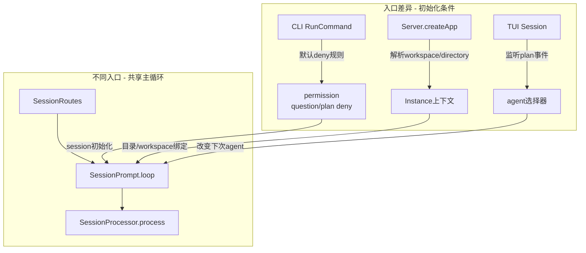

# 从用户入口开始：CLI、TUI、Web 怎样把请求送进同一套 runtime

> **总纲** [00-opencode_ko](./00-opencode_ko.md) · **能力域** I. 入口与架构 · **分层定位** 第一层：宿主与入口层
> **前置阅读** [14-hardcoded-vs-configurable](./14-hardcoded-vs-configurable.md)
> **后续阅读** [02-architecture-diagram](./02-architecture-diagram.md) · [16-observability](./16-observability.md)

这一篇从用户最先接触到的地方开始，也就是 CLI、TUI、Web 这些入口。它们都把请求送进同一套 `SessionRoutes -> SessionPrompt.prompt() -> SessionPrompt.loop() -> SessionProcessor.process()` 主链，但会在进入主链之前注入不同的初始条件。

真正需要记住的是两件事：

1. 用户先接触到的是入口。
2. runtime 真正接管执行的是入口背后的统一 session 主链。

## CLI：入口先决定权限和 session 初值

`RunCommand.handler()`（`packages/opencode/src/cli/cmd/run.ts:306-672`）在进入真正执行前，先构造了一组默认 deny 规则，其中 `question`、`plan_enter` 和 `plan_exit` 都被显式拒绝（`packages/opencode/src/cli/cmd/run.ts:357-373`）。随后 `session()` 这个局部 helper（`packages/opencode/src/cli/cmd/run.ts:381-394`）把这些规则写进新建 session。

这意味着 CLI 入口负责先给 session 写入权限边界和初始条件，再把请求交给统一 runtime。

## Server：入口负责挂载实例上下文

`Server.createApp()`（`packages/opencode/src/server/server.ts:195-221`）会从 query/header 里解析 `workspace` 与 `directory`，再通过 `WorkspaceContext.provide()` 和 `Instance.provide()` 把它们灌进后续所有路由。两个客户端即便最终都调用 `POST /session/:sessionID/message`（`packages/opencode/src/server/routes/session.ts:781-820`），只要绑定的 workspace 或 directory 不同，`InstructionPrompt.systemPaths()`（`packages/opencode/src/session/instruction.ts:72-115`）、`ReadTool.execute()`（`packages/opencode/src/tool/read.ts:28-231`）和插件作用域就会随之变化。

这一层负责把请求挂到正确的实例上下文上。

## TUI：入口叠加本地交互状态

`Session()` 组件（`packages/opencode/src/cli/cmd/tui/routes/session/index.tsx:116-232`）会监听 `message.part.updated`，在 `plan_exit` 或 `plan_enter` 完成后主动切换本地 agent 选择器（`packages/opencode/src/cli/cmd/tui/routes/session/index.tsx:217-232`）。这会影响用户下一次提交消息时带上的 agent 和交互状态。

这一层负责把服务端事件和本地 UI 状态接起来。

## 统一主链：入口之后都回到同一套 runtime

CLI、Server 和 TUI 在入口层各自注入不同初值，但进入 runtime 以后，共享的是同一套主链：

1. `SessionRoutes`（`packages/opencode/src/server/routes/session.ts:25-1023`）
2. `SessionPrompt.prompt()`（`packages/opencode/src/session/prompt.ts:161-188`）
3. `SessionPrompt.loop()`（`packages/opencode/src/session/prompt.ts:277-735`）
4. `SessionProcessor.process()`（`packages/opencode/src/session/processor.ts:46-425`）

因此这篇的核心结论可以直接写成一句话：

**OpenCode 从用户入口开始进入系统；CLI 负责 session 初值，Server 负责实例上下文，TUI 负责本地交互状态，三者随后都把请求送进同一套 session runtime。**
