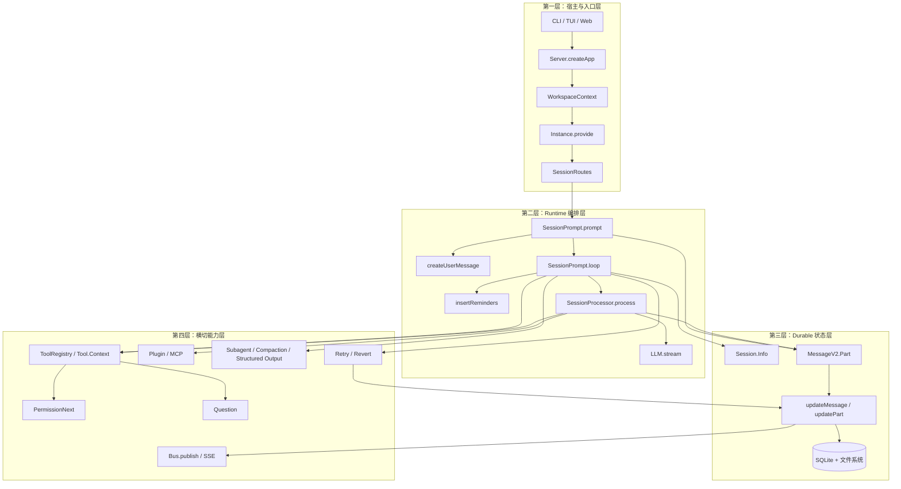

# 按四层读架构总图：先看骨架，再在每层里展开模块

> **总纲** [00-opencode_ko](./00-opencode_ko.md) · **分层定位** 四层骨架总览  
> **前置阅读** [01-user-entry](./01-user-entry.md)  
> **后续阅读** [03-request-lifecycle](./03-request-lifecycle.md)

这一篇不再把目录树当模块清单来背，而是把 OpenCode 压成一张四层架构图。**先认层，再认层内模块，最后再认每层对应的深拆文档。**

## 第一层：宿主与入口层

这一层的职责只有一个：**把外部请求挂到正确的实例上下文和 session 上。**

- `Server.createApp()`（`packages/opencode/src/server/server.ts:58-575`）是统一宿主入口。
- `WorkspaceContext.provide()` 与 `Instance.provide()`（调用点见 `packages/opencode/src/server/server.ts:195-221`）把 workspace、directory、插件和项目上下文灌进去。
- `SessionRoutes`（`packages/opencode/src/server/routes/session.ts:25-1023`）把 HTTP / CLI / TUI 的外部操作统一翻译成 session runtime 操作。

这一层读完后，你应该能说明入口怎样绑定实例上下文，以及不同入口为什么会带来不同初始条件。

继续展开时读：

- [01-user-entry](./01-user-entry.md)

## 第二层：Runtime 编排层

这一层负责“真正推进执行”。

- `SessionPrompt.prompt()`（`packages/opencode/src/session/prompt.ts:161-188`）把一次外部输入转成 runtime 里的正式动作。
- `SessionPrompt.createUserMessage()`（`packages/opencode/src/session/prompt.ts:965-1355`）在写入前完成输入预处理。
- `SessionPrompt.loop()`（`packages/opencode/src/session/prompt.ts:277-735`）做 session 级调度。
- `SessionProcessor.process()`（`packages/opencode/src/session/processor.ts:46-425`）做单轮执行。
- `LLM.stream()`（`packages/opencode/src/session/llm.ts:47-257`）提供第二层访问 provider 的统一接口。

这一层读完后，你应该能画出 `prompt -> loop -> process -> continue/compact/stop` 的主时钟。

继续展开时读：

- [03-request-lifecycle](./03-request-lifecycle.md)
- [06-context-engineering](./06-context-engineering.md)
- [10-loop-and-processor](./10-loop-and-processor.md)
- [11-loop-source-walkthrough](./11-loop-source-walkthrough.md)
- [12-processor-source-walkthrough](./12-processor-source-walkthrough.md)

## 第三层：Durable 状态层

这一层负责“什么才算被执行过”。

- `Session.Info`（`packages/opencode/src/session/index.ts:122-164`）定义执行边界。
- `MessageV2.Part`（`packages/opencode/src/session/message-v2.ts:377-395`）定义最小状态单元。
- `Session.updateMessage()`（`packages/opencode/src/session/index.ts:686-706`）和 `Session.updatePart()`（`packages/opencode/src/session/index.ts:755-776`）是统一写路径。
- SQLite 与文件系统保存 durable state，summary / fork / revert 站在这层之上成立。

这一层读完后，你应该能回答：OpenCode 为什么可以 resume、fork、share，为什么工具输出和普通文本能共存在同一条历史里。

继续展开时读：

- [04-session-centric-runtime](./04-session-centric-runtime.md)
- [05-object-model](./05-object-model.md)
- [20-storage-and-persistence](./20-storage-and-persistence.md)

## 第四层：横切能力层

这一层负责“哪些能力在主链的固定插槽里介入”。

- `ToolRegistry.tools()` 和 `Tool.Context` 提供统一工具面。
- `PermissionNext.ask()` 与 `Question.ask()` 提供用户介入原语。
- `Plugin.trigger()` 与 `MCP.tools()` 折叠扩展能力。
- `SessionCompaction.process()`、subagent、structured output 把高级能力接回主链。
- `Bus.publish()` 与 SSE 把 durable 写操作投影成实时事件。
- retry / revert / overflow compaction 提供恢复路径。

这一层读完后，你应该能回答：为什么 OpenCode 能做这么多事，但仍然没有长出第二套状态系统。

继续展开时读：

- [13-advanced-primitives](./13-advanced-primitives.md)
- [14-hardcoded-vs-configurable](./14-hardcoded-vs-configurable.md)
- [16-observability](./16-observability.md)
- [21-error-recovery](./21-error-recovery.md)

## 这张图的正确读法

如果只记一句话，就记这个顺序：

1. 第一层负责挂载上下文。
2. 第二层负责推进执行。
3. 第三层负责保存真相。
4. 第四层负责在固定插槽里扩展和恢复。

这样再回头看任何目录、模块名或文档标题，都能迅速知道它属于哪一层，为什么会在那里。
