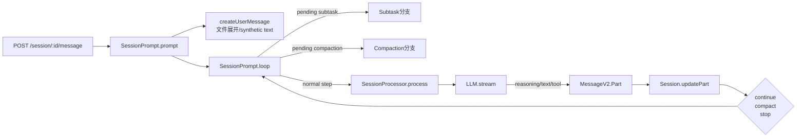

# 一次请求的完整生命周期：一条用户输入怎样被编译成 durable execution log

主向导对应章节：`一次请求的完整生命周期`

&nbsp;

最值得跟读的一条链是：`POST /session/:sessionID/message`（`packages/opencode/src/server/routes/session.ts:781-820`）调用 `SessionPrompt.prompt()`（`packages/opencode/src/session/prompt.ts:161-188`），后者先用 `SessionRevert.cleanup()` 清理回滚状态，再把输入交给 `SessionPrompt.createUserMessage()`（`packages/opencode/src/session/prompt.ts:965-1355`）落成真正的 user message，最后进入 `SessionPrompt.loop()`（`packages/opencode/src/session/prompt.ts:277-735`）。请求在这里就已经从“HTTP 调用”变成了“session runtime 的一次推进”。

`SessionPrompt.createUserMessage()`（`packages/opencode/src/session/prompt.ts:975-1349`）不是简单写 message 头和 text part。它会决定当前 agent 和 model，解析 variant，把 file/agent/subtask part 编译成真正的 `MessageV2.Part`（`packages/opencode/src/session/message-v2.ts:377-395`），并在必要时提前调用 `ReadTool.execute()`（`packages/opencode/src/tool/read.ts:28-231`）或 `MCP.readResource()`（`packages/opencode/src/mcp/index.ts:721-746`）把内容展开成 synthetic text。到这一步为止，“用户输入”已经被一次语义编译。

进入 `SessionPrompt.loop()`（`packages/opencode/src/session/prompt.ts:301-318`）后，runtime 会先从 durable history 恢复现场，而不是直接起一轮新模型调用。它会识别 `lastUser`、`lastAssistant`、`lastFinished` 以及 pending `subtask/compaction`，优先消费显式任务（`packages/opencode/src/session/prompt.ts:353-543`），必要时在 overflow 检查后补建 compaction request（`packages/opencode/src/session/prompt.ts:545-558`）。只有这些前置状态都处理完，才会进入 normal processing。

普通轮次的入口是 `SessionPrompt.loop()`（`packages/opencode/src/session/prompt.ts:560-687`）里创建 assistant message、插 reminder、解析 tools、拼 system 并调用 `SessionProcessor.process()`（`packages/opencode/src/session/processor.ts:46-425`）。processor 再通过 `LLM.stream()`（`packages/opencode/src/session/llm.ts:47-257`）消费 provider 流事件，把 reasoning、text、tool、step、patch 逐项写成 part（`packages/opencode/src/session/processor.ts:63-340`）。这里最关键的不是“模型回复了什么”，而是“这轮执行被拆成了哪些 durable state mutation”。

本轮结束后，processor 只回 `continue / compact / stop`（`packages/opencode/src/session/processor.ts:421-424`）。`SessionPrompt.loop()`（`packages/opencode/src/session/prompt.ts:713-723`）据此决定是否继续下一轮、是否创建 compaction message、是否结束执行；而 `SessionSummary.summarize()`（`packages/opencode/src/session/summary.ts:70-82`）和 `SessionCompaction.prune()`（`packages/opencode/src/session/compaction.ts:59-100`）则在旁边持续维护 diff 与旧工具输出的清理。一次请求的终点因此不是“拿到一段文本”，而是“主链完成了对 session durable log 的一次推进”。
