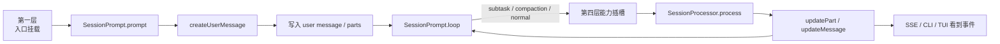

# 一次请求怎样穿过四层：从输入到 durable log 的完整生命周期

> **总纲** [00-opencode_ko](./00-opencode_ko.md) · **分层定位** 连接四层的主链  
> **前置阅读** [02-architecture-diagram](./02-architecture-diagram.md)  
> **后续阅读** [04-session-centric-runtime](./04-session-centric-runtime.md) · [10-loop-and-processor](./10-loop-and-processor.md)

如果说 [02](./02-architecture-diagram.md) 解决的是“这套系统分哪四层”，那这一篇解决的就是另一件事：**一次真实请求是怎样按顺序穿过这四层的。**

## 第一段：请求先穿过第一层，被绑定到实例上下文

无论请求来自 CLI、TUI 还是 Web，它都不会直接跳进模型调用。`Server.createApp()`（`packages/opencode/src/server/server.ts:58-575`）和 `SessionRoutes`（`packages/opencode/src/server/routes/session.ts:25-1023`）会先把它绑定到当前 workspace、directory 和 session。

第一层先完成挂载，确定下面三件事：

1. 这条请求属于哪个 session。
2. 这次执行工作目录是什么。
3. 后续 instruction、plugin、tool 应该落在哪个实例上下文里。

如果这一步错了，后面每一层看到的世界都会错。

## 第二段：进入第二层，输入先被编译，再进入主循环

`POST /session/:sessionID/message`（`packages/opencode/src/server/routes/session.ts:781-820`）最终会调用 `SessionPrompt.prompt()`（`packages/opencode/src/session/prompt.ts:161-188`）。从这里开始，第二层正式接管这次请求。

它先做三件事：

1. 清理可能存在的回滚状态。
2. 调 `SessionPrompt.createUserMessage()`（`packages/opencode/src/session/prompt.ts:965-1355`）把输入、附件、目录、MCP 资源、agent mention 编译成 durable user message。
3. 启动 `SessionPrompt.loop()`（`packages/opencode/src/session/prompt.ts:277-735`）。

这一段的关键点是：**用户输入在进入 loop 之前，已经先被编译成 durable state 了。**

## 第三段：第三层先把输入落盘，runtime 才能恢复现场

`createUserMessage()` 完成后，写入的是由 `MessageV2.Part`（`packages/opencode/src/session/message-v2.ts:377-395`）组成的 durable 消息。  
`Session.updateMessage()`（`packages/opencode/src/session/index.ts:686-706`）和 `Session.updatePart()`（`packages/opencode/src/session/index.ts:755-776`）把这些对象写回数据库和事件流。

当 `SessionPrompt.loop()` 开始工作时，它面对的是**已经落盘的 session history**。这也是它能从 `lastUser`、`lastAssistant`、pending subtask、pending compaction 等状态恢复现场的原因。

## 第四段：第二层进入 loop，先决定本轮到底处理什么

`SessionPrompt.loop()` 的第一职责是判定 session 当前应该消费哪类任务。

它会优先看 durable history 里有没有：

1. pending `subtask`
2. pending `compaction`
3. 需要继续的普通 assistant 轮次

只有这些前置状态都处理完，普通轮次才会走到 `SessionProcessor.process()`。这就是 OpenCode 与“每次收到消息就直接调一次 LLM”最大的不同。

## 第五段：第四层在固定插槽里介入，然后第二层继续推进

当普通轮次开始前，第四层能力就会陆续介入：

1. `ToolRegistry.tools()`（`packages/opencode/src/tool/registry.ts:132-173`）决定当前暴露哪些工具。
2. `InstructionPrompt.system()`、`SystemPrompt.environment()`、`Plugin.trigger()` 等共同构造 system 和 messages。
3. `PermissionNext.ask()`（`packages/opencode/src/permission/index.ts:148-182`）和 `Question.ask()`（`packages/opencode/src/question/index.ts:109-133`）在需要用户介入时挂起执行。
4. subagent、compaction、structured output 也会在 loop 或 processor 的固定节点插入。

这一步说明第四层以能力插槽的形式参与第二层推进。

## 第六段：processor 把一次模型流翻译成 durable state mutation

普通轮次真正执行时，`SessionProcessor.process()`（`packages/opencode/src/session/processor.ts:46-425`）会通过 `LLM.stream()`（`packages/opencode/src/session/llm.ts:47-257`）消费 provider 流，再把 reasoning、text、tool、patch、step 等内容一项项写成 `MessageV2.Part`。

这里最值得盯住的是“本轮被拆成了哪些 durable mutation”。  
processor 的职责是把单轮执行**翻译成可持久化、可恢复、可观察的 part 序列**。

## 第七段：第三层落盘后，第一层和第二层同时得到后续动作

本轮写入完成以后，会发生两件事：

1. 第三层通过 `updateMessage()` / `updatePart()` 继续扩充 durable history。
2. 第一层通过 `Bus.publish()` 和 `/event` SSE 把变化推给 CLI、TUI、Web。

与此同时，processor 只向 loop 返回 `continue / compact / stop`。  
loop 再根据这个返回值决定是否继续下一轮、是否创建 compaction 请求、是否结束本次推进。

一次请求的终点可以概括成：

**四层一起完成了一次对 session durable log 的推进、持久化和投影。**
