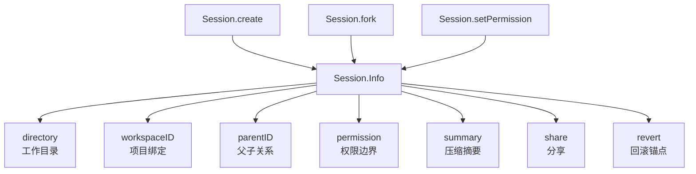

# 侧面回看：为什么 session 才是中心，源码里它定义的是执行边界而不是聊天容器

> **总纲** [00-opencode_ko](./00-opencode_ko.md) · **能力域** III. Session 与状态模型 · **分层定位** 第三层：Durable 状态层 · **阅读角色** 侧面展开
> **前置阅读** [03-request-lifecycle](./03-request-lifecycle.md) · [10-loop-and-processor](./10-loop-and-processor.md)
> **后续阅读** [05-对象模型](./05-object-model.md) · [20-持久化与存储](./20-storage-and-persistence.md)

这一篇不是 `02 -> 03 -> loop` 主线的直接续篇，而是从主线回头看：**为什么 `loop()`、`processor()`、`tool` 和恢复语义都要围绕 session 边界组织。**

把 OpenCode 看成”多轮聊天 + 工具调用”时，最容易低估的就是 `Session.Info`（`packages/opencode/src/session/index.ts:122-164`）。从字段上看，它似乎只是一些元数据；但沿着实现看，会发现 session 决定了工作目录、workspace、父子关系、权限、summary、share、revert 等所有执行边界。OpenCode 里真正长期存活的主体不是 CLI 进程，而是 session。

`Session.create()`（`packages/opencode/src/session/index.ts:219-237`）和 `Session.createNext()`（`packages/opencode/src/session/index.ts:297-338`）负责生成根 session 或 child session，默认标题、project/workspace 绑定和初始权限都在这里落盘。`Session.plan()`（`packages/opencode/src/session/index.ts:340-345`）甚至把 plan 文件路径也挂在 session 属性上，而不是让 plan mode 自己去猜目录。这说明 session 保存的不只是会话历史，还保存 runtime 需要稳定依赖的物理边界。

`Session.fork()`（`packages/opencode/src/session/index.ts:239-280`）更能说明它是执行容器而不是消息列表。fork 时不仅复制 message，还会重建 parent-child 映射并重新生成 part ID，使新 session 拥有独立而完整的执行轨迹。这个能力之所以自然，不是因为有“导出聊天记录”功能，而是因为消息和 part 从一开始就在 session 作用域下持久化。

权限和恢复也都依赖 session。`Session.setPermission()`（`packages/opencode/src/session/index.ts:423-441`）把入口差异或运行中变更的权限写进 session；`Session.setRevert()`（`packages/opencode/src/session/index.ts:444-468`）和 `Session.clearRevert()`（`packages/opencode/src/session/index.ts:472-488`）把回滚锚点直接挂在 session 上；`Session.messages()`（`packages/opencode/src/session/index.ts:524-537`）与 `Session.children()`（`packages/opencode/src/session/index.ts:652-662`）则提供了按 session 恢复执行现场的基本读取接口。

所以 OpenCode 的“session 中心化”不是一句架构口号，而是具体体现在：`SessionPrompt.loop()`（`packages/opencode/src/session/prompt.ts:277-735`）围绕 session 调度，`TaskTool.execute()`（`packages/opencode/src/tool/task.ts:46-163`）通过 child session 实现 subagent，`SessionCompaction.process()`（`packages/opencode/src/session/compaction.ts:102-297`）通过 summary message 改写 session 历史，`Server.createApp()`（`packages/opencode/src/server/server.ts:195-221`）通过实例上下文把请求绑定到某个 session 所属的目录和 workspace。读懂 session，才算抓住了这套 runtime 的宿主。
