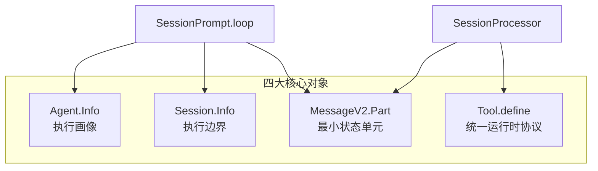

# 侧面回看：把对象模型放回执行链里看，Agent、Session、MessageV2、Tool 如何协作

> **总纲** [00-opencode_ko](./00-opencode_ko.md) · **能力域** IV. 对象模型 · **分层定位** 第三层：Durable 状态层 · **阅读角色** 侧面展开
> **前置阅读** [04-session中心化](./04-session-centric-runtime.md)
> **后续阅读** [06-上下文工程](./06-context-engineering.md) · [13-高级能力](./13-advanced-primitives.md)

这一篇同样不是主线代码流的继续推进，而是解释：**`loop()` 和 `processor()` 手里那些状态对象，到底各自是什么、为什么要分开。**

OpenCode 的对象模型不是围绕”聊天消息”组织的，而是围绕”执行状态”组织的。只看类型定义会觉得它对象很多；把它们放回主链后，会发现每个对象都在给 `SessionPrompt.loop()`（`packages/opencode/src/session/prompt.ts:277-735`）和 `SessionProcessor.process()`（`packages/opencode/src/session/processor.ts:46-425`）提供一块必要的状态面。

## Agent：执行画像，而不是继承树

`Agent.Info`（`packages/opencode/src/agent/agent.ts:25-50`）定义的不是类层次，而是一份声明式执行画像：`mode`、`permission`、`model`、`variant`、`prompt`、`options`、`steps` 才是 agent 差异的载体。`Agent.state`（`packages/opencode/src/agent/agent.ts:52-252`）先内建 `build / plan / general / explore / compaction / title / summary`，再把用户配置 merge 进去覆盖字段。这就是为什么新增 agent 往往不需要改控制流，只需要改画像数据。

## Session：会话是执行边界

`Session.Info`（`packages/opencode/src/session/index.ts:122-164`）里真正重要的字段是 `parentID`、`directory`、`workspaceID`、`permission`、`summary`、`share` 和 `revert`。这些字段让 session 同时携带身份、环境、权限和恢复语义。`Session.createNext()`（`packages/opencode/src/session/index.ts:297-338`）和 `Session.fork()`（`packages/opencode/src/session/index.ts:239-280`）也证明了这一点：创建或分叉 session 时，复制的不只是标题，而是整套执行边界。

## MessageV2：part 才是最小状态单元

`MessageV2.Part`（`packages/opencode/src/session/message-v2.ts:377-395`）把 text、reasoning、file、tool、step、patch、subtask、compaction 都统一成同一层结构。其中 `MessageV2.ToolPart`（`packages/opencode/src/session/message-v2.ts:335-344`）承载工具生命周期，`MessageV2.ReasoningPart`（`packages/opencode/src/session/message-v2.ts:121-132`）承载推理流，`MessageV2.CompactionPart`（`packages/opencode/src/session/message-v2.ts:201-208`）和 `MessageV2.SubtaskPart`（`packages/opencode/src/session/message-v2.ts:210-225`）则把高级能力纳入主链。`Session.updatePart()`（`packages/opencode/src/session/index.ts:755-776`）因此是整个 runtime 最核心的写路径之一。

## Tool：能力面依赖统一上下文，而不是裸函数

`Tool.Context`（`packages/opencode/src/tool/tool.ts:17-27`）把 `sessionID`、`messageID`、`agent`、`abort`、`messages`、`metadata()` 和 `ask()` 打包成统一执行上下文；`Tool.define()`（`packages/opencode/src/tool/tool.ts:49-89`）再为每个工具固定参数校验、截断和返回协议。这意味着工具不是“模型随手调用的函数”，而是 runtime 的正式参与者。`TaskTool.execute()`（`packages/opencode/src/tool/task.ts:46-163`）和 `ReadTool.execute()`（`packages/opencode/src/tool/read.ts:28-231`）都大量依赖这个上下文来访问权限、历史和 session 边界。

## Permission 与 Question：用户介入也有正式对象

`PermissionNext.Request`（`packages/opencode/src/permission/index.ts:42-60`）和 `Question.Request`（`packages/opencode/src/question/index.ts:34-47`）把“等待用户确认/回答”定义成正式对象，而不是 UI 状态。`PermissionNext.ask()`（`packages/opencode/src/permission/index.ts:148-182`）和 `Question.ask()`（`packages/opencode/src/question/index.ts:109-133`）都把挂起点写成 pending request，再通过 bus 和路由暴露给外部。这就是为什么 OpenCode 的对象模型读起来不像聊天应用，而像一个可暂停、可恢复的 agent runtime。
