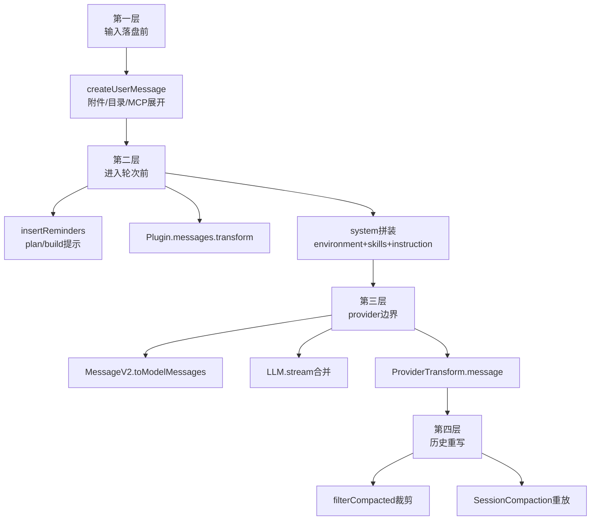

# 上下文工程并不只发生在 system prompt：OpenCode 在多个阶段共同塑造模型视角

> **总纲** [00-opencode_ko](./00-opencode_ko.md) · **能力域** V. 上下文工程
> **前置阅读** [05-对象模型](./05-object-model.md)
> **后续阅读** [07-system装配链](./07-context-system-and-instructions.md) · [08-输入预处理](./08-context-input-and-history-rewrite.md) · [09-注入顺序](./09-context-injection-order.md)

如果把 OpenCode 的上下文工程只理解成 `SystemPrompt.provider()`（`packages/opencode/src/session/system.ts:22-30`）或几份 prompt 模板，那会漏掉大半实现。真正决定模型“看见什么”的，是从 `SessionPrompt.createUserMessage()`（`packages/opencode/src/session/prompt.ts:965-1355`）到 `ProviderTransform.message()`（`packages/opencode/src/provider/transform.ts:252-289`）的一整条流水线。

第一层发生在输入落盘前。`SessionPrompt.createUserMessage()`（`packages/opencode/src/session/prompt.ts:965-1355`）会把附件、目录、MCP 资源、agent mention 先转成 durable parts，其中纯文本文件甚至会被提前用 `ReadTool.execute()`（`packages/opencode/src/tool/read.ts:28-231`）展开。模型看到的“用户输入”因此往往已经包含 synthetic read output，而不是原始附件引用。

第二层发生在进入普通轮次之前。`SessionPrompt.insertReminders()`（`packages/opencode/src/session/prompt.ts:1357-1495`）会注入 plan/build 切换提示，`Plugin.trigger("experimental.chat.messages.transform")`（调用点见 `packages/opencode/src/session/prompt.ts:652`）还可以整体改写消息数组；与此同时 `InstructionPrompt.system()`（`packages/opencode/src/session/instruction.ts:117-142`）、`SystemPrompt.environment()`（`packages/opencode/src/session/system.ts:32-57`）和 `SystemPrompt.skills()`（`packages/opencode/src/session/system.ts:59-71`）共同构建 system。

第三层发生在 provider 边界。`MessageV2.toModelMessages()`（`packages/opencode/src/session/message-v2.ts:559-792`）先把 durable history 翻译成 UIMessage，再由 `LLM.stream()`（`packages/opencode/src/session/llm.ts:47-257`）合并 model、agent、variant 和 provider options，最后 `ProviderTransform.message()`（`packages/opencode/src/provider/transform.ts:252-289`）按 provider 约束重写消息结构、tool-call ID、reasoning 字段和 cache point。换句话说，provider 适配并不是 transport 细节，而是上下文工程的最后一道工序。

第四层则是历史重写本身。`MessageV2.filterCompacted()`（`packages/opencode/src/session/message-v2.ts:882-898`）会裁掉被 summary 覆盖的旧消息，`SessionCompaction.process()`（`packages/opencode/src/session/compaction.ts:102-297`）又会在 overflow 后重放关键用户消息。OpenCode 的上下文工程因此包含两件事：一是“追加什么”，二是“保留什么”。后者同样决定模型能不能保持任务连续性。
