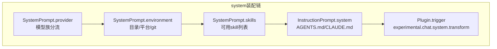

# 上下文工程深拆一：system、provider、environment 与 instruction 是怎样层层叠上去的

> **总纲** [00-opencode_ko](./00-opencode_ko.md) · **能力域** V. 上下文工程 · **分层定位** 第二层：Runtime 编排层
> **前置阅读** [06-上下文工程总览](./06-context-engineering.md)
> **后续阅读** [08-输入预处理与历史重写](./08-context-input-and-history-rewrite.md)

system 在 OpenCode 里不是一个模板文件，而是一条装配链。真正的装配发生在 `SessionPrompt.loop()`（`packages/opencode/src/session/prompt.ts:654-664`）和 `LLM.stream()`（`packages/opencode/src/session/llm.ts:68-95`）之间：前者先准备 environment、skills、instruction，后者再把 agent prompt、provider prompt、手工 system 和 user message 自带 system 合并成最终 header。

## provider prompt：模型族差异先在这里分叉

`SystemPrompt.provider()`（`packages/opencode/src/session/system.ts:22-30`）不是通用文案库，而是 provider family 的第一层分流器。它根据 model API ID 选择 `codex_header`、`beast`、`gemini`、`anthropic` 或 `default` 模板。随后 `LLM.stream()`（`packages/opencode/src/session/llm.ts:71-80`）会优先使用 agent 自定义 prompt；只有 agent 没有覆盖时，才退回 provider prompt。Codex 还进一步特判为 `options.instructions`（`packages/opencode/src/session/llm.ts:111-113`），不和普通 system 合流。

这段代码说明 system 的第一层其实是“模型适配层”。OpenCode 没有尝试写一个绝对统一的基础 prompt，而是承认不同模型族需要不同 header，再在其上叠加运行时信息。

## environment 与 skill：运行现场也进入 system

`SystemPrompt.environment()`（`packages/opencode/src/session/system.ts:32-57`）把目录、工作树、平台、日期和 git 状态写进 `<env>` 段落；`SystemPrompt.skills()`（`packages/opencode/src/session/system.ts:59-71`）则在 agent 允许 `skill` 工具时，把当前可用 skill 列表直接塞进 system。它们都不是“补充说明”，而是在模型调用前显式声明 runtime 现场。

这种设计的含义是：某些事实不等待模型自己发现。相较于让模型先调用 `pwd`、`ls` 或 `skill` 再建立世界模型，OpenCode 选择把最稳定、最关键的环境事实前置进 system，减少探索回合数。

## instruction 搜索：项目规则是运行时发现，不是编译期打包

`InstructionPrompt.systemPaths()`（`packages/opencode/src/session/instruction.ts:72-115`）定义了 instruction 文件的真实搜索顺序：先向上查项目里的 `AGENTS.md / CLAUDE.md / CONTEXT.md`，再查全局配置目录和 `~/.claude/CLAUDE.md`，最后把配置里声明的本地路径或 glob 展开。`InstructionPrompt.system()`（`packages/opencode/src/session/instruction.ts:117-142`）才去读这些文件内容，并额外支持从 URL 拉远端 instruction。

这意味着项目规则不是仓库启动时一次性载入的常量，而是每次实例化 `Instance.directory`（`packages/opencode/src/server/server.ts:195-221`）后动态发现的上下文。换目录、换 workspace、换 config，system 就会变。

## 最后还留了可变换钩子

即便 system 装到这一步，OpenCode 仍然保留了最后一刀。`LLM.stream()`（`packages/opencode/src/session/llm.ts:84-94`）会调用 `Plugin.trigger("experimental.chat.system.transform")`（`packages/opencode/src/plugin/index.ts:112-127`），允许插件在模型请求发出前继续改 system。也就是说，provider prompt、environment、skill、instruction 共同形成的是“默认装配顺序”，不是绝对封闭结构。

这条链读懂之后，再看 `SessionPrompt.insertReminders()`（`packages/opencode/src/session/prompt.ts:1357-1495`）或 `ReadTool.execute()`（`packages/opencode/src/tool/read.ts:28-231`）就会很清楚：它们并不是在替代 system，而是在 system 之外用 history 和 tool output 再做一次更局部的约束。
