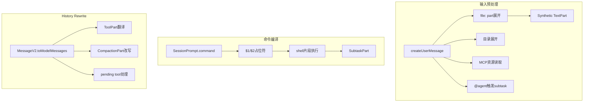

# 上下文工程深拆二：输入预处理、命令展开与 history rewrite 怎样改写模型看到的世界

> **总纲** [00-opencode_ko](./00-opencode_ko.md) · **能力域** V. 上下文工程
> **前置阅读** [07-system装配链](./07-context-system-and-instructions.md)
> **后续阅读** [09-注入顺序图](./09-context-injection-order.md)

OpenCode 对输入的第一轮改写发生在 `SessionPrompt.createUserMessage()`（`packages/opencode/src/session/prompt.ts:965-1355`），不是发生在模型调用之前的某个字符串模板里。这个函数把 `PromptInput.parts`（`packages/opencode/src/session/prompt.ts:94-159`）转成真正落盘的 `MessageV2.Part`（`packages/opencode/src/session/message-v2.ts:377-395`），并在这里提前执行了大量“上下文工程”：文件读取、目录展开、MCP 资源读取、`@agent` 触发 subtask hint、媒体内容降级成 synthetic text。

## 文件和目录不是附件，它们会先被预解释

当输入里出现 `file:` part 时，`SessionPrompt.createUserMessage()`（`packages/opencode/src/session/prompt.ts:1067-1268`）会按 MIME 类型走不同路径。纯文本文件和目录不会原样进入模型，而是先借用 `ReadTool.execute()`（`packages/opencode/src/tool/read.ts:28-231`）读成文本，再把“调用了 read 工具”和读出的正文一起写成 synthetic `MessageV2.TextPart`（`packages/opencode/src/session/message-v2.ts:104-119`）。这意味着用户“附加了一个文件”，在 durable history 里往往会变成“已经读过这个文件，并把结果当作上下文事实写进消息”。

MCP 资源也遵循相同原则。`SessionPrompt.createUserMessage()`（`packages/opencode/src/session/prompt.ts:999-1066`）在发现 `part.source.type === "resource"` 时，先调用 `MCP.readResource()`（`packages/opencode/src/mcp/index.ts:721-746`），再把文本资源写成 synthetic text，把二进制资源降级成占位说明。这说明输入预处理并不是纯本地文件逻辑，而是整个资源层都要先被转成历史的一部分。

## 命令不是 prompt 别名，而是一次新的输入编译

`SessionPrompt.command()`（`packages/opencode/src/session/prompt.ts:1781-1923`）是另一条重要的重写链。它先从 `Command.get()`（`packages/opencode/src/command/index.ts:144-146`）取命令模板，再处理 `$1/$2/$ARGUMENTS` 占位符（`packages/opencode/src/session/prompt.ts:1786-1813`），还会执行内嵌的 ``!`...` `` shell 片段（`packages/opencode/src/session/prompt.ts:1815-1829`）。这一步之后，命令已经不再是“用户输入的一句别名”，而是被编译成一套具体 prompt parts。

更关键的是，命令还可能直接改写执行拓扑。`SessionPrompt.command()`（`packages/opencode/src/session/prompt.ts:1870-1894`）在判断目标 agent 是否为 subagent 且命令允许 subtask 时，会把整条命令改写成一个 `MessageV2.SubtaskPart`（`packages/opencode/src/session/message-v2.ts:210-225`），把执行权交给 `SessionPrompt.loop()`（`packages/opencode/src/session/prompt.ts:353-529`）里的 subtask 分支，而不是当前 session 的普通模型轮次。

## history rewrite：durable parts 要再次翻译成 provider 可消费的消息

进入模型前，`MessageV2.toModelMessages()`（`packages/opencode/src/session/message-v2.ts:559-792`）会把 durable history 再翻译一遍。这里最重要的不是序列化，而是语义重写：`MessageV2.ToolPart`（`packages/opencode/src/session/message-v2.ts:335-344`）会被翻成 tool-call / tool-result；`MessageV2.CompactionPart`（`packages/opencode/src/session/message-v2.ts:201-208`）会被改写成“我们到目前为止做了什么”的文本；pending/running tool part 会被翻译成 error result，以避免某些 provider 悬挂 tool_use。

媒体也会在这一步被重新布置。`MessageV2.toModelMessages()`（`packages/opencode/src/session/message-v2.ts:703-778`）会根据 provider 是否支持 tool result media 决定是把图片留在 tool output 里，还是拆成单独的 user message。也就是说，同一条 durable history 在不同 provider 面前看到的 message 序列可能不同，但这个差异被集中在一处完成，而不是散在业务代码里。

## compaction 还会改写“历史窗口”的边界

最后不要忘了 `MessageV2.filterCompacted()`（`packages/opencode/src/session/message-v2.ts:882-898`）和 `SessionCompaction.process()`（`packages/opencode/src/session/compaction.ts:102-297`）。前者决定 loop 看见的可见历史窗口，后者决定 compaction 成功后哪些消息会被保留、哪些消息会被 replay。上下文工程在 OpenCode 里因此不只是“补充更多上下文”，也包括“有意识地删掉、替换、重放上下文”。
