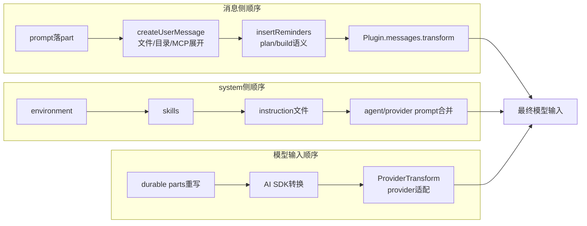

# 上下文注入顺序图：OpenCode 真正控制的是装配顺序，不只是装配内容

> **总纲** [00-opencode_ko](./00-opencode_ko.md) · **能力域** V. 上下文工程
> **前置阅读** [08-输入预处理与历史重写](./08-context-input-and-history-rewrite.md)
> **后续阅读** [10-loop与processor](./10-loop-and-processor.md)

OpenCode 的上下文链条如果只看”有哪些 prompt”，很容易低估顺序的重要性。真正的注入顺序大致是：`SessionPrompt.prompt()`（`packages/opencode/src/session/prompt.ts:161-188`）把原始输入落成 part，`SessionPrompt.createUserMessage()`（`packages/opencode/src/session/prompt.ts:965-1355`）先把文件、目录、MCP 资源和 `@agent` 展开成 synthetic text，`SessionPrompt.insertReminders()`（`packages/opencode/src/session/prompt.ts:1357-1495`）再按 plan/build 语义补 reminder，`Plugin.trigger("experimental.chat.messages.transform")`（调用点见 `packages/opencode/src/session/prompt.ts:652`）最后还可以再改写消息数组。到这里，history 本身已经不是用户原始输入了。

system 侧的顺序也不是任意拼接。`SystemPrompt.environment()`（`packages/opencode/src/session/system.ts:32-57`）先注入运行环境，`SystemPrompt.skills()`（`packages/opencode/src/session/system.ts:59-71`）再补 skill 列表，`InstructionPrompt.system()`（`packages/opencode/src/session/instruction.ts:117-142`）最后把 AGENTS.md / CLAUDE.md / 远端 instruction 文件拼进来。等进入 `LLM.stream()`（`packages/opencode/src/session/llm.ts:68-95`），这一层 system 还会与 agent prompt、provider prompt、`input.system` 以及当前 user message 自带的 `system` 字段重新合并。

历史转模型消息时，顺序仍在继续发挥作用。`MessageV2.toModelMessages()`（`packages/opencode/src/session/message-v2.ts:559-792`）先把 durable parts 重写成 UIMessage，再交给 AI SDK 的消息转换层；之后 `ProviderTransform.message()`（`packages/opencode/src/provider/transform.ts:252-289`）还会按 provider 做空消息过滤、tool-call ID 正规化、reasoning 字段改写、media 支持降级和 cache point 注入。也就是说，“最终模型输入”是多轮变换的产物，而不是某个文件模板的直接展开。

局部 instruction 的注入顺序尤其值得注意。`ReadTool.execute()`（`packages/opencode/src/tool/read.ts:118-231`）会在读取文件后调用 `InstructionPrompt.resolve()`（`packages/opencode/src/session/instruction.ts:168-190`），把靠近目标文件的 AGENTS.md 附加到工具输出尾部。这个提醒不是 system 级全局规则，而是借由 read tool 的结果重新进入 history，随后再被 `MessageV2.toModelMessages()`（`packages/opencode/src/session/message-v2.ts:559-792`）带给模型。它的位置更靠近“文件事实”，因此经常比全局 system 更有约束力。

所以在 OpenCode 里，上下文问题通常不是“有没有这段话”，而是“它在哪一层、什么时候进入消息装配”。同样一句约束，放在 `InstructionPrompt.system()`（`packages/opencode/src/session/instruction.ts:117-142`）和放在 `ReadTool.execute()`（`packages/opencode/src/tool/read.ts:118-231`）后果完全不同；前者是全局前缀，后者则会与具体文件读取形成更紧的局部因果关系。
