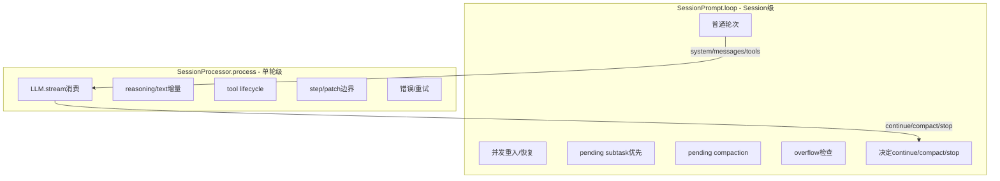

# loop 与 processor：OpenCode 把状态机拆成两层之后，代码为什么会稳很多

主向导对应章节：`loop 与 processor`

&nbsp;

&nbsp;

`SessionPrompt.loop()`（`packages/opencode/src/session/prompt.ts:277-735`）和 `SessionProcessor.process()`（`packages/opencode/src/session/processor.ts:46-425`）是同一台状态机的两层，但二者的时间尺度完全不同。前者处理 session 级问题：并发重入、历史恢复、pending task 优先级、何时需要 compaction、何时该停机。后者处理单轮级问题：provider 流事件、tool lifecycle、reasoning/text 增量、patch、retry 和 blocked。

如果把这两层揉在一起，`subtask`、`compaction`、`structured output` 和普通 tool use 会立刻互相污染。现在的分层里，`SessionPrompt.loop()`（`packages/opencode/src/session/prompt.ts:353-558`）负责决定“当前轮次到底要不要开始，开始之前是不是还有别的显式任务”；`SessionProcessor.process()`（`packages/opencode/src/session/processor.ts:112-340`）只需要专注“既然这一轮开始了，流里来的每个事件要怎样落盘”。这就是为什么 processor 不需要知道 pending compaction，loop 也不需要知道 provider 的 `reasoning-delta` 长什么样。

二者的接口被刻意压得很小。loop 传给 processor 的是已经装配好的 `system`、`messages`、`tools` 和 model（`packages/opencode/src/session/prompt.ts:666-687`）；processor 回给 loop 的只有 `continue / compact / stop`（`packages/opencode/src/session/processor.ts:421-424`）。这个接口越小，provider 兼容、tool lifecycle 和 session 调度之间的耦合就越低。

更重要的是，分层之后 durable state 的位置也变清楚了。loop 负责创建轮次级别的 assistant message（`packages/opencode/src/session/prompt.ts:570-599`），processor 负责在这个 message 下追加 `MessageV2.Part`（`packages/opencode/src/session/message-v2.ts:377-395`）。换句话说，loop 生产“回合容器”，processor 生产“回合内容”。OpenCode 之所以能恢复和回放，不是因为有某种神秘 checkpoint，而是因为这两层各自只写自己该负责的那一层状态。
