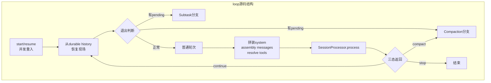

# loop 源码逐段解剖：主循环怎样把 session 推进成状态机

- [一次请求的完整生命周期：请求如何进入主链](./03-request-lifecycle.md)
- [loop 与 processor：两层状态机的边界](./10-loop-and-processor.md)

&nbsp;

&nbsp;

`SessionPrompt.loop()`（`packages/opencode/src/session/prompt.ts:277-735`）是 OpenCode 真正的 session orchestrator。它的代码看上去分支很多，但这些分支其实都在回答同一个问题：基于当前 durable history，这条 session 下一步最该执行什么。

## 入口：先解决并发重入，再解决业务逻辑

函数开头先处理 `start()` / `resume()`（`packages/opencode/src/session/prompt.ts:241-257`）和 callback 队列（`packages/opencode/src/session/prompt.ts:280-286`）。也就是说，loop 的第一职责不是“开始跑模型”，而是保证同一 session 只有一个活跃执行者，其他请求只能挂到 callback 上等待结果。这也是为什么 `SessionPrompt.assertNotBusy()`（`packages/opencode/src/session/prompt.ts:89-92`）和 `SessionPrompt.cancel()`（`packages/opencode/src/session/prompt.ts:259-270`）都属于 session runtime 的基础设施，而不是 UI 逻辑。

## 恢复现场：loop 每轮都从 durable history 重新建局面

进入 while 之后，`MessageV2.filterCompacted()`（`packages/opencode/src/session/message-v2.ts:882-898`）先把可见历史收拢出来，然后 loop 倒序扫描 `lastUser`、`lastAssistant`、`lastFinished` 和 pending `subtask/compaction`（`packages/opencode/src/session/prompt.ts:301-318`）。这一步非常关键：loop 不依赖某个内存态的“当前指针”，而是每次都从 durable log 重新推导现场，所以它天然支持恢复和多入口接管。

接下来的退出判断（`packages/opencode/src/session/prompt.ts:320-328`）也值得注意。它不是简单看“最后一条 assistant 是否存在”，而是看最后完成的 assistant 是否真正结束，且其 parent user 是否已经落后于它。换句话说，loop 的停止条件同样建立在消息因果关系上，而不是“当前 promise resolve 了没”。

## 优先消费显式任务：subtask 和 compaction 在普通轮次之前

pending `MessageV2.SubtaskPart`（`packages/opencode/src/session/message-v2.ts:210-225`）会进入 `SessionPrompt.loop()` 的 subtask 分支（`packages/opencode/src/session/prompt.ts:353-529`）。这段代码并没有复用 processor，而是显式创建 assistant message、显式写入一个 `task` tool part，再手工调用 `TaskTool.execute()`（`packages/opencode/src/tool/task.ts:46-163`）。原因很直接：subtask 在 session 级别上更像“待调度任务”，而不是“当前模型流里触发的一次普通工具调用”。

pending `MessageV2.CompactionPart`（`packages/opencode/src/session/message-v2.ts:201-208`）则进入 compaction 分支（`packages/opencode/src/session/prompt.ts:531-543`），直接调用 `SessionCompaction.process()`（`packages/opencode/src/session/compaction.ts:102-297`）。再往下，overflow 检查（`packages/opencode/src/session/prompt.ts:545-558`）会在必要时补建 compaction message，而不是就地缩 history。这里体现了 loop 的一个判断：compaction 是显式阶段，不是 processor 内部的一次隐形优化。

## 普通轮次：loop 负责把“执行条件”准备好

只有走到 normal processing（`packages/opencode/src/session/prompt.ts:560-687`），loop 才会做“常规聊天/工具执行”理解中的那些事。它先取 agent 和 step 限制，再调用 `SessionPrompt.insertReminders()`（`packages/opencode/src/session/prompt.ts:1357-1495`）改写 user message，随后创建 assistant message（`packages/opencode/src/session/prompt.ts:570-599`），再通过 `SessionPrompt.resolveTools()`（`packages/opencode/src/session/prompt.ts:745-933`）拿到本轮工具集。

system 组装也发生在这里。`SystemPrompt.environment()`（`packages/opencode/src/session/system.ts:32-57`）、`SystemPrompt.skills()`（`packages/opencode/src/session/system.ts:59-71`）和 `InstructionPrompt.system()`（`packages/opencode/src/session/instruction.ts:117-142`）被按固定顺序拼成 `system` 数组（`packages/opencode/src/session/prompt.ts:654-664`），然后连同 `MessageV2.toModelMessages()`（`packages/opencode/src/session/message-v2.ts:559-792`）转出来的历史一并交给 `SessionProcessor.process()`（`packages/opencode/src/session/processor.ts:46-425`）。也就是说，loop 管的是执行前的“装配工序”，不是执行中的流事件。

## 收尾：processor 只回三态，loop 负责把三态接成 session 行为

`SessionPrompt.loop()`（`packages/opencode/src/session/prompt.ts:689-723`）在拿到 processor 返回值后，会优先处理 structured output 成功、模型未按 schema 输出、`stop` 和 `compact` 这些 session 级语义。`compact` 不是在 processor 里直接触发二次压缩，而是由 loop 再次调用 `SessionCompaction.create()`（`packages/opencode/src/session/compaction.ts:299-330`）把压缩排入主链。

函数最后的 callback flush（`packages/opencode/src/session/prompt.ts:725-735`）也说明了它的真正职责：loop 不是为了某次 HTTP 请求服务，而是 session 级执行器。无论谁在等结果，最终都只是等待这台状态机跑完当前可执行阶段。
