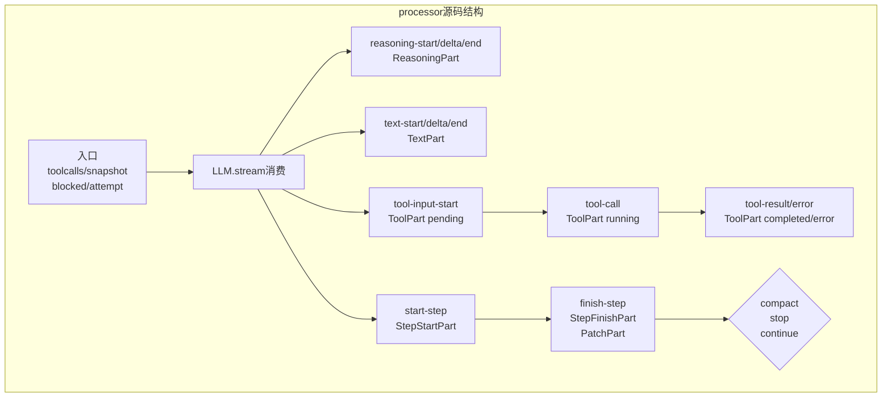

# processor 源码逐段解剖：单轮执行怎样被写成 durable parts

> **总纲** [00-opencode_ko](./00-opencode_ko.md) · **能力域** VI. 状态机双层架构 · **分层定位** 第二层：Runtime 编排层
> **前置阅读** [10-loop与processor](./10-loop-and-processor.md) · [11-loop源码解剖](./11-loop-source-walkthrough.md)
> **后续阅读** [13-高级能力](./13-advanced-primitives.md) · [21-错误恢复](./21-error-recovery.md)

`SessionProcessor.create()`（`packages/opencode/src/session/processor.ts:27-429`）返回的对象本身很薄，真正的重心是 `process()`（`packages/opencode/src/session/processor.ts:46-425`）。这个函数不关心 session 还有没有 pending subtask，也不关心下一轮是否该启动；它只负责把当前一次 `LLM.stream()`（`packages/opencode/src/session/llm.ts:47-257`）产生的事件序列翻译成 part。

## 先看函数入口：局部状态只保留“本轮必须的少数变量”

一开头只保留了 `toolcalls`、`snapshot`、`blocked`、`attempt` 和 `needsCompaction`（`packages/opencode/src/session/processor.ts:33-37`）。这个变量集合很能说明职责边界：processor 不持有整个 session 状态，只持有当前轮次正在运行的 tool call 映射、当前 step 对应的文件快照，以及本轮结束后要回给 loop 的控制信号。

随后 `process()`（`packages/opencode/src/session/processor.ts:46-54`）调用 `LLM.stream()`（`packages/opencode/src/session/llm.ts:47-257`）拿到流。这里的输入已经是 loop 组装好的 model、system、messages 和 tools，所以 processor 看到的是“已经决策完毕的一轮执行”，不是待规划的请求。

## 推理和文本为什么都拆成独立 part

`reasoning-start / delta / end` 分支（`packages/opencode/src/session/processor.ts:63-110`）会创建 `MessageV2.ReasoningPart`（`packages/opencode/src/session/message-v2.ts:121-132`），并在增量到达时通过 `Session.updatePartDelta()`（`packages/opencode/src/session/index.ts:778-789`）持续推送。`text-start / delta / end` 分支（`packages/opencode/src/session/processor.ts:291-340`）对 `MessageV2.TextPart`（`packages/opencode/src/session/message-v2.ts:104-119`）做同样的事，只是在 text 完成后还会走一次 `Plugin.trigger("experimental.text.complete")`（调用点见 `packages/opencode/src/session/processor.ts:323-338`）。

这一拆分很关键，因为 OpenCode 不把 reasoning 当作 provider 私有日志，而是把它变成 durable history 的一等对象。后续的 TUI、CLI、SSE 都可以直接消费这些 part，而不需要知道某家 provider 的流事件格式。

## tool lifecycle：pending、running、completed、error 都是持久化状态

`tool-input-start` 到 `tool-result / tool-error` 这一段（`packages/opencode/src/session/processor.ts:112-229`）是 processor 的另一条主干。`tool-input-start` 先把 `MessageV2.ToolPart`（`packages/opencode/src/session/message-v2.ts:335-344`）写成 `pending`，`tool-call` 再把它升级成 `running`，`tool-result` 和 `tool-error` 最终把它收束成 `completed` 或 `error`。也就是说，OpenCode 不需要额外的 tool journal，因为 tool 本身就活在 message part 里。

这一段还顺手做了一个很工程化的保护：doom loop 检查（`packages/opencode/src/session/processor.ts:152-177`）。如果连续三次看到同名工具、同样输入且都不是 pending，就触发 `PermissionNext.ask()`（`packages/opencode/src/permission/index.ts:148-182`）请求用户确认。这个检测逻辑放在 processor 里很合理，因为只有它掌握当前轮次最精细的 tool 序列。

## step 和 patch：文件系统副作用被绑定到 step 边界

`start-step` 分支（`packages/opencode/src/session/processor.ts:234-243`）会调用 `Snapshot.track()`（`packages/opencode/src/snapshot/index.ts:38-40`）记录快照，并写入 `MessageV2.StepStartPart`（`packages/opencode/src/session/message-v2.ts:239-245`）。`finish-step` 分支（`packages/opencode/src/session/processor.ts:245-289`）计算 usage、更新 assistant message、生成 `MessageV2.StepFinishPart`（`packages/opencode/src/session/message-v2.ts:247-265`），然后如果 diff 非空，再调用 `Snapshot.patch()`（`packages/opencode/src/snapshot/index.ts:42-44`）并追加 `MessageV2.PatchPart`（`packages/opencode/src/session/message-v2.ts:95-102`）。

这一步的意义不在“展示 patch”，而在“把文件系统副作用和模型 step 建立因果绑定”。因此后面的 `SessionSummary.summarize()`（`packages/opencode/src/session/summary.ts:70-82`）可以从 step snapshot 推导整段 diff，而不是靠工具输出猜测改了什么。

## 错误、重试和 compact：processor 只做翻译，不做重调度

错误路径集中在 `catch`（`packages/opencode/src/session/processor.ts:354-386`）。这里先用 `MessageV2.fromError()`（`packages/opencode/src/session/message-v2.ts:900-940` 及后续）把 provider 或系统异常翻译成统一错误对象；如果是 context overflow，就只把 `needsCompaction` 置位；如果可重试，就用 `SessionRetry.retryable()`（调用点见 `packages/opencode/src/session/processor.ts:367-378`）和 `SessionRetry.sleep()` 做退避；否则把错误写回 assistant message。

函数收尾（`packages/opencode/src/session/processor.ts:388-424`）会补写未完成工具的 aborted error、补全 `time.completed`，最后只返回 `compact / stop / continue`。这就是 processor 最干净的地方：它负责把复杂流事件压缩成可恢复的 durable state，再把最小控制信号还给 loop。真正的重调度仍然由 `SessionPrompt.loop()`（`packages/opencode/src/session/prompt.ts:277-735`）承担。
