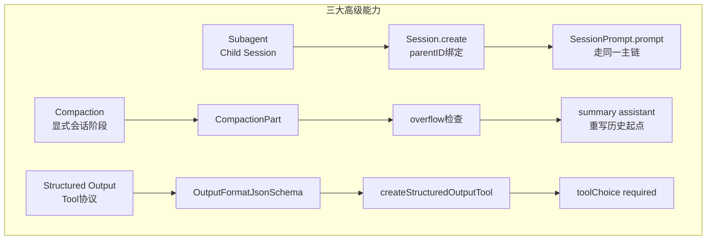

# subagent、compaction 与 structured output：这些高级能力为什么没有长歪

主向导对应章节：`subagent、compaction 与 structured output`

&nbsp;

&nbsp;

## subagent：不是 persona 切换，而是 child session

OpenCode 没有把 subagent 做成“同一轮里临时换 prompt”。`TaskTool.execute()`（`packages/opencode/src/tool/task.ts:46-163`）一旦被调用，会先基于当前 assistant message 推导模型和权限，再通过 `Session.create()`（`packages/opencode/src/session/index.ts:219-237`）创建 child session，把父 session ID 写进 `parentID`（`packages/opencode/src/tool/task.ts:73-103`）。随后它并不是手工模拟一个子循环，而是直接再次调用 `SessionPrompt.prompt()`（`packages/opencode/src/session/prompt.ts:161-188`），让子任务走同一套主链。

`SessionPrompt.loop()`（`packages/opencode/src/session/prompt.ts:353-529`）对 pending `MessageV2.SubtaskPart`（`packages/opencode/src/session/message-v2.ts:210-225`）的处理也验证了这个边界：主 session 只是把 `task` 视作一个工具 part，在本轮 assistant message 里记录其 `running/completed/error` 状态；真正的执行历史落在 child session 自己的 message/part 轨迹里。因此 subagent 既共享 runtime，又隔离状态和权限，这比在一个 session 里混多套 persona 干净得多。

## compaction：不是后台 GC，而是显式会话阶段

`SessionCompaction.create()`（`packages/opencode/src/session/compaction.ts:299-330`）不会偷偷改历史，只会新增一条带 `MessageV2.CompactionPart`（`packages/opencode/src/session/message-v2.ts:201-208`）的 user message，把“压缩”排进主循环。`SessionPrompt.loop()`（`packages/opencode/src/session/prompt.ts:531-558`）遇到 pending compaction 或 overflow 时，才会转入 `SessionCompaction.process()`（`packages/opencode/src/session/compaction.ts:102-297`）。

`SessionCompaction.process()`（`packages/opencode/src/session/compaction.ts:114-130`）里最关键的实现，不是总结提示词，而是 overflow replay 逻辑：它会回溯到上一个非 compaction user message，必要时裁掉后半段历史，再生成一条 `summary: true` 的 assistant message（`packages/opencode/src/session/compaction.ts:136-167`）。如果压缩成功，函数要么重放用户消息，要么补一条 synthetic “continue” 提示（`packages/opencode/src/session/compaction.ts:238-292`）。也就是说，compaction 并不只是“把长历史缩短”，而是在重写后续执行的起点。

## structured output：不是 prompt 约束，而是 tool 协议

JSON schema 模式也没有被做成“在 system 里写一句请输出 JSON”。`SessionPrompt.loop()`（`packages/opencode/src/session/prompt.ts:616-687`）在发现 `MessageV2.OutputFormatJsonSchema`（`packages/opencode/src/session/message-v2.ts:66-79`）后，会动态注入 `createStructuredOutputTool()`（`packages/opencode/src/session/prompt.ts:936-963`），并把 `toolChoice` 强制为 `required`。结构化输出因此不是 text post-process，而是模型必须完成的一次工具调用。

对应地，assistant message 也有专门的 `structured` 字段（`packages/opencode/src/session/message-v2.ts:397-444`）。`SessionPrompt.loop()`（`packages/opencode/src/session/prompt.ts:689-709`）在 tool 成功时把结果直接写进 `processor.message.structured`，模型如果停机却没调用该工具，则生成 `MessageV2.StructuredOutputError`（`packages/opencode/src/session/message-v2.ts:27-33`）。这一层设计把“最终输出格式”从 prompt 建议升级成 runtime 级成功条件。

## 为什么三者都能接进主链

表面上看，subagent、compaction、structured output 分别属于任务切分、上下文控制和输出协议，像是三类完全不同的功能；但在实现里，它们都服从同一条规则：要么表现成 `MessageV2.Part`（`packages/opencode/src/session/message-v2.ts:377-395`），要么表现成 `Tool`（`packages/opencode/src/tool/tool.ts:49-89`），然后交给 `SessionPrompt.loop()`（`packages/opencode/src/session/prompt.ts:277-735`）和 `SessionProcessor.process()`（`packages/opencode/src/session/processor.ts:46-425`）消费。正因为骨架足够固定，这些高级能力才没有在不同分支里各自长出一套特殊运行时。
