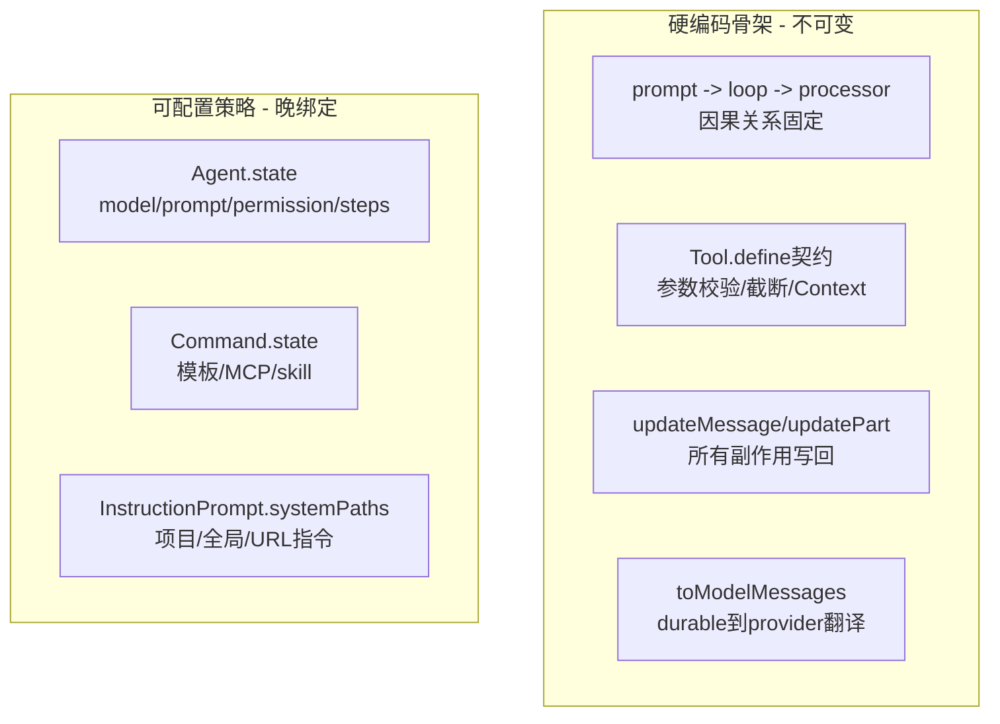

# 硬编码与可配置的边界：骨架固定，策略晚绑定

> **总纲** [00-opencode_ko](./00-opencode_ko.md) · **能力域** VII. 高级能力
> **前置阅读** [13-高级能力](./13-advanced-primitives.md)
> **后续阅读** [16-观测性](./16-observability.md) · [15-入口差异](./15-client-differences.md)

OpenCode 的骨架其实非常硬。`SessionPrompt.prompt()`（`packages/opencode/src/session/prompt.ts:161-188`）一定会先写 user message 再进入 `SessionPrompt.loop()`（`packages/opencode/src/session/prompt.ts:277-735`）；主循环一定按 pending `subtask`、pending `compaction`、overflow 检查、normal step 的顺序推进；normal step 一定交给 `SessionProcessor.process()`（`packages/opencode/src/session/processor.ts:46-425`）返回 `continue / compact / stop`。这条 `prompt -> loop -> processor -> durable parts` 的骨架是硬编码的，因为它定义了 runtime 的因果关系，不能随便被配置打散。

同样硬的还有工具和持久化契约。`Tool.define()`（`packages/opencode/src/tool/tool.ts:49-89`）固定了参数校验、输出截断和 `Tool.Context`（`packages/opencode/src/tool/tool.ts:17-27`）接口；`Session.updateMessage()`（`packages/opencode/src/session/index.ts:686-706`）和 `Session.updatePart()`（`packages/opencode/src/session/index.ts:755-776`）固定了所有运行时副作用都要回写到 message/part；`MessageV2.toModelMessages()`（`packages/opencode/src/session/message-v2.ts:559-792`）固定了 durable part 到 provider message 的翻译出口。这些地方如果都可插拔，OpenCode 就不再是一个稳定 runtime，而是脚本拼装器。

真正被延后绑定的是策略内容。`Agent.state`（`packages/opencode/src/agent/agent.ts:52-252`）先给出一套内建 agent，再把 `cfg.agent` 合并进来覆盖 `model`、`prompt`、`permission`、`steps` 和 `options`；`Command.state`（`packages/opencode/src/command/index.ts:60-142`）把命令模板、MCP prompt 和 skill 一并编译成可调用命令；`InstructionPrompt.systemPaths()`（`packages/opencode/src/session/instruction.ts:72-115`）则把项目级、全局级和 URL 指令文件搜出来。也就是说，框架决定“哪里可以配置”，配置决定“这里具体放什么内容”。

最有意思的是那些介于两者之间的软约束。`SessionPrompt.insertReminders()`（`packages/opencode/src/session/prompt.ts:1357-1495`）并没有改主循环的状态转移，却通过 synthetic text 强烈塑造了 plan/build 的行为；`LLM.stream()`（`packages/opencode/src/session/llm.ts:96-132`）把 model、agent、variant、provider options 合并起来，但最后仍然由 `ProviderTransform.message()`（`packages/opencode/src/provider/transform.ts:252-289`）去适配 provider 约束；`Plugin.trigger()`（`packages/opencode/src/plugin/index.ts:112-127`）能在固定节点上改变 system、headers、tool definition 和 tool output，却不能重写主循环拓扑。

所以 OpenCode 的边界不是“哪些字段能配，哪些字段不能配”，而是“哪些代码在定义 runtime 时序，哪些代码只是在往固定时序里灌内容”。前者应当稳定，后者应当晚绑定；只盯配置文件看源码，很容易把这条边界看反。
