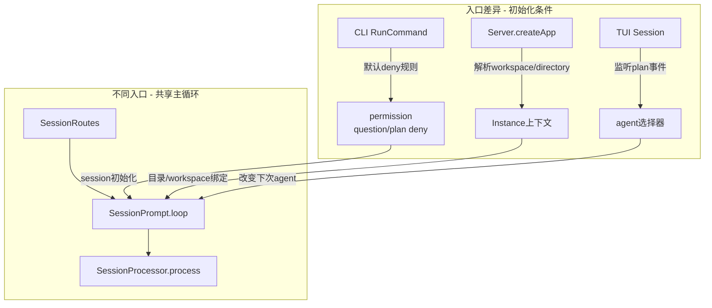

# 为什么不同入口看到的 agent 行为会不一样：共享主循环，不共享初始化条件

> **总纲** [00-opencode_ko](./00-opencode_ko.md) · **能力域** I. 入口与架构
> **前置阅读** [01-runtime-host](./01-runtime-host.md) · [14-硬编码与可配置](./14-hardcoded-vs-configurable.md)
> **后续阅读** [16-观测性](./16-observability.md)

不同入口共用的是 `SessionRoutes`（`packages/opencode/src/server/routes/session.ts:25-1023`）和后面的 `SessionPrompt.prompt()`（`packages/opencode/src/session/prompt.ts:161-188`）、`SessionPrompt.loop()`（`packages/opencode/src/session/prompt.ts:277-735`）、`SessionProcessor.process()`（`packages/opencode/src/session/processor.ts:46-425`），不是共用“完全相同的初始 session”。行为差异大多发生在 runtime 之前，也就是 session 是怎么建出来、带了什么 permission、用哪个 agent、在哪个 directory 下被打开。

CLI 的差异最明显。`RunCommand.handler()`（`packages/opencode/src/cli/cmd/run.ts:306-672`）在进入真正执行前，先构造了一组默认 deny 规则，其中 `question`、`plan_enter` 和 `plan_exit` 都被显式拒绝（`packages/opencode/src/cli/cmd/run.ts:357-373`）。随后 `session()` 这个局部 helper（`packages/opencode/src/cli/cmd/run.ts:381-394`）把这些规则写进新建 session。于是同样的 `SessionPrompt.loop()`（`packages/opencode/src/session/prompt.ts:277-735`）在 CLI `run` 里天然更少走到提问和 plan mode 分支；这不是 loop 的差异，而是 session 权限边界已经被入口改写了。

Server 入口的差异则主要体现在实例上下文。`Server.createApp()`（`packages/opencode/src/server/server.ts:195-221`）会从 query/header 里解析 `workspace` 与 `directory`，再通过 `WorkspaceContext.provide()` 和 `Instance.provide()` 把它们灌进后续所有路由。也就是说，两个客户端即便最后都调用 `POST /session/:sessionID/message`（`packages/opencode/src/server/routes/session.ts:781-820`），只要绑定的 workspace 或 directory 不同，`InstructionPrompt.systemPaths()`（`packages/opencode/src/session/instruction.ts:72-115`）、`ReadTool.execute()`（`packages/opencode/src/tool/read.ts:28-231`）和插件作用域就都会不同。

TUI 又叠加了一层本地 UI 状态。`Session()` 组件（`packages/opencode/src/cli/cmd/tui/routes/session/index.tsx:116-232`）会监听 `message.part.updated`，在 `plan_exit` 或 `plan_enter` 完成后主动切换本地 agent 选择器（`packages/opencode/src/cli/cmd/tui/routes/session/index.tsx:217-232`）。这类差异不会改变服务端已经执行过的 part，但会改变用户下一次提交消息时带上的 agent。于是你看到的“行为不同”经常是入口在未来请求里改了初值，而不是主循环里存在两套分叉实现。

调试时最有效的顺序因此不是先看模型输出，而是先查入口。先看 `RunCommand.handler()`（`packages/opencode/src/cli/cmd/run.ts:306-672`）或 `Server.createApp()`（`packages/opencode/src/server/server.ts:58-575`）给 session 注入了什么初始条件，再去看 `Session.get()`（`packages/opencode/src/session/index.ts:347-350`）和 `Session.setPermission()`（`packages/opencode/src/session/index.ts:423-441`）里的真实状态，最后才进入 `SessionPrompt.loop()`（`packages/opencode/src/session/prompt.ts:277-735`）和 `SessionProcessor.process()`（`packages/opencode/src/session/processor.ts:46-425`）排查执行分支。这样通常更快命中根因。
