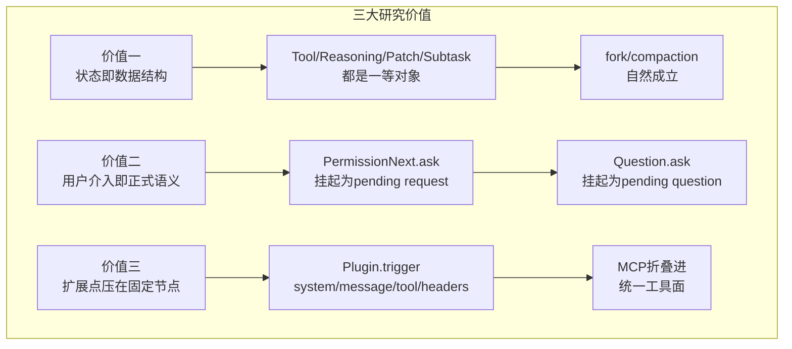

# 这套设计为什么值得研究：因为复杂度直接对着长任务运行时开刀

> **总纲** [00-opencode_ko](./00-opencode_ko.md) · **能力域** IX. 设计哲学 · **分层定位** 读完全套后的价值回看
> **前置阅读** [16-观测性](./16-observability.md) · [14-硬编码与可配置](./14-hardcoded-vs-configurable.md)
> **后续阅读** [18-阅读路径](./18-reading-path.md) · [19-最终心智模型](./19-final-mental-model.md)

OpenCode 值得研究，不是因为模块多，而是因为它把“长任务 agent 的状态应该放哪儿”这个问题落实到了 `Session.Info`（`packages/opencode/src/session/index.ts:122-164`）、`MessageV2.Part`（`packages/opencode/src/session/message-v2.ts:377-395`）、`Session.updateMessage()`（`packages/opencode/src/session/index.ts:686-706`）和 `Session.updatePart()`（`packages/opencode/src/session/index.ts:755-776`）上。很多系统也能调工具，但工具执行结果、推理流、补丁、压缩、子任务往往只是旁路日志；这里它们直接变成主数据结构，所以 `Session.fork()`（`packages/opencode/src/session/index.ts:239-280`）和 `SessionCompaction.process()`（`packages/opencode/src/session/compaction.ts:102-297`）才能自然成立。

第二个值得研究的点，是它把“用户介入执行”做成了正式语义，而不是 UI 旁白。`PermissionNext.ask()`（`packages/opencode/src/permission/index.ts:148-182`）会把工具权限挂起成 pending request，`Question.ask()`（`packages/opencode/src/question/index.ts:109-133`）会把缺失信息挂起成 pending question，`SessionProcessor.process()`（`packages/opencode/src/session/processor.ts:221-226`）则把这些拒绝翻译成 `blocked`。这意味着权限和澄清问题不是额外弹窗，而是状态机的一部分，因而恢复、重试和事件同步都有统一语义。

第三个值得研究的点，是它没有用“插件化一切”掩盖主链，而是把扩展点压在固定节点上。`ToolRegistry.tools()`（`packages/opencode/src/tool/registry.ts:132-173`）统一装配工具定义，`Plugin.trigger()`（`packages/opencode/src/plugin/index.ts:112-127`）只在 system、message、tool execute、headers、params 等关键节点介入，`MCP.tools()`（`packages/opencode/src/mcp/index.ts:609-649`）把外部服务器能力折叠回统一工具面。结果是扩展很多，但主干依旧能在 `SessionPrompt.loop()`（`packages/opencode/src/session/prompt.ts:277-735`）和 `SessionProcessor.process()`（`packages/opencode/src/session/processor.ts:46-425`）里被完整画出来。

代价也同样明确。第一，阅读成本高，因为 `SessionPrompt.createUserMessage()`（`packages/opencode/src/session/prompt.ts:965-1355`）、`LLM.stream()`（`packages/opencode/src/session/llm.ts:47-257`）和 `ProviderTransform.message()`（`packages/opencode/src/provider/transform.ts:252-289`）把输入、system、provider 适配拆散了。第二，行为往往不是“某个 if 决定一切”，而是 `Agent.Info`（`packages/opencode/src/agent/agent.ts:25-50`）配置、`SessionPrompt.insertReminders()`（`packages/opencode/src/session/prompt.ts:1357-1495`）synthetic prompt、`InstructionPrompt.system()`（`packages/opencode/src/session/instruction.ts:117-142`）项目规则和 `Plugin.trigger()`（`packages/opencode/src/plugin/index.ts:112-127`）共同叠出来的。第三，provider 兼容性复杂度并没有消失，而是被集中到 `ProviderTransform.message()`（`packages/opencode/src/provider/transform.ts:252-289`）和 `MessageV2.toModelMessages()`（`packages/opencode/src/session/message-v2.ts:559-792`）里。

这正是它“难读但值得读”的原因。复杂度没有被伪装成简洁 API，而是被摊开成可定位的源码边界。对做 agent runtime 的程序员来说，这种复杂度比黑盒 prompt magic 更有研究价值。
