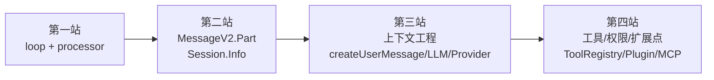

# 建议的源码阅读路径：先打通状态机，再扩展到上下文和扩展点

> **总纲** [00-opencode_ko](./00-opencode_ko.md) · **能力域** IX. 设计哲学
> **前置阅读** [17-设计价值](./17-why-this-design-matters.md)
> **后续阅读** [19-最终心智模型](./19-final-mental-model.md)

## 第一站：先读主循环，而不是先读目录树

第一遍只读 `SessionPrompt.loop()`（`packages/opencode/src/session/prompt.ts:277-735`）和 `SessionProcessor.process()`（`packages/opencode/src/session/processor.ts:46-425`）。前者回答“session 此刻应该推进哪种工作”，后者回答“这一轮 assistant 流式输出如何写回 durable state”。把这两段连起来，你就能看见 OpenCode 的主链不是“prompt 一把梭”，而是 `subtask -> compaction -> normal step` 的调度器包住一个单轮执行器。

这一遍不要急着看工具实现，先盯三个断点。第一，`SessionPrompt.loop()`（`packages/opencode/src/session/prompt.ts:301-318`）是怎样从消息流里恢复 `lastUser`、`lastAssistant`、`lastFinished` 和 pending task 的。第二，`SessionPrompt.loop()`（`packages/opencode/src/session/prompt.ts:560-687`）怎样为普通轮次创建 assistant message、解析工具、拼 system、再把控制权交给 `SessionProcessor.process()`（`packages/opencode/src/session/processor.ts:46-425`）。第三，`SessionProcessor.process()`（`packages/opencode/src/session/processor.ts:421-424`）为什么只返回 `continue / compact / stop` 三态，而不是把更多 provider 细节暴露给上层。

## 第二站：回头看状态模型

主链稳定之后，再读 `MessageV2.Part`（`packages/opencode/src/session/message-v2.ts:377-395`）、`MessageV2.ToolPart`（`packages/opencode/src/session/message-v2.ts:335-344`）、`Session.updateMessage()`（`packages/opencode/src/session/index.ts:686-706`）和 `Session.updatePart()`（`packages/opencode/src/session/index.ts:755-776`）。这几处定义了 OpenCode 的“真实状态”到底是什么。你会发现 loop 和 processor 之所以能拆开，是因为二者都不直接依赖临时内存，而是围绕 message/part 轨迹在推进。

接着读 `Session.Info`（`packages/opencode/src/session/index.ts:122-164`）、`Session.createNext()`（`packages/opencode/src/session/index.ts:297-338`）、`Session.fork()`（`packages/opencode/src/session/index.ts:239-280`）和 `SessionCompaction.process()`（`packages/opencode/src/session/compaction.ts:102-297`）。这一组代码把“会话边界”落成了可复制、可压缩、可恢复的状态容器。读完这里，再看 resume、fork、share、revert，就不会把它们误会成 API 层的小功能。

## 第三站：再读上下文工程

然后读 `SessionPrompt.createUserMessage()`（`packages/opencode/src/session/prompt.ts:965-1355`）、`SessionPrompt.insertReminders()`（`packages/opencode/src/session/prompt.ts:1357-1495`）、`InstructionPrompt.system()`（`packages/opencode/src/session/instruction.ts:117-142`）、`ReadTool.execute()`（`packages/opencode/src/tool/read.ts:28-231`）、`LLM.stream()`（`packages/opencode/src/session/llm.ts:47-257`）和 `ProviderTransform.message()`（`packages/opencode/src/provider/transform.ts:252-289`）。这条链解释了模型看到的上下文并不是一份固定模板，而是输入预处理、文件读取、副作用提示、system 合成和 provider 适配的叠加结果。

如果你在调某个“模型为什么突然这样回答”的问题，通常就停在这一层。因为很多行为差异不是出在 prompt 文案，而是出在 `ReadTool.execute()`（`packages/opencode/src/tool/read.ts:118-231`）动态补的局部 instruction、`SessionPrompt.insertReminders()`（`packages/opencode/src/session/prompt.ts:1357-1495`）加的 synthetic text，或者 `ProviderTransform.message()`（`packages/opencode/src/provider/transform.ts:47-289`）为不同 provider 重写了消息形态。

## 第四站：最后看工具面、交互和扩展点

最后再看 `ToolRegistry.tools()`（`packages/opencode/src/tool/registry.ts:132-173`）、`TaskTool.execute()`（`packages/opencode/src/tool/task.ts:46-163`）、`PermissionNext.ask()`（`packages/opencode/src/permission/index.ts:148-182`）、`Question.ask()`（`packages/opencode/src/question/index.ts:109-133`）、`Plugin.trigger()`（`packages/opencode/src/plugin/index.ts:112-127`）和 `MCP.tools()`（`packages/opencode/src/mcp/index.ts:609-649`）。这一层不是主链，但它们都把自己接在主链的明确位置上：工具定义发生在 prompt 之前，权限和提问发生在 tool context 里，插件可以插系统、消息、headers、tool definition，MCP 则把外部能力折叠进统一工具面。

按这个顺序读，难点会明显少很多。先看 `SessionPrompt.loop()`（`packages/opencode/src/session/prompt.ts:277-735`）和 `SessionProcessor.process()`（`packages/opencode/src/session/processor.ts:46-425`）建立主时钟，再看 `MessageV2.Part`（`packages/opencode/src/session/message-v2.ts:377-395`）建立状态单元，最后再去吸收 provider、plugin、MCP、TUI 这些横切面，代码就不会散。
