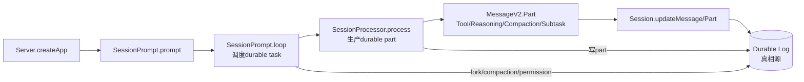

# 最终心智模型：把 OpenCode 看成”以 durable log 为真相源的 session 调度器”

> **总纲** [00-opencode_ko](./00-opencode_ko.md) · **能力域** IX. 设计哲学
> **前置阅读** [18-阅读路径](./18-reading-path.md)

如果只保留一句话，我会把 OpenCode 解释成这样：`Server.createApp()`（`packages/opencode/src/server/server.ts:58-575`）把请求装进实例上下文，`SessionPrompt.prompt()`（`packages/opencode/src/session/prompt.ts:161-188`）把输入落成 user message，`SessionPrompt.loop()`（`packages/opencode/src/session/prompt.ts:277-735`）决定当前 session 下一步应该消费哪类任务，`SessionProcessor.process()`（`packages/opencode/src/session/processor.ts:46-425`）把单轮模型流翻译成 `MessageV2.Part`（`packages/opencode/src/session/message-v2.ts:377-395`），而 `Session.updateMessage()`（`packages/opencode/src/session/index.ts:686-706`）与 `Session.updatePart()`（`packages/opencode/src/session/index.ts:755-776`）把这一切写回持久化轨迹。

这句话里最重要的不是“模型”而是“轨迹”。`MessageV2.ToolPart`（`packages/opencode/src/session/message-v2.ts:335-344`）、`MessageV2.ReasoningPart`（`packages/opencode/src/session/message-v2.ts:121-132`）、`MessageV2.CompactionPart`（`packages/opencode/src/session/message-v2.ts:201-208`）和 `MessageV2.SubtaskPart`（`packages/opencode/src/session/message-v2.ts:210-225`）把工具执行、推理、压缩和子任务都建模成同一套 part。于是 `Session.fork()`（`packages/opencode/src/session/index.ts:239-280`）、`SessionCompaction.process()`（`packages/opencode/src/session/compaction.ts:102-297`）、`PermissionNext.ask()`（`packages/opencode/src/permission/index.ts:148-182`）和 `Question.ask()`（`packages/opencode/src/question/index.ts:109-133`）都不是外挂，而是在改写同一条 session 历史。

所以读源码时，不要把 `SessionPrompt.loop()`（`packages/opencode/src/session/prompt.ts:277-735`）理解成“一个 while true 包住模型调用”，也不要把 `SessionProcessor.process()`（`packages/opencode/src/session/processor.ts:46-425`）理解成“AI SDK 的薄封装”。前者是在调度 durable task，后者是在生产 durable part；前者管 session 级别的因果顺序，后者管单轮 assistant 的落盘粒度。OpenCode 的工程价值，恰恰来自这两层分工把复杂能力都压回到统一状态机里。
