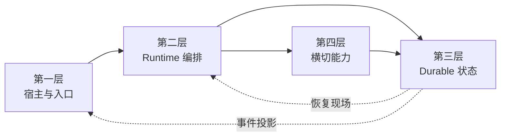

# 最终心智模型：把 OpenCode 看成“四层协作的 durable session runtime”

> **总纲** [00-opencode_ko](./00-opencode_ko.md) · **分层定位** 全套收束文档  
> **前置阅读** [18-reading-path](./18-reading-path.md)

如果现在只保留一张图，可以直接记住这四层怎样闭环协作：

## 第一层：把请求挂进去

`Server.createApp()`（`packages/opencode/src/server/server.ts:58-575`）、`WorkspaceContext.provide()`、`Instance.provide()` 和 `SessionRoutes` 负责把 CLI、TUI、Web 发来的请求挂到正确的 workspace、directory 和 session 上。  
这一层负责确定这次执行属于哪个 workspace、directory 和 session。

## 第二层：把执行推进下去

`SessionPrompt.prompt()`（`packages/opencode/src/session/prompt.ts:161-188`）把输入变成正式 runtime 动作，`SessionPrompt.loop()`（`packages/opencode/src/session/prompt.ts:277-735`）做 session 级调度，`SessionProcessor.process()`（`packages/opencode/src/session/processor.ts:46-425`）做单轮执行。  
这一层回答的是“下一步跑什么、怎么跑”，它是 OpenCode 的主时钟。

## 第三层：把真相保存下来

`Session.Info`（`packages/opencode/src/session/index.ts:122-164`）定义执行边界，`MessageV2.Part`（`packages/opencode/src/session/message-v2.ts:377-395`）定义最小状态单元，`Session.updateMessage()`（`packages/opencode/src/session/index.ts:686-706`）和 `Session.updatePart()`（`packages/opencode/src/session/index.ts:755-776`）把一切写回 durable history。  
这一层回答的是“什么算真的发生过”，也是 resume、fork、share、revert 能成立的基础。

## 第四层：把能力插回主链里

工具、权限、问题、插件、MCP、subagent、compaction、structured output、事件和恢复机制都属于第四层。  
它们看起来分散，但本质上只做两类事：

1. 在第二层的固定节点介入执行。
2. 对第三层的 durable history 做写入、读取或投影。

因此第四层可以直接理解为主链上的能力插槽集合。

## 最后只记一句话

**OpenCode 可以概括成“四层协作的 durable session runtime”：第一层挂载上下文，第二层推进 session，第三层保存 durable 真相，第四层在固定插槽里扩展能力。**

只要这个心智模型稳定了，再去看具体文件、具体函数、具体 bug，你都会更快知道问题属于哪一层，应该往哪条链上追。
