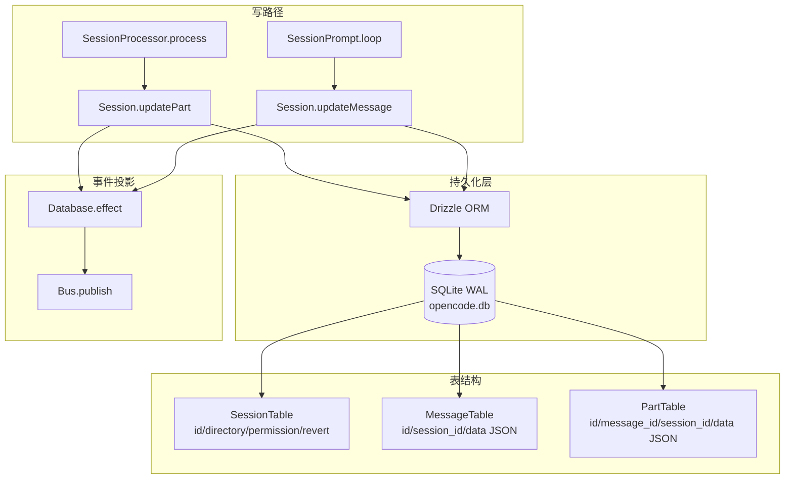

# 持久化与存储：durable state 存在哪里

> **总纲** [00-opencode_ko](./00-opencode_ko.md) · **能力域** III. Session 与状态模型 · **分层定位** 第三层：Durable 状态层
> **前置阅读** [04-session中心化](./04-session-centric-runtime.md) · [05-对象模型](./05-object-model.md)
> **后续阅读** [16-观测性](./16-observability.md) · [21-错误恢复](./21-error-recovery.md)

本系列前面多次提到"durable history"和"持久化轨迹"，但始终没有交代它们具体存在哪里。这篇补上这块拼图。

## 存储引擎：SQLite + Drizzle ORM

OpenCode 使用 Bun 原生 `bun:sqlite` 驱动，上层用 Drizzle ORM 做类型安全查询。数据库文件位于 `<data_dir>/opencode.db`（`packages/opencode/src/storage/db.ts`）。SQLite 以 WAL 模式运行，配合 `synchronous = NORMAL`、`busy_timeout = 5000`、`cache_size = -64000` 等性能调优 PRAGMA。

这意味着 OpenCode 的全部运行时状态——session、message、part、permission、todo——都落在一个本地 SQLite 文件里。没有外部数据库依赖，没有分布式存储，这也是为什么它天然适合单机开发场景。

## 核心表结构

schema 定义集中在 `*.sql.ts` 文件里，通过 `packages/opencode/src/storage/schema.ts` 统一导出。

| 表 | 定义位置 | 关键字段 |
|----|----------|----------|
| `SessionTable` | `session/session.sql.ts` | `id`, `project_id`, `workspace_id`, `parent_id`, `directory`, `permission`(JSON), `revert`(JSON), `summary_*` |
| `MessageTable` | `session/session.sql.ts` | `id`, `session_id`(FK), `data`(JSON blob) |
| `PartTable` | `session/session.sql.ts` | `id`, `message_id`(FK), `session_id`, `data`(JSON blob) |
| `PermissionTable` | `session/session.sql.ts` | session 级权限记录 |
| `TodoTable` | `session/session.sql.ts` | session 内 todo 跟踪 |
| `ProjectTable` | `project/project.sql.ts` | 项目元数据 |
| `AccountTable` | `account/account.sql.ts` | 账户与状态 |
| `SessionShareTable` | `share/share.sql.ts` | 分享记录 |

`MessageTable` 和 `PartTable` 的设计值得注意：顶层字段（`id`、`session_id`、`message_id`、`time_created`）用独立列存储以支持索引查询，其余全部序列化进 `data` JSON 列。这是一种"结构化索引 + 半结构化内容"的混合策略，兼顾查询效率和 schema 灵活性。

## 写路径：upsert + 延迟事件

`Session.updateMessage()`（`packages/opencode/src/session/index.ts`）和 `Session.updatePart()`（`packages/opencode/src/session/index.ts`）是整个 runtime 最核心的两条写路径。它们的实现遵循同一模式：

1. **Upsert**：用 `INSERT ... ON CONFLICT DO UPDATE` 语义，首次写入创建行，后续调用只更新 `data` 列。
2. **延迟事件**：通过 `Database.effect()` 注册事件回调，保证只有在 DB 写入成功后才发布 `message.updated` 或 `message.part.updated` 到 `Bus`。

`Database.use(cb)` 会复用已有事务上下文；`Database.transaction(cb)` 则开启真实 SQLite 事务，所有 `Database.effect()` 注册的副作用在 COMMIT 之后批量执行。这就是为什么观测性（[16](./16-observability.md)）和持久化是同一套机制的两个面——事件发布本身就是写路径的延迟副产物。

## 遗留 JSON 存储

`packages/opencode/src/storage/storage.ts` 保留了一套基于 JSON 文件的键值存储（`Storage.read/write/update/list/remove`），数据存在 `<data_dir>/storage/*.json`。启动时 `JsonMigration`（`packages/opencode/src/storage/json-migration.ts`）会一次性把旧 JSON 数据迁入 SQLite。目前 JSON 存储仅用于少量非核心数据（如 `session_diff`），所有主实体都已迁入 SQLite。

## 为什么这套存储设计让 runtime 能力自然成立

理解了存储层，前面很多设计选择就有了落脚点：

- **Session.fork()** 之所以能复制完整执行轨迹，是因为 message 和 part 都在同一个 SQLite 库里，复制只需按 `session_id` 查出所有行并重建 ID。
- **SessionCompaction.process()** 之所以能裁剪历史，是因为被压缩的消息可以直接从 `MessageTable` 和 `PartTable` 中删除。
- **SessionRevert** 之所以能回滚，是因为 `revert` 状态直接存在 `SessionTable.revert` JSON 列里，且相关 message/part 可以按时间和因果关系精确删除。
- **Bus 事件** 之所以粒度这么细，是因为每一次 `updatePart` 都已经是一次 DB upsert + 一次 event publish，不需要额外的日志层。
