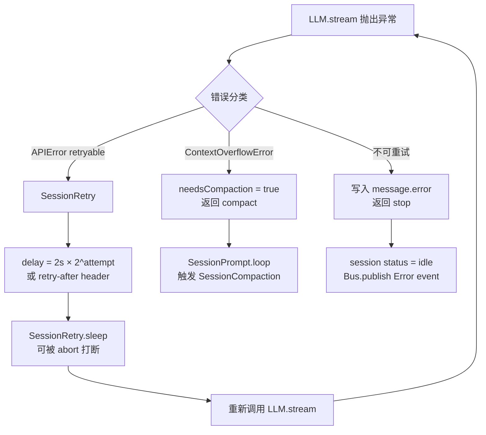

# 错误恢复与重试策略：失败后怎么办

> **总纲** [00-opencode_ko](./00-opencode_ko.md) · **能力域** VIII. 运维与可观测 · **分层定位** 第四层：横切能力层
> **前置阅读** [12-processor源码解剖](./12-processor-source-walkthrough.md) · [20-持久化与存储](./20-storage-and-persistence.md)
> **后续阅读** [13-高级能力](./13-advanced-primitives.md)（compaction 作为溢出恢复）· [04-session中心化](./04-session-centric-runtime.md)（revert 语义）

OpenCode 的错误恢复不是一个独立模块，而是分布在 `SessionProcessor.process()`、`SessionRetry`、`SessionRevert` 和 `SessionCompaction` 四个位置。它们各自处理不同类型的失败，但共享同一条原则：**把错误状态写回 durable history，而不是吞掉或只打日志。**

## 第一层：processor 内的错误分类

`SessionProcessor.process()`（`packages/opencode/src/session/processor.ts`）在消费 `LLM.stream()` 时遇到异常，会先用 `MessageV2.fromError()`（`packages/opencode/src/session/message-v2.ts`）把 provider 或系统异常翻译成统一错误对象，然后按类型分流：

| 错误类型 | 可重试？ | 处理方式 |
|----------|----------|----------|
| `ContextOverflowError` | 否 | 设 `needsCompaction = true`，返回 `compact` 触发压缩 |
| `APIError`（retryable） | 是 | 进入 `SessionRetry` 退避重试 |
| `APIError`（non-retryable） | 否 | 错误写入 assistant message，返回 `stop` |
| `FreeUsageLimitError` | 是 | 重试并附带账单提示 |
| Provider "Overloaded" | 是 | 重试并提示 provider 过载 |
| `ECONNRESET` | 是 | 重试（网络瞬断） |
| `AuthError` / `AbortedError` | 否 | 停止，错误写入消息 |
| `OutputLengthError` | 否 | 停止，错误写入消息 |

## 第二层：SessionRetry 退避重试

`SessionRetry`（`packages/opencode/src/session/retry.ts`）提供三个函数：

- **`retryable(error)`**：判断错误是否值得重试。返回人类可读的重试原因字符串，或 `undefined` 表示不重试。`ContextOverflowError` 永远不重试（走 compaction 路径）。
- **`delay(attempt, error?)`**：计算退避延迟。优先使用 provider 返回的 `retry-after-ms` 或 `retry-after` header；否则按 `2000 × 2^(attempt-1)` 指数退避，不超过 30 秒。
- **`sleep(ms, signal)`**：可中断的等待。如果用户在等待期间取消（abort signal），立即抛出 `AbortError`。

重试循环没有硬性上限——只要 `retryable()` 返回非空，就一直重试。循环只在以下条件终止：错误不可重试、用户取消（abort）、或错误是上下文溢出（转 compaction）。

重试期间，session 状态被设为 `{ type: "retry", attempt, message, next }`，通过 Bus 事件推送给前端，让用户能看到"正在第 N 次重试，下次尝试时间"。

## 第三层：上下文溢出 → Compaction

当 processor 检测到 `ContextOverflowError`，不会重试模型调用，而是返回 `compact` 给 `SessionPrompt.loop()`。Loop 随后调用 `SessionCompaction.create()`（`packages/opencode/src/session/compaction.ts`）在主链上插入一条带 `CompactionPart` 的 user message，下一轮迭代进入 `SessionCompaction.process()` 执行真正的压缩。

这意味着上下文溢出不是终端错误，而是触发了一次显式的历史裁剪和重放。压缩成功后，Loop 会重新进入 normal processing，用更短的历史继续执行。详见 [13-advanced-primitives](./13-advanced-primitives.md) 的 compaction 部分。

## 第四层：SessionRevert 回滚

`SessionRevert`（`packages/opencode/src/session/revert.ts`）处理的不是模型错误，而是"用户想撤销 agent 已经做的事"。它提供三个操作：

- **`revert(sessionID, messageID, partID?)`**：从指定消息/part 开始回滚。收集该点之后所有 `PatchPart`（对应 git commit），调用 `Snapshot.revert()` 撤销文件系统变更，把回滚锚点写入 `Session.setRevert()`（存在 `SessionTable.revert` JSON 列）。
- **`unrevert(sessionID)`**：恢复被回滚的变更。从 snapshot 恢复 git 状态，清除 revert 列。
- **`cleanup(session)`**：永久删除被回滚的 message 和 part。按 messageID/partID 精确删除 SQLite 行，发布 `Removed` / `PartRemoved` 事件，清除 revert 状态。

`SessionPrompt.prompt()`（`packages/opencode/src/session/prompt.ts`）在每次新请求进入时会先调用 `SessionRevert.cleanup()` 清理未完成的回滚状态，保证 durable history 的干净。

## 第五层：未完成工具的收尾

当 processor 因任何原因退出（错误、用户取消、正常结束），它会在收尾阶段（`packages/opencode/src/session/processor.ts`）把所有处于 `pending` 或 `running` 状态的 `ToolPart` 标记为 `error`，错误文本为 `"Tool execution aborted"`。这保证了 durable history 里不会残留悬空的工具状态，后续的 `MessageV2.toModelMessages()` 在翻译 history 时也会把这些失败的工具正确转成 error result，避免某些 provider 因悬挂 `tool_use` 而报错。

## 错误恢复的统一原则

回顾这五层，OpenCode 的错误恢复遵循一条清晰的设计线索：

1. **错误是状态，不是日志。** 无论是 provider error、重试中、还是用户回滚，状态都写回 `Session.Info` 或 `MessageV2.Part`，而不是只 `console.error`。
2. **恢复路径复用主链。** Compaction 走 `SessionPrompt.loop()` 的 compaction 分支，revert 通过 `cleanup()` 删除 durable history 行——都是在主链的固定位置处理，没有旁路恢复流程。
3. **用户始终可见。** 重试状态通过 `Bus.publish()` 推事件，错误通过 `Session.Event.Error` 通知前端，回滚通过 diff 事件展示变更——观测性（[16](./16-observability.md)）在错误路径上同样生效。
