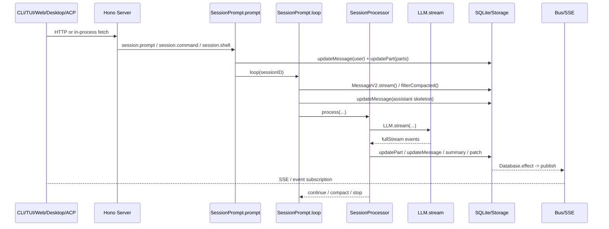

# A 系列索引：OpenCode 执行主线深度解析

> 本文基于 `opencode` `v1.3.2`（tag `v1.3.2`，commit `0dcdf5f529dced23d8452c9aa5f166abb24d8f7c`）源码校对。

这份索引把 A 系列各篇文档对应到默认执行主线上的具体代码跳点。沿着这些跳点展开，读者可以稳定地追踪 OpenCode 的完整执行链：

```text
opencode/package.json
  -> packages/opencode/src/index.ts
  -> cli/cmd/tui/thread.ts / run.ts / attach.ts
  -> server/server.ts
  -> server/routes/session.ts
  -> session/prompt.ts
  -> session/processor.ts
  -> session/llm.ts
  -> session/index.ts / message-v2.ts
```

> 文档状态说明：主线索引以 `A00-A07` 与 `B01-B10` 为准。目录里的 [B08-plugin](./B08-plugin.md) 是保留旧编号的 plugin 深挖补充稿，不参与主编号，但可以作为 [B09](./B09-extension.md) 的延伸阅读。

---

## 1. A 系列覆盖 7 个代码交接点

| 篇 | 主文件 | 核心交接点 | 这一跳回答什么 |
| --- | --- | --- | --- |
| [A01](./A01-entry-transports.md) | `src/index.ts`、`cli/cmd/run.ts`、`cli/cmd/tui/*`、桌面壳 | 入口怎样收束成同一套 HTTP/SSE contract | CLI/TUI/Web/Attach/ACP/Desktop 为什么最后都能打到同一个 server |
| [A02](./A02-server-routing.md) | `server/server.ts`、`server/routes/session.ts` | 请求怎样获得 `WorkspaceContext` / `Instance` | Hono app 怎样完成认证、实例绑定、路由装配并进入 `/session` |
| [A03](./A03-prompt-compilation.md) | `session/prompt.ts` | `POST /session/:id/message` 怎样变成 durable user message | text/file/agent/subtask parts 怎样被编译、改写和落库 |
| [A04](./A04-session-loop.md) | `session/prompt.ts` | `loop()` 如何从 durable history 推导下一轮动作 | 并发占位、历史回放、subtask、compaction、overflow、normal round 怎样串成一台状态机 |
| [A05](./A05-stream-processor.md) | `session/processor.ts` | `SessionProcessor.process()` 如何消费单轮流事件 | reasoning、text、tool、step、patch、error 怎样写回 durable history |
| [A06](./A06-llm-request.md) | `session/llm.ts`、`session/system.ts`、`provider/provider.ts` | 进入模型前的最后一次编译 | provider prompt、system、tools、headers、options、middleware 怎样拼起来 |
| [A07](./A07-durable-state.md) | `session/processor.ts`、`session/index.ts`、`message-v2.ts` | 模型流怎样写回 durable state | reasoning/text/tool/step/patch 事件怎样落库并重新投影给前端 |

A 系列围绕这 7 个固定交接点组织。

---

## 2. 如果把默认主线压成一条调用链

只看默认 `opencode` / `bun dev` 主线，可以压成下面这 10 步：

1. `opencode/package.json:8-18`
   `dev` 把开发态启动送进 `packages/opencode/src/index.ts`。
2. `packages/opencode/src/index.ts:67-147`
   初始化日志、环境变量、SQLite 迁移，并注册所有命令。
3. `cli/cmd/tui/thread.ts:66-230`
   默认 `$0 [project]` 命令解析目录、启动 worker、选择内嵌还是真实 HTTP transport。
4. `cli/cmd/tui/worker.ts:47-154`
   用 `Server.Default().fetch()` 和 `sdk.event.subscribe()` 把 UI 接到 runtime。
5. `server/server.ts:55-253`
   请求经过 `onError -> auth -> logging -> CORS -> WorkspaceContext -> Instance.provide -> route mount`。
6. `server/routes/session.ts:783-821`
   `/session/:sessionID/message` 调 `SessionPrompt.prompt({ ...body, sessionID })`。
7. `session/prompt.ts:162-188`
   `prompt()` 先 `createUserMessage(input)`，把本次输入编译进 durable history。
8. `session/prompt.ts:278-756`
   `loop()` 每轮回放 `MessageV2.stream()`，判断这轮该走 subtask、compaction，还是 normal round。
9. `session/processor.ts:46-425`
   `processor.process()` 只消费这一轮 `LLM.stream()` 产出的事件流。
10. `session/index.ts`、`message-v2.ts`
    `Session.updateMessage()` / `updatePart()` 把结果写回 SQLite，再通过 `Bus` / SSE 投影出去。

记住这条链后，后续章节会依次说明每一步如何把上一跳产物改造成下一跳输入。

---

## 3. 按时序看，这条链的产物怎样一层层变化



阅读这张图时，建议重点关注每一步生成的 durable 产物：

1. 入口层产出的是一个 HTTP/RPC 请求。
2. `prompt()` 产出的是 durable user message / parts。
3. `loop()` 产出的是本轮要执行的分支，以及一条 assistant skeleton。
4. `processor` 产出的是一串 durable parts 和 assistant finish/error/tokens。
5. 前端订阅到的是数据库写回后的事件投影。

---

## 4. A 线为什么必须和 B 线一起读

### 4.1 A 线回答“主调用链怎么走”

| A 线节点 | 需要的 B 线补充 |
| --- | --- |
| A01 入口与 transport | [B08](./B08-startup-config.md)、[B05](./B05-infra.md) 解释配置加载、instance bootstrap 和事件基础设施 |
| A03 输入编译 | [B01](./B01-model.md)、[B02](./B02-context.md) 解释 MessageV2/Part 模型和上下文编译 |
| A04-A05 编排主线 | [B03](./B03-orchestration.md)、[B04](./B04-resilience.md) 解释 subtask / compaction / retry / revert |
| A06 模型请求 | [B02](./B02-context.md)、[B06](./B06-philosophy.md)、[B09](./B09-extension.md) 解释 system/tool/provider 的晚绑定 |
| A07 durable 写回 | [B05](./B05-infra.md) 解释 SQLite、Bus、effect 队列为什么能保证投影一致性 |

### 4.2 B 线回答“为什么主调用链能稳定成立”

如果 A 线只顺着调用栈看，会知道“代码怎么走”；但很多关键判断只有回到 B 线才会完整：

1. 为什么 `loop()` 每轮都能重新求状态，而不是依赖内存 conversation。
2. 为什么 plugin、MCP、skill 很多，但没长出第二条执行骨架。
3. 为什么崩溃恢复、fork、revert、compaction 可以共存。

所以最稳妥的读法是：A 线先按顺序跑一遍，遇到“为什么会这样”再跳 B 线补结构。

---

## 5. A 线刻意不展开什么

A 系列只盯主链，不会把这些专题塞进每一篇里反复展开：

1. **对象模型**：`Agent / Session / MessageV2 / Part` 的 durable schema，放到 [B01](./B01-model.md)。
2. **上下文工程**：system prompt、AGENTS/CLAUDE、skill、历史投影、tool set，放到 [B02](./B02-context.md)。
3. **高级编排**：subagent、command、compaction 的专题展开，放到 [B03](./B03-orchestration.md)。
4. **韧性机制**：retry、overflow、自愈、revert、permission/question，放到 [B04](./B04-resilience.md)。
5. **基础设施**：SQLite、Storage、Bus、Instance、SSE，放到 [B05](./B05-infra.md)。
6. **固定骨架与晚绑定**：为什么这套 runtime 看起来灵活，但中心骨架很硬，放到 [B06](./B06-philosophy.md)。
7. **LSP / 启动配置 / 扩展 / Skill**：分别放到 [B07](./B07-lsp.md) 到 [B10](./B10-skill.md)。

这个边界很重要，因为 A 线的价值恰恰在于不被专题细节打断。

---

## 6. 读 A 线时要死盯的 4 个代码事实

### 6.1 请求作用域先于 session

`Server.createApp()` 会先通过 `WorkspaceContext.provide(...)` 和 `Instance.provide(...)` 把请求绑定到当前 `workspace` 和 `directory`，然后后面的 `/session` 路由才开始工作。

### 6.2 `prompt()` 先写 durable 输入，再决定要不要回复

`SessionPrompt.prompt()` 不会直接碰模型。它先 `createUserMessage(input)`，必要时改 session permission，然后才决定 `noReply` 还是 `loop()`。

### 6.3 `loop()` 每轮都重新回放历史

`MessageV2.filterCompacted(MessageV2.stream(sessionID))` 是 `loop()` 的真实输入，不是某个常驻会话对象。subtask、compaction、overflow 都是基于这批 durable 历史再次分支。

### 6.4 `processor` 只负责单轮，不负责全局调度

`SessionProcessor.process()` 的职责只是消费一次 `LLM.stream()` 产出的事件流，把 reasoning/text/tool/step 写回 state，再返回 `"continue" | "compact" | "stop"` 给 `loop()`。

只要这 4 件事没看偏，A01-A07 的边界就不会混。

---

## 7. 推荐阅读顺序

1. 先读 [A01](./A01-entry-transports.md) 和 [A02](./A02-server-routing.md)，把 transport 边界和 runtime 边界切开。
2. 再读 [A03](./A03-prompt-compilation.md) 到 [A05](./A05-stream-processor.md)，把 `prompt -> loop -> processor` 的交接链吃透。
3. 接着看 [A06](./A06-llm-request.md) 和 [A07](./A07-durable-state.md)，理解“请求怎样发出去、结果怎样落回来”。
4. 最后回看 [B01](./B01-model.md) 到 [B10](./B10-skill.md)，补对象模型、上下文工程、韧性、基础设施，以及 LSP、启动配置和扩展系统。

