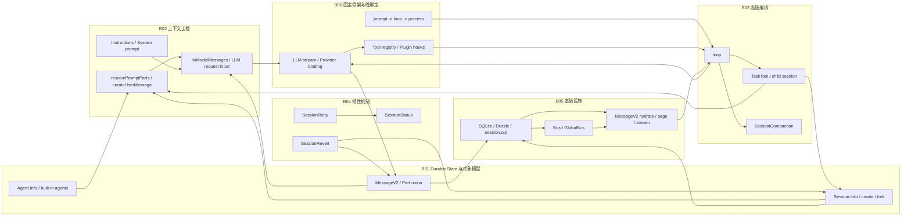

# OpenCode 源码深度解析：README

OpenCode 是一个以 Session 为执行边界、以 Message/Part 为真相源的 durable runtime。入口、编排、落盘与扩展分别落在不同文件中，但执行主线始终稳定。

## 一、四层架构的精确坐标

| 层 | 文件与代码行 | 这一层真正做什么 |
| --- | --- | --- |
| 入口层 | `packages/opencode/src/cli/cmd/run.ts:306-675` | 解析 CLI 输入、选定 session、决定走内嵌 fetch 还是远端 HTTP。 |
| Server 层 | `packages/opencode/src/server/server.ts:53-55`, `55-128`, `242-253` | 构建 Hono app，挂认证/CORS/日志中间件，再把请求分发给 `/session` 等路由。 |
| Runtime 编排层 | `packages/opencode/src/session/prompt.ts:162-188`, `278-736` | `prompt()` 负责写入用户消息，`loop()` 负责多轮调度、subtask、compaction、正常推理。 |
| 单轮执行层 | `packages/opencode/src/session/processor.ts:27-46`, `46-425` | 把 LLM 流事件变成 reasoning/text/tool/patch 等 durable parts。 |
| Durable 状态层 | `packages/opencode/src/session/index.ts:686-788`, `packages/opencode/src/session/message-v2.ts:335-448`, `838-898` | `updateMessage`/`updatePart` 落库，`MessageV2` 定义消息与部件模型并负责回放。 |
| 横切能力层 | `packages/opencode/src/tool/registry.ts:155-195`, `packages/opencode/src/plugin/index.ts:159-174`, `packages/opencode/src/session/compaction.ts:33-331` | 工具装配、插件钩子、压缩与恢复都在固定插槽里介入，而不是另起一套状态机。 |

## 二、A 系列总流程图

```mermaid
flowchart LR

    U["用户输入: CLI / TUI / Web / Attach / Desktop / ACP"]
    A01["A01 多入口与传输适配"]
    A02["A02 Server 与 /session 路由"]
    A03["A03 第 1 步: prompt 编译成 durable user message"]
    A04["A04 第 2 步: loop 决定下一轮并调用 processor"]
    A05["A05 第 3 步: loop 分支展开<br/>subtask / compaction / normal round"]
    A06["A06 第 4 步: processor 进入 LLM.stream()<br/>组 system / tools / provider request"]
    P["Provider 流事件<br/>reasoning / text / tool / step"]
    A07["A07 第 5 步: Session.updatePart / updateMessage<br/>DB effect / Bus.publish / MessageV2.replay"]
    R["下一轮 loop / CLI-TUI-Web 实时订阅 / 分页历史回放"]

    U --> A01
    A01 --> A02
    A02 --> A03
    A03 --> A04
    A04 --> A05
    A05 --> A06
    A06 --> P
    P --> A07
    A07 --> R
    R --> A04
```

这张图对应 A 系列的完整主线：A01-A02 解释入口怎样进入 runtime，A03-A07 解释一次输入怎样被编译、调度、发给模型、写回 durable history，并重新成为下一轮判断依据。

> **入口**：[A00-overview](./opencode_kickoff/A00-overview.md) 是 A 系列的总索引，按执行顺序整理了每篇的核心坐标和问题域。

## 三、执行主线

1. CLI 从 `RunCommand.handler()` 进入，坐标在 `packages/opencode/src/cli/cmd/run.ts:306-675`。
2. 本地模式把 SDK `fetch` 直接指向 `Server.Default().fetch()`，坐标在 `packages/opencode/src/cli/cmd/run.ts:667-673`。
3. Hono `/session/:sessionID/message` 路由校验请求后调用 `SessionPrompt.prompt()`，坐标在 `packages/opencode/src/server/routes/session.ts:781-820`。
4. `prompt()` 先 `SessionRevert.cleanup()`，再 `createUserMessage()`，最后进入 `loop()`，坐标在 `packages/opencode/src/session/prompt.ts:162-188`。
5. `loop()` 从数据库回放消息、判断是否有 pending subtask/compaction，再创建 `SessionProcessor`，坐标在 `packages/opencode/src/session/prompt.ts:302-724`。
6. `SessionProcessor.process()` 消费 `LLM.stream()` 的 `fullStream`，按事件类型调用 `Session.updatePart()`/`updatePartDelta()`/`updateMessage()`，坐标在 `packages/opencode/src/session/processor.ts:54-425`。
7. DB 写入成功后才通过 `Database.effect()` 触发 `Bus.publish()`，坐标在 `packages/opencode/src/storage/db.ts:126-162`、`packages/opencode/src/session/index.ts:686-788`、`packages/opencode/src/bus/index.ts:41-64`。

## 四、B 系列总组件图

这张图对应 B 系列的完整组件视角：B01 给出对象与状态边界，B02 解释上下文如何被编译，B03 解释 loop 内部的高级编排分支，B04 解释失败与恢复路径，B05 解释落盘与事件基础设施，B06 则把这些能力重新收束到固定骨架与晚绑定策略上。

## 五、三个必须保留的细节

### 1. OpenCode 不是“内存里跑一条 loop，再顺手记日志”

`loop()` 每轮都重新从 `MessageV2.stream()` 读历史，坐标在 `packages/opencode/src/session/prompt.ts:302` 和 `packages/opencode/src/session/message-v2.ts:838-898`。这意味着 runtime 的判断依据是数据库里的 message/part，而不是某个长驻内存对象。

### 2. assistant 骨架先落盘，再开始生成

正常处理分支里，`loop()` 会先插入空的 assistant message，再把它交给 `SessionProcessor`，坐标在 `packages/opencode/src/session/prompt.ts:571-600`。因此即使生成途中崩溃，父子关系、模型、agent、cwd/root 这些边界信息也已经 durable 了。

### 3. 扩展能力都被塞回同一条 durable history

subtask 写成 `subtask`/`tool` parts，compaction 写成 `compaction` user part + `summary` assistant，权限与问题通过 `Bus` 事件挂起。对应坐标分别是 `packages/opencode/src/session/prompt.ts:356-543`、`packages/opencode/src/session/compaction.ts:299-329`、`packages/opencode/src/permission/index.ts:166-259`、`packages/opencode/src/question/index.ts:131-196`。

## 六、带着这些坐标读后续章节

- **先读** [A00-overview](./opencode_kickoff/A00-overview.md)，它按执行顺序整理了 A01-A07 的问题域、核心坐标和每篇之间的关系。
- A01 看 CLI 如何把外部输入编译成一次 `session.prompt` 请求，重点是 `run.ts:306-675`。
- A02 看 Hono app 和 `/session` 路由如何进入 runtime，重点是 `server.ts:55-128`、`session.ts:781-919`。
- A03-A07 按顺序看 `prompt -> loop -> processor -> llm -> durable writeback/replay` 这条编排链。
- A07 与 B05 一起看 durable 写路径和事件投影。
- B01-B06 再回头理解对象模型、上下文工程、高级编排和设计哲学。
