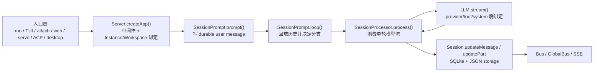

# OpenCode 源码深度解析 README

> 本文档基于 `opencode` `v1.3.2`（tag `v1.3.2`，commit `0dcdf5f529dced23d8452c9aa5f166abb24d8f7c`）源码校对；目标不是复述目录说明，而是把默认启动链真正经过哪些文件、最后是谁在驱动 agent 讲清楚。


---

## 1. 先盯住默认启动链上的 8 个源码跳点

如果只沿默认 `bun dev` / `opencode` 主线读代码，最关键的跳点其实只有这 8 个：

| 跳点 | 代码坐标 | 真正发生了什么 |
| --- | --- | --- |
| 仓库启动脚本 | `opencode/package.json:8-18` | `dev` 明确把默认开发启动送进 `packages/opencode/src/index.ts`。 |
| CLI 总入口 | `packages/opencode/src/index.ts:50-169` | 初始化日志、环境变量、SQLite 迁移，并注册所有命令。 |
| 默认命令 | `cli/cmd/tui/thread.ts:66-230` | `$0 [project]` 不是直接跑 agent，而是先切目录、拉 worker、选 transport。 |
| TUI worker | `cli/cmd/tui/worker.ts:47-154` | 用 `Server.Default().fetch()` 和 `/event` 订阅把本地 runtime 暴露给 UI。 |
| HTTP 边界 | `server/server.ts:55-253` | 认证、日志、CORS、`WorkspaceContext`、`Instance.provide()` 和路由挂载都在这里。 |
| Session 路由 | `server/routes/session.ts:783-859` | `/session/:id/message`、`prompt_async` 等入口把请求送进 `SessionPrompt.prompt()`。 |
| Session 主骨架 | `session/prompt.ts:162-756` | `prompt()` 写入 durable user message，`loop()` 决定 subtask / compaction / normal round。 |
| 单轮执行器 | `session/processor.ts:27-429`、`session/llm.ts:48-294` | `processor` 消费模型流并写回，`LLM.stream()` 做 provider/tool/system 的晚绑定。 |

这套文档真正围绕的，就是这 8 个跳点之间的交接关系。

---

## 2. 根脚本怎样把你送到 runtime

`opencode/package.json:8-18` 已经把“默认启动到底去哪”写得很直白：

1. `dev` 是 `bun run --cwd packages/opencode --conditions=browser src/index.ts`。
2. `dev:desktop`、`dev:web`、`dev:console` 分别进入桌面壳、前端壳和控制台，不会直接解释 runtime 主链。
3. 根目录的 `typecheck` 之类脚本服务的是整个 workspace，不是某个单体应用。

这意味着读仓库时不能把“monorepo 根目录”误当成 runtime 本体。真正执行 agent 的第一跳，已经被脚本固定到了 `packages/opencode/src/index.ts`。

---

## 3. `src/index.ts` 做的第一件事不是跑 agent

`packages/opencode/src/index.ts:67-123` 的全局 middleware 先完成三件基础工作：

1. `Log.init(...)` 打开日志系统，并根据本地安装态决定默认 log level。
2. 写入 `AGENT`、`OPENCODE`、`OPENCODE_PID` 这些进程级环境变量。
3. 如果 `Global.Path.data/opencode.db` 还不存在，就跑一次 `JsonMigration.run(...)`，把旧 JSON 存储迁进 SQLite。

然后 `126-147` 才注册命令；其中最关键的不是 `run`，而是 `128` 行的 `TuiThreadCommand`，因为默认 `$0 [project]` 就会落到它。

所以默认启动顺序不是：

```text
opencode -> 直接进入 session loop
```

而是：

```text
opencode/package.json
  -> packages/opencode/src/index.ts
  -> 全局日志/迁移/命令注册
  -> 默认命令 TuiThreadCommand
```

---

## 4. 默认 TUI 命令怎样把 UI 接到同一套 server

`packages/opencode/src/cli/cmd/tui/thread.ts:102-225` 的 handler 有一条非常明确的执行链：

1. 先校验 `--fork`、`--continue`、`--session` 等参数关系。
2. 把 `--project` 解析成绝对目录并 `chdir` 过去，保证主线程和 worker 看到的是同一个 `cwd`。
3. `new Worker(file, ...)` 拉起 `worker.ts`。
4. 用 RPC 包两种能力：
   - `createWorkerFetch(client)`：把 UI 发来的 HTTP 请求转成 worker 内部的 `Server.Default().fetch()`。
   - `createEventSource(client)`：把 worker 转发的 runtime 事件变成 UI 可订阅的 event source。
5. 再根据是否显式开 `--port` / `--hostname` / `--mdns` 选择 transport：
   - 外部模式：真的起一个 HTTP server。
   - 内嵌模式：URL 固定成 `http://opencode.internal`，但 `fetch/events` 都走 worker RPC。

也就是说，默认 TUI 并不是直接调用 `SessionPrompt.prompt()`；它先把“如何访问同一套 server contract”这件事做出来。

---

## 5. worker 为什么是启动链中间那一层

`packages/opencode/src/cli/cmd/tui/worker.ts:47-154` 说明 worker 不是“第二个 runtime”，而是默认宿主和 runtime 之间的桥。

它做的几件关键事是：

1. `startEventStream({ directory: process.cwd() })` 启一个本地 SDK 客户端，订阅 `sdk.event.subscribe(...)`。
2. SDK 的 `fetch` 被重定向到 `Server.Default().fetch(request)`，所以 event 订阅和 API 请求都直接打进同一套 Hono app。
3. RPC 暴露：
   - `fetch()`：给 UI 转发任意 HTTP 请求。
   - `server()`：必要时把 app 真实监听在端口上。
   - `setWorkspace()`：切换 event stream 的 workspace 作用域。
   - `reload()` / `shutdown()`：重置 config、释放 instances。

所以默认启动继续展开后是：

```text
TuiThreadCommand
  -> worker.ts
  -> Server.Default().fetch()
  -> /event 订阅 + /session API
```

这也是为什么桌面端、TUI、本地 CLI 看起来是不同宿主，但最终都能复用同一套 server/session contract。

---

## 6. runtime 真正收束到哪条骨架

无论入口是 `run`、默认 TUI、`attach`、`serve`、`web`、ACP 还是桌面 sidecar，最后都会收束到同一条 runtime 骨架：



这条骨架最容易被说错的地方有两个：

1. `loop()` 每轮都重新从 durable history 求 `lastUser`、`lastAssistant`、`tasks`，不是依赖一份长驻 conversation 对象。
2. subtask、compaction、retry、revert、permission 并没有旁路状态机，它们最后都回写进 `Session / MessageV2 / Part / Bus` 这组统一对象。

---

## 7. 这套文档如何按代码跳点分工

### 7.1 A 线：顺着主调用链走

| 篇 | 对应代码跳点 | 真正回答的问题 |
| --- | --- | --- |
| [A00](./A00-mainline-index.md) | 全链路索引 | 如果把默认执行主线压成一条链，A 系列各篇分别卡在哪个函数交接点。 |
| [A01](./A01-entry-transports.md) | `index.ts`、`run.ts`、`cli/cmd/tui/*`、桌面壳 | 各宿主怎样收束成同一套 HTTP/SSE contract。 |
| [A02](./A02-server-routing.md) | `server/server.ts`、`server/routes/session.ts` | 请求怎样获得 `WorkspaceContext` / `Instance`，再进入 session runtime。 |
| [A03](./A03-prompt-compilation.md) | `session/prompt.ts` | 用户输入怎样被编译成 durable user message / parts。 |
| [A04](./A04-session-loop.md) | `session/prompt.ts` | `loop()` 如何从 durable history 推导下一轮动作。 |
| [A05](./A05-stream-processor.md) | `session/processor.ts` | `SessionProcessor.process()` 如何把单轮流事件写回 durable history。 |
| [A06](./A06-llm-request.md) | `session/llm.ts`、`session/system.ts`、`provider/provider.ts` | 本轮历史怎样在进入模型前被编译成 provider 请求。 |
| [A07](./A07-durable-state.md) | `session/processor.ts`、`session/index.ts`、`message-v2.ts` | 模型流事件怎样写回 durable state 并重新投影给前端。 |

### 7.2 B 线：解释这条调用链为什么能成立

| 篇 | 补充的代码层 | 真正回答的问题 |
| --- | --- | --- |
| [B01](./B01-model.md) | `agent.ts`、`session/index.ts`、`message-v2.ts` | 这条主线依赖的 durable 对象模型到底长什么样。 |
| [B02](./B02-context.md) | `prompt.ts`、`system.ts`、`instruction.ts`、`message-v2.ts` | 输入、指令、技能、提醒、历史投影怎样一起组成模型上下文。 |
| [B03](./B03-orchestration.md) | `task.ts`、`prompt.ts`、`compaction.ts` | Subagent、Command、Compaction 为什么都没绕开主骨架。 |
| [B04](./B04-resilience.md) | `retry.ts`、`revert.ts`、`permission`、`question` | 失败、自愈、回滚和交互式阻塞怎样挂回主线。 |
| [B05](./B05-infra.md) | `storage/db.ts`、`session.sql.ts`、`bus`、`instance` | durable runtime 依赖的基础设施语义是什么。 |
| [B06](./B06-philosophy.md) | `util/log.ts`、`bus/*`、`effect/*`、`session/status.ts` | 结构化日志、typed Bus 事件、GlobalBus 广播、SessionStatus 状态追踪与 effect 实例作用域。 |
| [B07](./B07-lsp.md) | `lsp/*`、`tool/*`、`server/*` | LSP 怎样成为 runtime 的代码理解和诊断底座。 |
| [B08](./B08-startup-config.md) | `global/*`、`config/*`、`project/bootstrap.ts` | 项目级 runtime 在真正进入 loop 之前还要完成哪些加载动作。 |
| [B09](./B09-extension.md) | `plugin/*`、`mcp/*`、`tool/registry.ts`、`command/*`、`skill/*` | 扩展能力很多，但为什么没有长出第二条执行骨架。 |
| [B10](./B10-skill.md) | `skill/*`、`system.ts`、`tool/skill.ts` | Skill 怎样被发现、授权、注入 system prompt、tool 和 command。 |
| [B11](./B11-worktree.md) | `worktree/*`、`project/project.ts`、`project/instance.ts` | `sandbox` 在 OpenCode 里的真实语义，以及 Git worktree 的发现、创建与边界约束。 |
| [B12](./B12-memory.md) | `session/summary.ts`、`snapshot/*` | Session 级别文件变更追踪与摘要管理，”agent 记忆”的真正实现。 |
| [B13](./B13-mcp.md) | `mcp/index.ts`、`mcp/auth.ts`、`mcp/oauth-*.ts` | MCP 五状态机、OAuth 认证、远程/本地 server 连接、tool/prompt/resource 投影。 |
| [B14](./B14-observability.md) | `prompt.ts`、`llm.ts`、`message-v2.ts`、`agent.ts` | “固定骨架 + 晚绑定”在代码里具体体现在哪些硬边界和晚决策点；B 系列阅读完成后的设计哲学总结。 |

### 7.3 C 线：动手实战与补充专题

| 篇 | 内容定位 | 补充阅读 |
| --- | --- | --- |
| [C01](./C01-debugging.md) | VS Code / JetBrains 调试配置 | 如何对 `packages/opencode` 源码设置断点、调试具体命令，以及一边断点一边看日志。 |
| [C02](./C02-plugin.md) | Plugin 系统深挖：runtime 内部受信扩展层的全部 hook 节点 | 适合在读完 [B09](./B09-extension.md) 之后继续深究 plugin 内部。 |

> A 线顺主链路，B 线讲深度专题，C 线是动手实战与补充专题。三线并行，读者按需跳转。

---

## 8. 读源码前先修正 5 个常见误解

### 8.1 `Session` 不是“聊天框”

`session/index.ts` 里的 `Session.Info` 保存了 `projectID`、`workspaceID`、`directory`、`permission`、`revert`、`summary` 等执行边界；它是 durable 执行容器，不是 UI 上的一条标题记录。

### 8.2 `/session/:id/message` 不是 token SSE 通道

`server/routes/session.ts:783-821` 只是等待 `SessionPrompt.prompt()` 完成后把最终 assistant message JSON 写回响应。真正的实时事件通道是 `GET /event` 和 `GET /global/event`。

### 8.3 默认 TUI 不是直接调用 runtime 函数

`thread.ts` 先起 worker，worker 再通过 `Server.Default().fetch()` 提供统一 API 契约。默认 TUI 访问 runtime 的方式，本质上仍然是“SDK/HTTP contract 的本地化版本”。

### 8.4 Subagent 不是线程

`tool/task.ts` 真正做的是新建或恢复 child session，然后再次调用 `SessionPrompt.prompt()`。所谓并行 agent，在 durable 数据层上是父子 session 关系。

### 8.5 Compaction 不是偷偷删历史

`session/compaction.ts` 会显式插入 `compaction` part，并生成 `summary` assistant message；旧历史仍保留，只是在 `MessageV2.filterCompacted()` 回放时被折叠。

---

## 9. 推荐阅读顺序

1. 先读 [A00](./A00-mainline-index.md) 和 [A01](./A01-entry-transports.md)，把默认启动链的“入口到 server”先对齐。
2. 再读 [A02](./A02-server-routing.md) 到 [A05](./A05-stream-processor.md)，把 `Server -> prompt -> loop` 的固定骨架吃透。
3. 接着读 [A06](./A06-llm-request.md) 和 [A07](./A07-durable-state.md)，把“请求怎样发出去、结果怎样落回来”串完整。
4. 回看 [B01](./B01-model.md) 到 [B13](./B13-mcp.md)，按顺序补对象模型、上下文工程、韧性、基础设施、可观测性、LSP、启动配置、扩展、Skill、Worktree、Memory 和 MCP。
5. [B14](./B14-observability.md) 是设计哲学总结：读完所有实现细节后，回看 B14 理解"为什么 OpenCode 的骨架是固定的、各层扩展为什么都是晚绑定"。
5. [B14](./B14-observability.md) 补充可观测性底层（Log/Bus/SessionStatus/effect）；[C01](./C01-debugging.md) 是动手调试篇，[C02](./C02-plugin.md) 深挖 plugin 内部节点，按需跳转。

---

## 10. 补充材料

1. [infographic.html](./infographic.html)：一页式图解版摘要，适合在正式通读前快速建立模块关系。
2. [OpenCode_Architecture.png](./OpenCode_Architecture.png)：README 顶部使用的架构图原图。
