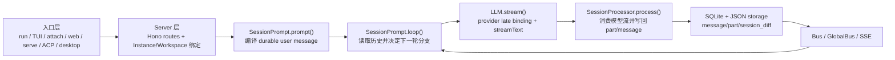

# OpenCode 源码深度解析 README

> 本文档基于 `opencode` `v1.3.2`（tag `v1.3.2`，commit `0dcdf5f529dced23d8452c9aa5f166abb24d8f7c`）源码校对；文中涉及的文件路径、方法名与代码行均以该版本为准。目标是把这份代码到底怎样组织、怎样执行、怎样持久化说清楚。

---

## 1. 先认清工程边界

`opencode` 是一个 monorepo，但真正构成 agent runtime 主链路的并不是所有包。

| 包/目录 | 角色 | 在本文里的位置 |
| --- | --- | --- |
| `packages/opencode` | 核心运行时：CLI、Server、Session、Tool、Provider、SQLite、事件总线、ACP。 | **主角**，A/B 两条线都围绕它展开。 |
| `packages/app` | 通用图形前端，走 SDK 调后端。 | 用于说明桌面壳和 UI 如何接到同一套 HTTP/SSE 协议上。 |
| `packages/desktop` | Tauri 桌面壳，负责拉起 sidecar、管理本地配置、承载 `@opencode-ai/app`。 | A01 的桌面入口。 |
| `packages/desktop-electron` | Electron 桌面壳，职责与 Tauri 版本类似。 | A01 的另一条桌面入口。 |
| `packages/web` | 公开站点/文档站点的 Web 壳与页面路由。 | **不是** `opencode web` 命令背后的本地 runtime UI。 |
| `packages/docs` | 文档正文、图片与 snippets 等内容源。 | 用于区分“文档内容仓”和 `packages/web` 这层站点壳。 |
| `packages/plugin` / `packages/sdk/js` / `packages/ui` | 插件、SDK、通用 UI。 | B02/B05/B06 讨论扩展点时会带到。 |

因此，这套文档的分析重心是：

1. `packages/opencode` 里的真实 runtime 骨架。
2. `packages/app` 与桌面壳如何消费这套 runtime。
3. 哪些扩展点会插进骨架，哪些不会。

---

## 2. 两条阅读线

`opencode_kickoff` 被拆成两条线，它们不是重复关系，而是同一系统的两个正交切面。

| 线 | 关注点 | 文档 |
| --- | --- | --- |
| A 线 | 一次请求从入口到落盘的执行主线。 | [A00](./A00-overview.md) 到 [A07](./A07-state.md) |
| B 线 | 支撑这条主线的对象模型、上下文工程、编排能力、韧性和基础设施。 | [B01](./B01-model.md) 到 [B06](./B06-philosophy.md) |

建议阅读顺序不是 A/B 二选一，而是：

1. 先读 [A00](./A00-overview.md) 建立执行主线。
2. 再顺着 A01-A07 跑一遍完整调用链。
3. 最后回到 B01-B06，看这条调用链背后的数据结构、约束和设计哲学。

---

## 3. 真实骨架只有一条

无论入口是 CLI、TUI、桌面、Web 还是 ACP，最后都会收束到同一条 runtime 骨架：

这条骨架的关键点有两个：

1. `loop()` 每轮都从 durable history 重新读状态，不依赖“某个常驻内存对话对象”。
2. subtask、compaction、retry、revert、permission 并没有另起状态机，而是都被编码回同一条 session/message/part 历史。

---

## 4. 读源码前先修正 5 个常见误解

### 4.1 `Session` 不是“聊天框”

`Session.Info` 里显式保存了 `projectID`、`workspaceID`、`directory`、`permission`、`revert`、`summary`、`share` 等执行边界；它是 durable 执行容器，不是 UI 上的一条会话标题。

### 4.2 `/session/:id/message` 不是 token SSE 通道

`POST /session/:id/message` 会等待 `SessionPrompt.prompt()` 完成后返回 JSON。真正的实时事件通道是 `GET /event` 和 `GET /global/event`，它们把 `Bus`/`GlobalBus` 里的事件转成 SSE。

### 4.3 `opencode web` 不是“本地直接起一个前端包”

`web` 命令本地起的是 `Server.listen()`；而 `Server.createApp()` 的兜底路由会把未知路径代理到 `https://app.opencode.ai`。所以浏览器里看到的是“本地 agent server + 远端 app shell”的组合，而不是 `packages/web`。

### 4.4 Subagent 不是线程，也不是 Promise

`task` 工具真正做的是新建 child session，把任务交给另一份 `SessionPrompt.prompt()`。所谓“并行 agent”在数据层上是父子 session 关系，不是某个内存线程池。

### 4.5 Compaction 不是偷偷删历史

压缩会先写一个 `compaction` user part，再由隐藏的 `compaction` agent 生成 summary assistant message；旧历史依然保留，只是在后续回放时通过 `MessageV2.filterCompacted()` 折叠。

---

## 5. A 线与 B 线如何互锁

| A 线节点 | 对应 B 线补充 |
| --- | --- |
| A01 入口 | B05 基础设施，解释 sidecar、事件和全局状态怎么撑起来。 |
| A03 prompt 编译 | B01 对象模型、B02 上下文工程。 |
| A04-A05 loop 编排 | B03 高级编排、B04 韧性机制。 |
| A06 LLM 请求 | B02 上下文投影、B06 晚绑定策略。 |
| A07 durable 写回 | B05 持久化与事件总线。 |

如果把 A 线当作“顺着调用栈走”，那 B 线就是“解释为什么这条调用栈能成立”。

---

## 6. 推荐阅读顺序

1. [A00-overview](./A00-overview.md)：先拿到完整主线和章节边界。
2. [A01-entry](./A01-entry.md) + [A02-server](./A02-server.md)：把入口和 Server 边界看准。
3. [A03-prompt](./A03-prompt.md) 到 [A07-state](./A07-state.md)：顺着 `prompt -> loop -> processor -> llm -> writeback` 跑完。
4. [B01-model](./B01-model.md) 到 [B06-philosophy](./B06-philosophy.md)：再回头理解对象模型、上下文编译、编排、韧性和设计哲学。

整套文档的中心结论可以先记住一句：

> OpenCode 不是“模型外面套一层工具调用”，而是“把 agent 执行过程编译成 durable session/message/part 历史，再由 loop 反复消费这条历史”。
